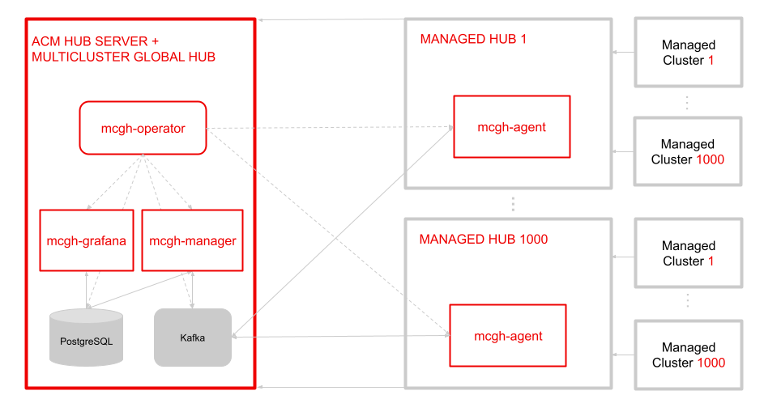

# Multicluster Global Hub Overview

[](https://prow.ci.openshift.org/?repo=stolostron%2F${multicluster-global-hub})
[](https://sonarcloud.io/dashboard?id=open-cluster-management_hub-of-hubs)
[](https://pkg.go.dev/github.com/stolostron/multicluster-global-hub)
[](/LICENSE)

This document attempts to explain how the different components in multicluster global hub come together to deliver multicluster management at very high scale. The multicluster-global-hub operator is the root operator which pulls in all things needed.

## Conceptual Diagram



### Multicluster Global Hub Operator

Operator is for multicluster global hub. It is used to deploy all required components for multicluster management. The components include multicluster-global-hub-manager in the global hub cluster and multicluster-global-hub-agent in the managed hub clusters.

The Operator also leverages the manifestwork to deploy the Advanced Cluster Management for Kubernetes in the managed cluster. So the managed cluster is switched to a standard ACM Hub cluster (managed hub cluster).

### Multicluster Global Hub Manager

The manager is used to persist the data into the postgreSQL. The data is from Kafka transport. The manager is also used to post the data to Kafka transport so that it can be synced to the managed hub clusters.

### Multicluster Global Hub Agent

The agent is running in the managed hub clusters. It is responsible to sync-up the data between the global cluster hub and the managed hub clusters. For instance, sync-up the managed clusters' info from the managed hub clusters to the global hub cluster and sync-up the policy or application from the global hub cluster to the managed hub clusters.

### Multicluster Global Hub Observability

Grafana runs on the global hub cluster, as the main service for Global Hub Observability. The Postgres data collected by the Global Hub Manager services as its default DataSource. By exposing the service via route(`multicluster-global-hub-grafana`), you can access the global hub grafana dashboards just like accessing the openshift console.

## Quick Start Guide

### Prerequisites

1. Connect to a Kubernetes cluster with `kubectl`
2. ACM or OCM is installed on the Kubernetes cluster

### Run the operator in the cluster

_Note:_ You can also install Multicluster Global Hub Operator from [Operator Hub](https://docs.openshift.com/container-platform/4.6/operators/understanding/olm-understanding-operatorhub.html) if you have ACM installed in an OpenShift Container Platform, the operator can be found in community operators by searching "multicluster global hub" keyword in the filter box, then follow the document to install the operator.

Follow the steps below to instal Multicluster Global Hub Operator in developing environment:

1. Check out the multicluster-global-hub repository

```bash
git clone git@github.com:stolostron/multicluster-global-hub.git
cd multicluster-global-hub/operator
```

2. Install git hooks for release checklist (recommended for contributors)

```bash
cd ..
./scripts/install-hooks.sh
cd operator
```

3. Build and push your image to the location specified by `IMG`:

```bash
make docker-build docker-push IMG=<some-registry>/multicluster-global-hub-operator:<tag>
```

3. Deploy the controller to the cluster with the image specified by `IMG`:

```bash
make deploy IMG=<some-registry>/multicluster-global-hub-operator:<tag>
```

4. Install instance of custom resource:

```bash
kubectl apply -k config/samples/
```

### Uninstall the operator

1. Delete the multicluster-global-hub-operator CR:

```bash
kubectl delete mgh --all
```

2. Delete the multicluster-global-hub-operator:

_Note:_ This will delete Multicluster Global Hub Operator and the CRD from the cluster.

```bash
make undeploy
```

# Contributing

Go to the [Contributing guide](CONTRIBUTING.md) to learn how to get involved.
