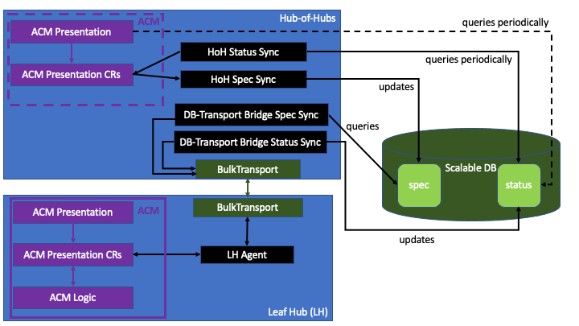

# Hub-of-Hubs

The main repository for the Hub-of-Hubs.

## Demo

The [demo script](demo.md).

## Repositories

### Ansible playbooks to setup PostgreSQL
* [hub-of-hubs-postgresql](https://github.com/open-cluster-management/hub-of-hubs-postgresql)

### On-the-hub-of-hubs components

* [hub-of-hubs-spec-sync](https://github.com/open-cluster-management/hub-of-hubs-spec-sync)
* [hub-of-hubs-status-sync](https://github.com/open-cluster-management/hub-of-hubs-status-sync)
* [hub-of-hubs-spec-transport-bridge](https://github.com/open-cluster-management/hub-of-hubs-spec-transport-bridge)
* [hub-of-hubs-status-transport-bridge](https://github.com/open-cluster-management/hub-of-hubs-status-transport-bridge)

### Transport

* [hub-of-hubs-sync-service](https://github.com/open-cluster-management/hub-of-hubs-sync-service)

### On-the-leaf-hub components

* [leaf-hub-spec-sync](https://github.com/open-cluster-management/leaf-hub-spec-sync)
* [leaf-hub-status-sync](https://github.com/open-cluster-management/leaf-hub-status-sync)

### Data type definitions

* [hub-of-hubs-data-types](https://github.com/open-cluster-management/hub-of-hubs-data-types)

## Development

### Go version
 
1.16

### Kubernetes APIs

We use [controller-runtime](https://github.com/kubernetes-sigs/controller-runtime) module, v0.6.0.

### Conventions

#### Context usage

`Context.Background()` should be defined in the beginning of each "main" method, such as `Reconcile`, or of a method to be called as a go routine,  and then passed to all the called methods. The functions that handle timers/timeouts/cancel events must handle cancelling the context.

References:
* http://p.agnihotry.com/post/understanding_the_context_package_in_golang/
* https://blog.golang.org/context

#### Errors and logging

All the errors should be wrapped before returning, using `fmt.Errorf("Some description: %w", err)`. The errors should only be logged once in the "main" method, such as `Reconcile` or methods that do not return errors.

References:
* https://www.orsolabs.com/post/go-errors-and-logs/

#### Concurrency

We should use go routines where possible. Note that the database concurrency is limited by the maximal number of database connections (about 100). The multiple connections to a database are handled by pgx connection pool.

#### Using controller-runtime Manager

While using [controller-runtime Manager](https://pkg.go.dev/sigs.k8s.io/controller-runtime/pkg/manager) for controllers seems to be an obvious choice, 
using [controller-runtime's Manager](https://pkg.go.dev/sigs.k8s.io/controller-runtime/pkg/manager) for other components (for example for DB synchronizers) 
is not. We try to use [controller-runtime's Manager](https://pkg.go.dev/sigs.k8s.io/controller-runtime/pkg/manager) as much as possible, even for running components that are not controllers.

[controller-runtime's Manager](https://pkg.go.dev/sigs.k8s.io/controller-runtime/pkg/manager) provides the following functionality in addition to managing controllers:

   * Kubernetes client with caching
   * start/stop [Runnables](https://pkg.go.dev/sigs.k8s.io/controller-runtime@v0.6.0/pkg/manager#Runnable).
   * signal handling
   * leader election
   * metrics
   * health/ready checks
   * client-side event processing

See [an example of using controller-runtime Manager features](https://github.com/kubernetes-sigs/kubebuilder/blob/master/docs/book/src/cronjob-tutorial/testdata/project/main.go).

#### Running as singletons

All the components are designed to run as singletons (a single active replica), since there is no load balancing between components. We use leader election of [controller-runtime's Manager](https://pkg.go.dev/sigs.k8s.io/controller-runtime/pkg/manager) to implement the singleton pattern.

#### Events

Currently we do not produce events.

#### Metrics

Currently we do not publish any metrics.

#### Health/ready checks

Currently we do not use health/ready checks.

### Build
 
* [Makefile](https://github.com/open-cluster-management/hub-of-hubs-spec-sync/blob/main/Makefile) 
* [Dockerfile](https://github.com/open-cluster-management/hub-of-hubs-spec-sync/blob/main/build/Dockerfile) 
* [build scripts](https://github.com/open-cluster-management/hub-of-hubs-spec-sync/tree/main/build/scripts)

### Formatting

* [GCI](https://github.com/daixiang0/gci) for ordering imports.
* [gofumpt](https://github.com/mvdan/gofumpt) for formatting (a stricter tool than `go fmt`.
* `go fmt`

### Linting

* `go vet`
* [golangci-lint](https://github.com/golangci/golangci-lint), the settings file is [.golangci.yaml](https://github.com/open-cluster-management/hub-of-hubs-spec-sync/blob/main/.golangci.yaml).

### Tests

We did not implement any unit/e2e tests for this POC.
