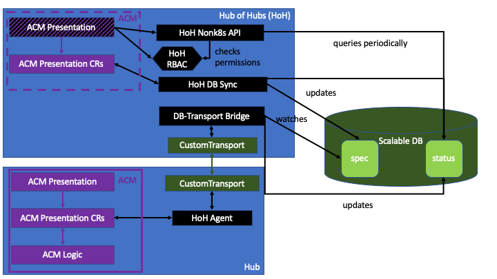

# Hub of Hubs

----

Hub of Hubs provides multi-cluster management at very high scale.

Hub of Hubs utilizes several standard [RHACM hub clusters](https://access.redhat.com/documentation/en-us/red_hat_advanced_cluster_management_for_kubernetes/2.4/html/about/welcome-to-red-hat-advanced-cluster-management-for-kubernetes#hub-cluster)
to provide cluster-management capabilities, such as applying compliance policies to managed clusters and monitoring
compliance status, or managing application and cluster lifecycle, while addressing the scale and performance
requirements of edge use cases.

Our [simulations](simulation.md) showed that a Hub of Hubs is able to manage one million clusters with hundreds of
policies and/or applications applied to each cluster.

----

## Getting started

The [demos](demos).

## Deployment

See [deployment scripts](deploy).

## Repositories

### Ansible playbooks to setup PostgreSQL

* [hub-of-hubs-postgresql](https://github.com/stolostron/hub-of-hubs-postgresql)

### Hub-of-Hubs components

* [hub-of-hub-manager](https://github.com/stolostron/hub-of-hubs-manager)

Note: [hub-of-hub-manager](https://github.com/stolostron/hub-of-hubs-manager) is an all-in-one repository that contains the following components in hub of hubs:

  - [hub-of-hubs-spec-sync](https://github.com/stolostron/hub-of-hubs-spec-sync)
  - [hub-of-hubs-status-sync](https://github.com/stolostron/hub-of-hubs-status-sync)
  - [hub-of-hubs-spec-transport-bridge](https://github.com/stolostron/hub-of-hubs-spec-transport-bridge)
  - [hub-of-hubs-status-transport-bridge](https://github.com/stolostron/hub-of-hubs-status-transport-bridge)
  - [hub-of-hubs-nonk8s-api](https://github.com/stolostron/hub-of-hubs-nonk8s-api)

#### RBAC

* [hub-of-hubs-rbac](https://github.com/stolostron/hub-of-hubs-rbac)

#### UI

See [package diagram](ui_packages.md).

* [hub-of-hubs-console](https://github.com/stolostron/hub-of-hubs-console)
* [hub-of-hubs-console-chart](https://github.com/stolostron/hub-of-hubs-console-chart)
* [hub-of-hubs-ui-components](https://github.com/stolostron/hub-of-hubs-ui-components)
* [hub-of-hubs-grc-ui](https://github.com/stolostron/hub-of-hubs-grc-ui)

### CLI

* [hub-of-hubs-cli-plugins](https://github.com/stolostron/hub-of-hubs-cli-plugins)

### Transport options

* [hub-of-hubs-sync-service](https://github.com/stolostron/hub-of-hubs-sync-service)
* [hub-of-hubs-kafka-transport](https://github.com/stolostron/hub-of-hubs-kafka-transport)

### Message Compression

* [hub-of-hubs-message-compression](https://github.com/stolostron/hub-of-hubs-message-compression)

### Hub-of-Hubs-agent components

* [hub-of-hub-agent](https://github.com/stolostron/hub-of-hubs-agent)

Note: [hub-of-hub-agent](https://github.com/stolostron/hub-of-hubs-agent) is an all-in-one repository that contains the following components in leaf hubs:

* [leaf-hub-spec-sync](https://github.com/stolostron/leaf-hub-spec-sync)
* [leaf-hub-status-sync](https://github.com/stolostron/leaf-hub-status-sync)

### Data types definitions

* [hub-of-hubs-crds](https://github.com/stolostron/hub-of-hubs-crds)
* [hub-of-hubs-data-types](https://github.com/stolostron/hub-of-hubs-data-types)

### Custom repositories

* Hub of Hubs
  * https://github.com/vadimeisenbergibm/governance-policy-propagator/tree/no_status_update to prevent updating policy status by governance policy propagator

## Development

See [the development page](./development.md).

### Simulation at high scale

See [simulation at high scale](./simulation.md).

### Contributing

Go to the [Contributing guide](CONTRIBUTING.md) to learn how to get involved.
