# Managed Cluster Migration Sequence Diagram

This document shows the sequence of operations during a managed cluster migration process in the multicluster global hub.

```mermaid
sequenceDiagram
    participant User
    participant GlobalHub as Global Hub Manager
    participant SourceHub as Source Hub Agent
    participant TargetHub as Target Hub Agent
    participant SourceCluster as Source Managed Cluster
    participant TargetCluster as Target Managed Cluster (migrated)

    Note over User, TargetCluster: Phase 1: Migration Request Creation
    User->>GlobalHub: Create ManagedClusterMigration CR
    Note right of User: Spec contains:<br/>- from: source-hub<br/>- to: target-hub<br/>- includedManagedClusters OR<br/>- includedManagedClustersPlacementRef

    Note over User, TargetCluster: Phase 2: Validating
    GlobalHub->>GlobalHub: Add finalizer & initialize status
    GlobalHub->>GlobalHub: Validate source/target hubs exist
    GlobalHub->>GlobalHub: Validate managed clusters exist
    
    alt Using PlacementRef
        GlobalHub->>SourceHub: Send validation event with PlacementName
        SourceHub->>SourceHub: Get clusters from PlacementDecisions
        Note right of SourceHub: List all PlacementDecision resources<br/>matching placement label<br/>(no batch size limit)
        SourceHub->>GlobalHub: Report clusters from placement
        GlobalHub->>GlobalHub: Store clusters in ConfigMap
    else Using explicit cluster list
        GlobalHub->>GlobalHub: Validate specified clusters
    end
    
    GlobalHub->>GlobalHub: Update status to "Validating" → "Initializing"

    Note over User, TargetCluster: Phase 3: Initializing
    GlobalHub->>GlobalHub: Generate bootstrap secret for target hub
    GlobalHub->>SourceHub: Send initializing event with bootstrap secret
    SourceHub->>SourceHub: Create bootstrap secret
    SourceHub->>SourceHub: Create KlusterletConfig (migration-{target-hub})
    SourceHub->>SourceCluster: Update ManagedCluster annotations
    Note right of SourceHub: Add annotations:<br/>- agent.open-cluster-management.io/klusterlet-config<br/>- global-hub.open-cluster-management.io/migrating
    SourceHub->>GlobalHub: Report initializing complete
    GlobalHub->>GlobalHub: Update status to "Deploying"

    Note over User, TargetCluster: Phase 4: Deploying
    GlobalHub->>SourceHub: Send deploying event
    SourceHub->>SourceHub: Collect ManagedCluster resources
    SourceHub->>SourceHub: Collect KlusterletAddonConfig resources
    SourceHub->>SourceHub: Clean metadata (finalizers, resourceVersion, etc.)
    SourceHub->>TargetHub: Send MigrationResourceBundle
    Note right of SourceHub: Bundle contains cleaned:<br/>- ManagedCluster objects<br/>- KlusterletAddonConfig objects
    TargetHub->>TargetHub: Create ManagedCluster resources
    TargetHub->>TargetHub: Create KlusterletAddonConfig resources
    SourceHub->>GlobalHub: Report deploying complete
    GlobalHub->>GlobalHub: Update status to "Registering"

    Note over User, TargetCluster: Phase 5: Registering
    GlobalHub->>TargetHub: Send registering event with MSA info
    TargetHub->>TargetHub: Auto-approve ManagedServiceAccount
    GlobalHub->>SourceHub: Send registering event
    SourceHub->>SourceCluster: Set HubAcceptsClient = false
    Note right of SourceHub: Triggers re-registration to target hub
    SourceCluster->>TargetCluster: Agent reconnects to target hub
    TargetCluster->>TargetHub: Register with target hub
    TargetHub->>TargetHub: Accept cluster registration
    TargetHub->>GlobalHub: Report registration complete
    SourceHub->>GlobalHub: Report registering complete
    GlobalHub->>GlobalHub: Update status to "Cleaning"

    Note over User, TargetCluster: Phase 6: Cleaning
    GlobalHub->>SourceHub: Send cleaning event
    SourceHub->>SourceHub: Delete bootstrap secret
    SourceHub->>SourceHub: Delete KlusterletConfig
    SourceHub->>SourceHub: Delete ManagedCluster (if HubAcceptsClient=false)
    SourceHub->>GlobalHub: Report cleaning complete
    GlobalHub->>GlobalHub: Update status to "Completed"
    GlobalHub->>GlobalHub: Remove finalizer

    Note over User, TargetCluster: Migration Complete
    Note right of TargetCluster: Managed cluster now registered<br/>with target hub and operational

    Note over User, TargetCluster: Error Handling: Rollback Phases
    Note over GlobalHub, SourceHub: ⚠️ ERROR HANDLING: If error occurs during any phase:
        GlobalHub->>GlobalHub: Update status to "Rollbacking"
        GlobalHub->>SourceHub: Send rollback event with RollbackStage
        
        alt Rollback Initializing
            SourceHub->>SourceHub: Remove migration annotations
            SourceHub->>SourceHub: Delete bootstrap secret
            SourceHub->>SourceHub: Delete KlusterletConfig
        else Rollback Deploying
            SourceHub->>SourceHub: Perform initializing rollback
            TargetHub->>TargetHub: Delete deployed resources
        else Rollback Registering
            SourceHub->>SourceHub: Set HubAcceptsClient = true
            SourceHub->>SourceHub: Perform deploying rollback
        
        SourceHub->>GlobalHub: Report rollback complete
        GlobalHub->>GlobalHub: Update status to "Failed"
    end
```

## Key Components

### Migration Controller (Global Hub Manager)
- **Location**: `manager/pkg/migration/migration_controller.go:127`
- **Phases**: Validating → Initializing → Deploying → Registering → Cleaning
- **Timeout Configuration**: Default 5-12 minutes per phase, configurable via `supportedConfigs.stageTimeout`

### Migration Source Syncer (Source Hub Agent)  
- **Location**: `agent/pkg/spec/migration/migration_from_syncer.go:72`
- **Functions**: 
  - Get clusters from PlacementDecisions (no batch size limit)
  - Manage bootstrap secrets and KlusterletConfig
  - Prepare and send cluster resources to target hub
  - Handle rollback operations

### Key Data Structures
- **MigrationSourceBundle**: Events from manager to source hub
- **MigrationTargetBundle**: Events from manager to target hub  
- **MigrationResourceBundle**: Cluster resources sent from source to target
- **MigrationStatusBundle**: Status reports back to global hub

## Important Notes

1. **No Batch Size Limit**: When using `includedManagedClustersPlacementRef`, all clusters from placement decisions are processed at once
2. **Atomic Operations**: Each phase must complete successfully before moving to the next
3. **Rollback Support**: Any phase failure triggers rollback to previous state
4. **Timeout Management**: Each phase has configurable timeouts with automatic failure detection
5. **Event-Driven**: All communication between components uses CloudEvents via Kafka transport
