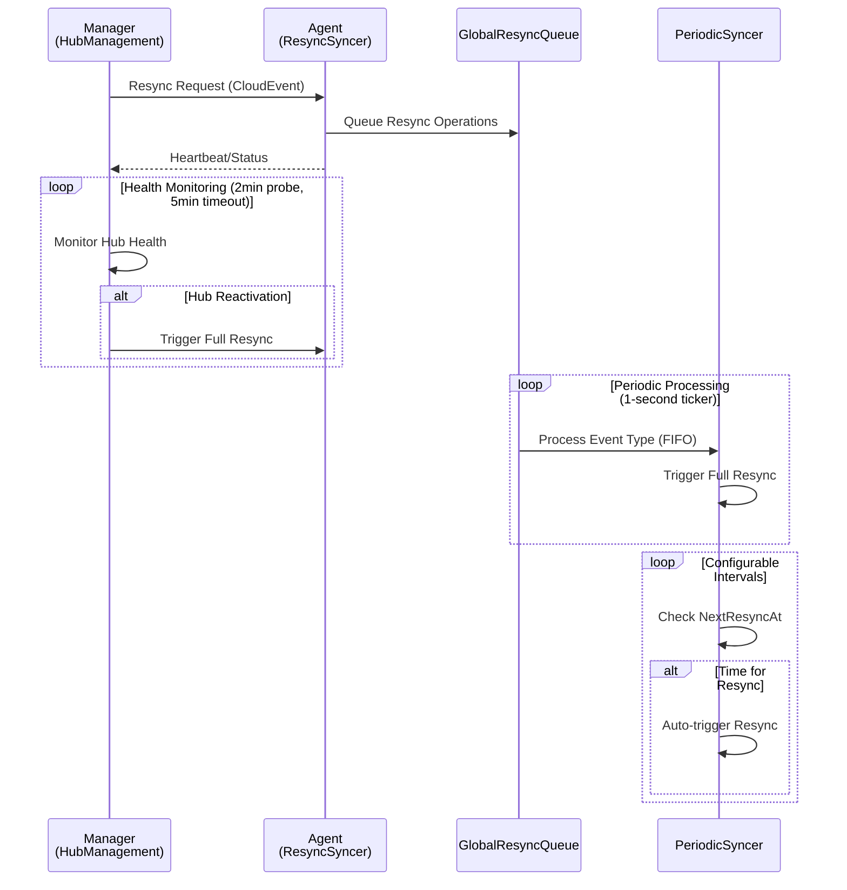

# Global Hub Resync Mechanism

This document provides a comprehensive analysis of the resync mechanism in the Multicluster Global Hub project, covering both manager and agent perspectives, along with the role of version control in ensuring data consistency.

## Overview

The resync mechanism in Global Hub ensures data consistency across distributed managed clusters by providing both on-demand and periodic synchronization capabilities. It handles scenarios such as network interruptions, hub restarts, and other exceptional conditions where data synchronization might be lost.

## Manager-side Resync Mechanism

The **Manager** component is responsible for initiating resync operations to synchronize full data with connected hubs.

### Core Component
- **HubManagement** (`manager/pkg/processes/hubmanagement/hub_management.go:75`)

### Key Operations

#### 1. Startup Full Sync
When `HubManagement.Start()` is called, it immediately triggers a comprehensive resync:
```go
err := h.resync(ctx, transport.Broadcast)
```
This ensures all connected hubs receive the latest state information upon manager startup.

#### 2. Hub Reactivation Sync
The manager continuously monitors hub heartbeats with a 2-minute probe duration and 5-minute timeout:
- Hubs that miss heartbeats beyond the timeout are marked as `inactive`
- When inactive hubs reconnect and send heartbeats, they are marked as `active`
- A full resync is triggered during reactivation to restore data consistency

#### 3. Resource Synchronization Scope
The manager requests resync for four critical resource types:
- `HubClusterInfoType` - Hub cluster information
- `ManagedClusterType` - Managed cluster data
- `LocalPolicySpecType` - Policy specifications
- `LocalComplianceType` - Compliance status data

### Communication Flow
```
Manager -> CloudEvent(ResyncMsgKey) -> Transport -> Agent
```

## Agent-side Resync Mechanism

The **Agent** component handles resync through two complementary approaches to ensure comprehensive data synchronization.

### Core Components
- **ResyncSyncer** (`agent/pkg/spec/syncers/resync_syncer.go:19`) - Processes resync requests
- **PeriodicSyncer** (`agent/pkg/status/generic/periodic_syncer.go:33`) - Executes synchronization operations

### 1. GlobalResyncQueue-based Resync

#### Queue Management
The `GlobalResyncQueue` is a thread-safe queue that manages pending resync operations:
```go
type ResyncTypeQueue struct {
    mu    sync.Mutex
    queue []string
}
```

#### Request Sources
- **Manager Requests**: Resync requests from the manager are processed by `ResyncSyncer.Sync()` and queued
- **Agent Startup**: During agent initialization, all registered resource types are added to the queue
- **Manual Triggers**: Additional resync requests can be programmatically queued

#### Processing Logic
- `PeriodicSyncer` processes one event type from the queue every second using a 1-second ticker
- Queue operates on a FIFO (First-In-First-Out) basis
- Each processed item triggers a full resync for that specific resource type

### 2. Periodic Resync

#### Configurable Intervals
Each resource type maintains independent resync schedules:
- Intervals are configurable through `configmap.GetResyncInterval(enum.EventType)`
- Each emitter tracks its own `NextResyncAt` timestamp
- Allows fine-tuning of synchronization frequency per resource type

#### Automatic Triggering
```go
if time.Now().After(state.NextResyncAt) {
    // Trigger full resync
    if err := p.Resync(ctx, eventType); err != nil {
        log.Errorf("failed to resync the event(%s): %v", eventType, err)
    }
    state.NextResyncAt = time.Now().Add(configmap.GetResyncInterval(enum.EventType(eventType)))
}
```

## Version Control in Resync Process

The resync mechanism relies on the Global Hub version system to ensure data consistency and prevent duplicate processing. For comprehensive details on the version mechanism, see [`ai-doc/version-mechanism-guide.md`](version-mechanism-guide.md).

### Key Resync-Specific Behaviors

#### 1. Forced Version Increment

During resync operations, `version.Incr()` is called to force version increment:

- Ensures data is marked as "changed" regardless of actual content changes
- Guarantees retransmission of all data during resync cycles
- Maintains consistency across distributed components

#### 2. Agent Restart Detection

- **Initial Version**: Agent starts with version `0.0`
- **Manager Response**: When receiving `Generation=0`, Manager resets conflation state
- **Resync Trigger**: Ensures complete state synchronization after agent restarts

#### 3. Change Detection

Version comparison (`currentVersion.NewerThan(&lastSentVersion)`) determines whether data needs retransmission during periodic resync cycles.

For detailed version structure, comparison logic, and race condition prevention mechanisms, refer to the [Version Mechanism Guide](version-mechanism-guide.md).

## Architecture Diagram



## Best Practices

### For Developers

1. **Resource Registration**: Ensure all resource types that require resync are properly registered with the periodic syncer
2. **Version Management**: Always call `version.Incr()` when forcing resync to maintain consistency
3. **Error Handling**: Implement proper error handling for resync operations to prevent data inconsistencies
4. **Configuration**: Set appropriate resync intervals based on resource criticality and update frequency

### For Operations

1. **Monitoring**: Monitor resync queue length and processing times
2. **Configuration Tuning**: Adjust resync intervals based on network conditions and resource usage
3. **Troubleshooting**: Check version mismatches when investigating data inconsistency issues

## Related Components

- **Transport Layer**: Handles cloud event communication between manager and agents
- **Database Models**: Store hub heartbeat and resource state information
- **Configuration Management**: Controls resync intervals and behavior parameters
- **Event Emitters**: Generate and manage versioned data bundles for transmission

## Conclusion

The Global Hub resync mechanism provides a robust foundation for maintaining data consistency across distributed multicluster environments. Through its dual-approach design (queue-based and periodic) combined with sophisticated version control, it ensures reliable data synchronization while handling various failure scenarios and operational requirements.

This mechanism is essential for enterprise-scale multicluster management where data consistency and reliability are paramount for successful cluster operations and policy enforcement.
