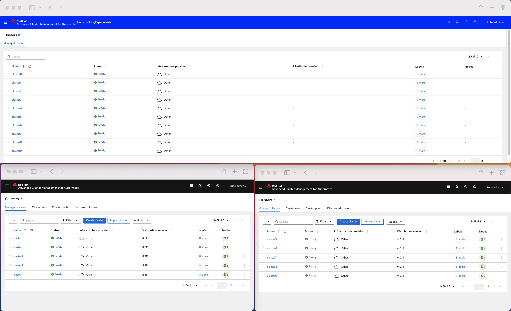
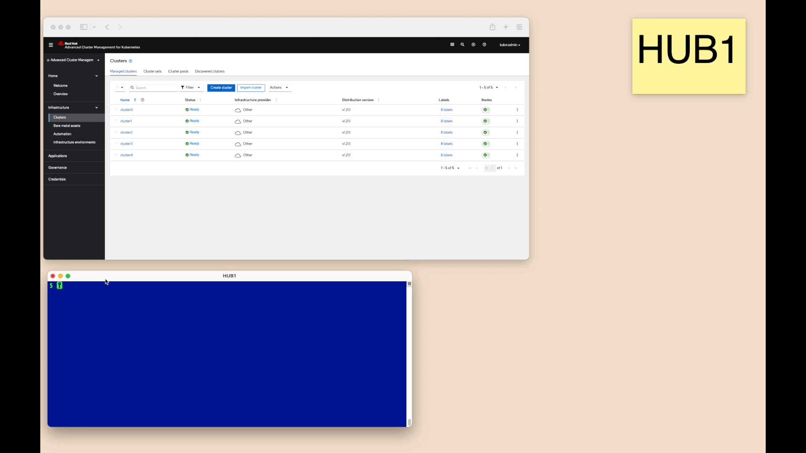

# Hub-of-Hubs demos

## Prerequisites

1. Three clusters with ACM 2.4 Hubs on them, `hoh` (the _Hub of Hubs_), `hub1` and `hub2` (two Hubs to connect to the Hub of Hubs). The minimal [requirements for ACM 2.4](https://access.redhat.com/documentation/en-us/red_hat_advanced_cluster_management_for_kubernetes/2.4/html/install/installing#requirements-and-recommendations) are sufficient for this demo.
1. Some managed clusters [imported into](https://access.redhat.com/documentation/en-us/red_hat_advanced_cluster_management_for_kubernetes/2.4/html/clusters/managing-your-clusters#importing-a-target-managed-cluster-to-the-hub-cluster) (or [created by](https://access.redhat.com/documentation/en-us/red_hat_advanced_cluster_management_for_kubernetes/2.4/html/clusters/managing-your-clusters#creating-a-cluster)) both `hub1` and `hub2`.
1. [Access to the ACM Web console](https://access.redhat.com/documentation/en-us/red_hat_advanced_cluster_management_for_kubernetes/2.4/html/web_console/web-console#accessing-your-console) of the three ACM hubs.

## Setup
1.  Define environment variables to hold kubernetes configurations of the clusters, `TOP_HUB_CONFIG`, `HUB1_CONFIG` and `HUB2_CONFIG`.
1.  Download [demo-magic shell script](https://github.com/paxtonhare/demo-magic) into this directory (_demos_).
    
    ```
    curl -s https://raw.githubusercontent.com/paxtonhare/demo-magic/master/demo-magic.sh -o demo-magic.sh
    chmod u+x demo-magic.sh
    ```

4.  Follow [the instructions to setup Hub-of-Hubs components](setup).
5.  If you do not have access to `hoh` as the `kubeadmin` user, [add an alternative user as the admin to Hub-of-Hubs RBAC](https://github.com/stolostron/hub-of-hubs-rbac#update-role-bindings-or-role-definitions).

## Demos

1.  [Single Desktop](single_desktop)

    

1.  [Multiple Desktops](multiple_desktops)

    

1.  [Setup](setup)

    Shows running setup scripts
