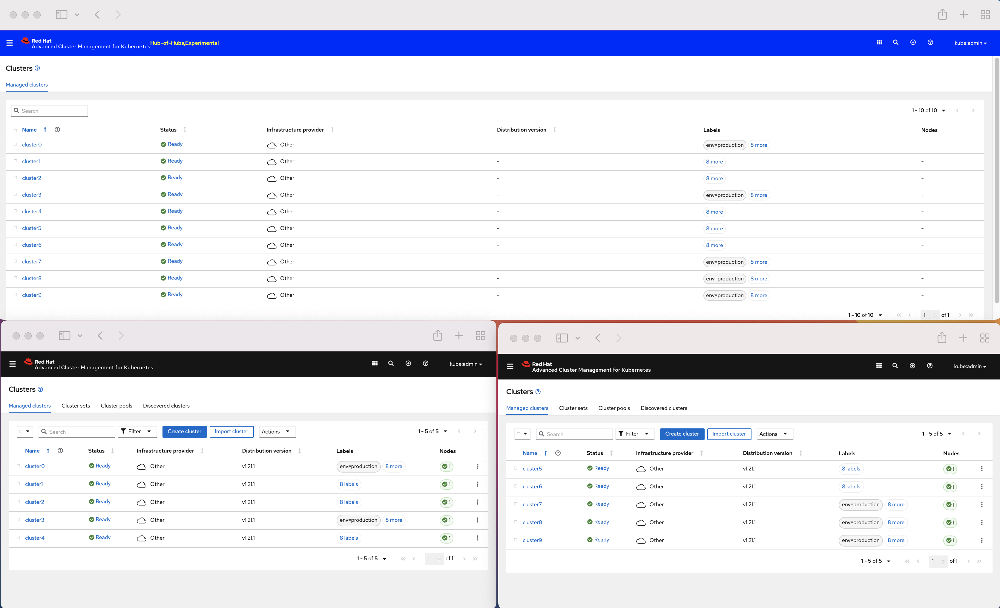
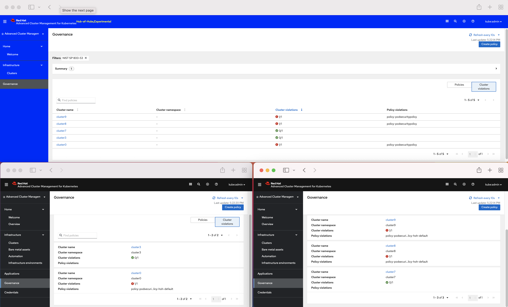

# The Hub-of-Hubs basic-demo script

1. The user observes all the managed clusters of the connected hubs in the Clusters view of the Hub-of-Hubs Web console.
1. The user defines a policy, a placement rule and a placement rule binding in their namespace, by Hub-of-Hubs Web console or
by CLI (`kubectl`, `oc`) of the Hub-of-Hubs OpenShift clster.
1. The user observes policy compliance status in the Web console of Hub of Hubs and in the Web console of the hubs connected to the Hub of Hubs.

## Prerequisites

1. Three clusters with ACM 2.4 Hubs on them, `hoh` (the _Hub of Hubs_), `hub1` and `hub2` (two Hubs to connect to the Hub of Hubs). The minimal [requirements for ACM 2.4](https://access.redhat.com/documentation/en-us/red_hat_advanced_cluster_management_for_kubernetes/2.4/html/install/installing#requirements-and-recommendations) are sufficient for this demo.
1. Some managed clusters [imported into](https://access.redhat.com/documentation/en-us/red_hat_advanced_cluster_management_for_kubernetes/2.4/html/clusters/managing-your-clusters#importing-a-target-managed-cluster-to-the-hub-cluster) (or [created by](https://access.redhat.com/documentation/en-us/red_hat_advanced_cluster_management_for_kubernetes/2.4/html/clusters/managing-your-clusters#creating-a-cluster)) both `hub1` and `hub2`.
1. [Access to the ACM Web console](https://access.redhat.com/documentation/en-us/red_hat_advanced_cluster_management_for_kubernetes/2.4/html/web_console/web-console#accessing-your-console) of the three ACM hubs.

## Setup

1. [Deploy Hub-of-Hubs components](https://github.com/stolostron/hub-of-hubs/blob/main/deploy/README.md) on `hoh`.
2. [Deploy Hub-of-Hubs-agent components](https://github.com/stolostron/hub-of-hubs/tree/main/deploy#deploying-a-hub-of-hubs-agent) on `hub1` and `hub2`.
3. Define environment variables to hold kubernetes configurations of the clusters, `TOP_HUB_CONFIG`, `HUB1_CONFIG` and `HUB2_CONFIG`.
4. If you do not have access to `hoh` as the `kubeadmin` user, [add an alternative user as the admin to Hub-of-Hubs RBAC](https://github.com/stolostron/hub-of-hubs-rbac#update-role-bindings-or-role-definitions).

## The demo script

1.  Login into the Web console of `hoh` as the `kubeadmin` user. The Hub-of-Hubs Web console has the same URL as the original [ACM Web console URL](https://access.redhat.com/documentation/en-us/red_hat_advanced_cluster_management_for_kubernetes/2.4/html/web_console/web-console#accessing-your-console).

    If you cannot login as `kubeadmin`, [add an alternative user as the admin to Hub-of-Hubs RBAC](https://github.com/stolostron/hub-of-hubs-rbac#update-role-bindings-or-role-definitions).

1.  Observe managed clusters in the Web console of `hoh`, of `hub1` and of `hub2`.
    Note that the Web console of `hoh` contains managed clusters of both `hub1` and `hub2`.

    The screenshot below shows an example setup. The Web console of `hub1` is at the bottom left quarter, `hub1` manages clusters `cluster0`-`cluster4`.
    The Web console of `hub2` is at the bottom right quarter, `hub2` manages clusters `cluster5`-`cluster9`.
    The Web console of `hoh`, with a distinctive blue color design, appears at the top half of the screen. It contains the clusters of both `hub1` and `hub2`,
    namely `cluster0`-`cluster9`.

    


1.  Note that the managed clusters on `hoh` are not represented by Kubernetes Custom Resources (not stored in etcd), and cannot be queried by `oc`:

    ```
    $ oc get managedcluster --kubeconfig $TOP_HUB_CONFIG
    No resources found
    ```

1.  Add the `env=production` label to some of the managed clusters of `hub1` and `hub2`, either by `oc` or [in the Web console](https://access.redhat.com/documentation/en-us/red_hat_advanced_cluster_management_for_kubernetes/2.4/html/clusters/managing-your-clusters#managing-cluster-labels) of `hub1`/`hub2`.

    ```
    $ oc label managedcluster <some-cluster> env=production --kubeconfig $HUB1_CONFIG
    ```

1.  Note that the new labels appear in the Cluster View of `hoh`.

    The screenshot below shows the previous example setup with labels `env=production` on clusters `cluster0`, `cluster3`, `cluster7`, `cluster8` and `cluster9`.
    The labels appear in the Cluster View of `hub1`, `hub2` and `hoh`.

    

1.  Create a policy, a placement rule and a placement binding in `hoh` cluster by `oc`. The policy used in the instructions below is an [ACM pod security policy](https://access.redhat.com/documentation/en-us/red_hat_advanced_cluster_management_for_kubernetes/2.4/html/governance/governance#pod-security-policy). The placement rule selects clusters with the `env=production` label.

    ```
    $ oc apply -f https://raw.githubusercontent.com/stolostron/hub-of-hubs/main/demos/policy-psp.yaml --kubeconfig $TOP_HUB_CONFIG
    policy.policy.open-cluster-management.io/policy-podsecuritypolicy created
    placementbinding.policy.open-cluster-management.io/binding-policy-podsecuritypolicy created
    placementrule.apps.open-cluster-management.io/placement-policy-podsecuritypolicy created
    ```

1.  Observe the policy in the Web console of `hoh`, `hub1` and `hub2`.

    The screenshot below shows `policy-podsecuritypolicy` in the Governance view of `hoh`, of `hub1` and of `hub2`.
    The policy is applied to two managed clusters of `hub1` and to three managed clusters of `hub2`.
    One managed cluster in `hub1` and two managed clusters in `hub2` violate the policy.
    Note that you can see in the Governance view of `hoh` aggregation of the managed clusters the policy is applied to.
    You can also observe in the Governance view of `hoh` aggregation of the cluster violations.
    In `hoh`, the policy is shown as applied to five clusters (in total) and it has three (in total) cluster violations.

    

1.  Click on the _Cluster violantions_ link in the Governance view of `hoh`, `hub1` and `hub2`.
    Note that all the managed clusters labeled with `env=production` from both `hub1` and `hub2` appear in the Cluster violiations view of `hoh`.

    The screenshot below shows the Cluster violations view of `hoh`, of `hub1` and of `hub2`. The managed clusters labeled with `env=production`, namely
    `cluster0`, `cluster3`, `cluster7`, `cluster8` and `cluster9`, appear in the violations view of `hoh`. Clusters `cluster0`, `cluster8` and `cluster9`
    appear as noncompliant in the Cluster violations view of `hoh`, and in the respective views of `hub1` and `hub2`.


    

1.  Change compliance of one of the managed clusters of `hub1`. To make the managed cluster compliant, run:

    ```
    $ kubectl apply -f https://raw.githubusercontent.com/stolostron/hub-of-hubs/main/demos/psp.yaml --kubeconfig <a managed cluster config>
    ```

1.  Observe changes of the compliance status in the Web console of `hoh` and `hub1`.

1.  Change the remediation action in the Web console of `hoh` to `enforce`. Observe propagation of the changes and the status.

    The screenshot below shows the policy in the Governance view of `hoh`, of `hub1` and of `hub2`. The remediation action is `enforce` in
    all of the views, and there are no cluster violations.

    

1.  Delete the policy in the Web console of `hoh`. Observe propagation of the deletion to `hub1` and `hub2`.
