# The Hub-of-Hubs multiple-desktop basic-demo script

The following figure shows the setup of this demo. ACM Hub `hub1` manages clusters named
 `cluster0`, `cluster1`, `cluster2`, `cluster3` and `cluster4`.
The ACM Hub `hub2` manages clusters named `cluster5`, `cluster6`, `cluster7`, `cluster8` and `cluster9`.
Hub-of-Hubs provides federated view on all the managed clusters and allows to apply a policy to the managed clusters of
both `hub1` and `hub2`. Hub-of-Hubs-agent components are installed on `hub1` and `hub2` to provide the Hub-of-Hubs
functionality.

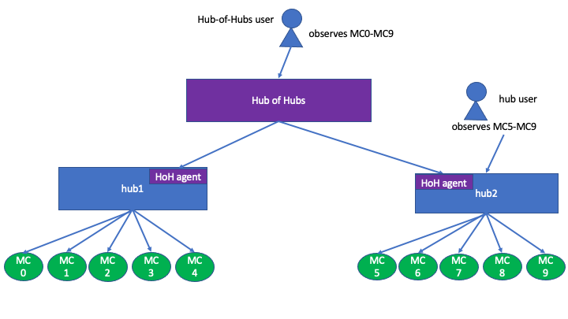

1.  Login into the Web console of `hub1`. As the `hub1` user, observe managed clusters `cluster0` to `cluster4` in the
    Cluster view.

1.  In the terminal of the `hub1` user, run:

    ```
    kubectl get managedcluster
    ```

    You should see clusters `cluster0` to `cluster4` returned.

    

1.  Perform the previous two steps as the user of `hub2`.

    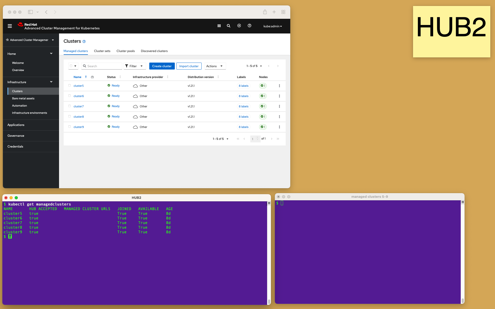

1.  Login into the Web console of Hub of Hubs as the `kubeadmin` user. The Hub-of-Hubs Web console has the same URL as the original [ACM Web console URL](https://access.redhat.com/documentation/en-us/red_hat_advanced_cluster_management_for_kubernetes/2.4/html/web_console/web-console#accessing-your-console).

    If you cannot login as `kubeadmin`, [add an alternative user as the admin to Hub-of-Hubs RBAC](https://github.com/stolostron/hub-of-hubs-rbac#update-role-bindings-or-role-definitions).

    Note that as a user of Hub of Hubs, you can observe the managed clusters of both `hub1` and `hub2`.

1.  Note that the managed clusters on the Hub-of-Hubs cluster are not represented by Kubernetes Custom Resources
    (not stored in etcd), and cannot be queried by `kubectl`:

    ```
    $ kubectl get managedcluster
    No resources found
    ```

    

1.  Browse the Web console of Hub of Hubs. Note that the Web console of Hub of Hubs has a distinct color from the
    Web console of ACM Hubs. Also note that it has `Hub-of-Hubs,Experimental` in its title.

    Currently the Web console of Hub of Hubs has only three views, namely `Welcome`, `Clusters` and
    `Governance`. Also note that the Cluster view has neither tabs nor buttons to create or import a cluster.
    The cluster table does not have actions to detach a cluster or to edit cluster labels.

    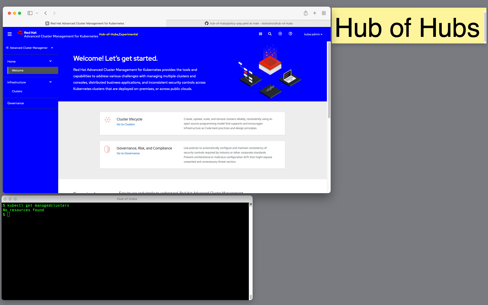

1.  As a user of `hub1`, add the `env=production` label to `cluster0` and `cluster3`, either by `kubectl`
    or
    [in the Web console](https://access.redhat.com/documentation/en-us/red_hat_advanced_cluster_management_for_kubernetes/2.4/html/clusters/managing-your-clusters#managing-cluster-labels)
    of `hub1`.

    ```
    kubectl label managedcluster cluster0 env=production
    kubectl label managedcluster cluster3 env=production
    ```

    

1.  As a user of `hub2`, add the `env=production` label to `cluster7`, `cluster8` and `cluster9`.

    ```
    kubectl label managedcluster cluster7 env=production
    kubectl label managedcluster cluster8 env=production
    kubectl label managedcluster cluster9 env=production
    ```

    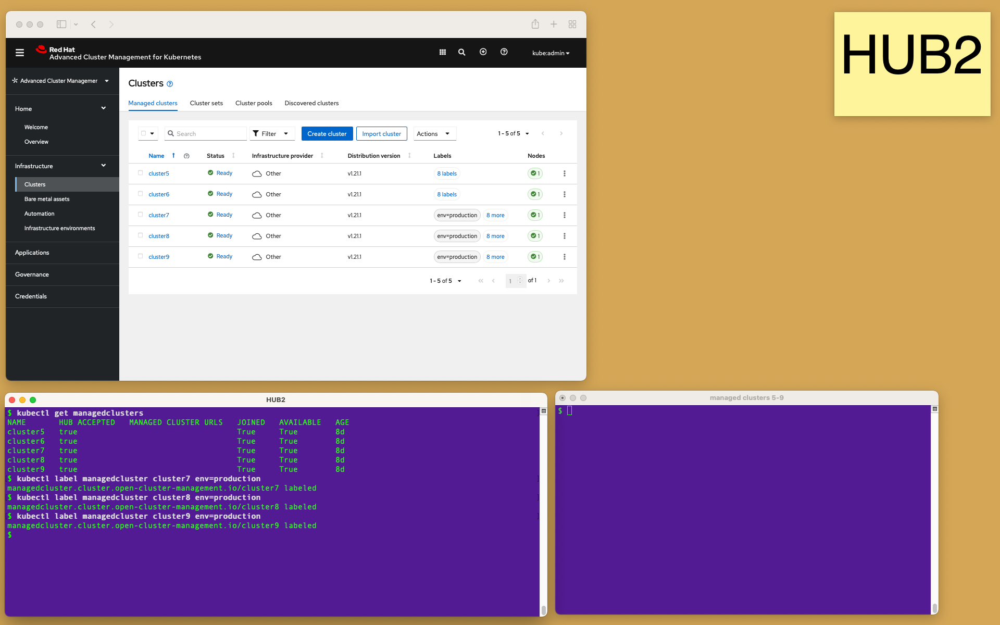

1.  Note that the new labels appear in the Cluster View of Hub of Hubs.

    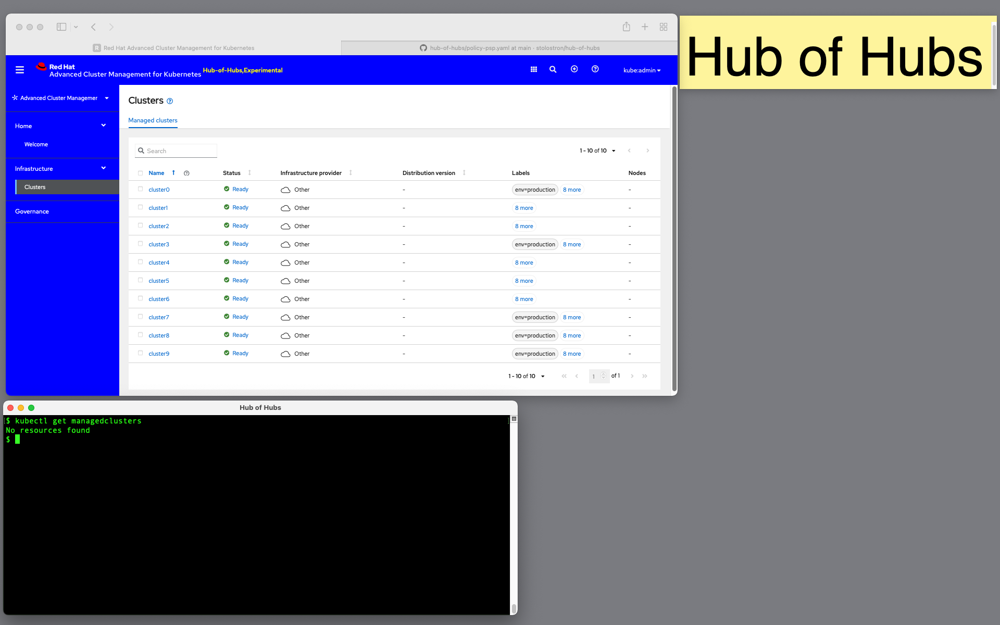

1.  In the following steps you will apply a policy to managed clusters as a Hub-of-Hubs user. Verify in the
    Governance view of Hub-of-Hubs, `hub1` and `hub2` that currently no policies are defined.

    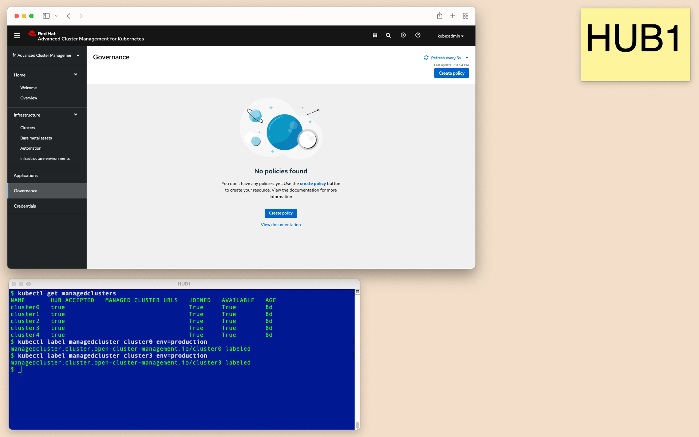

    

    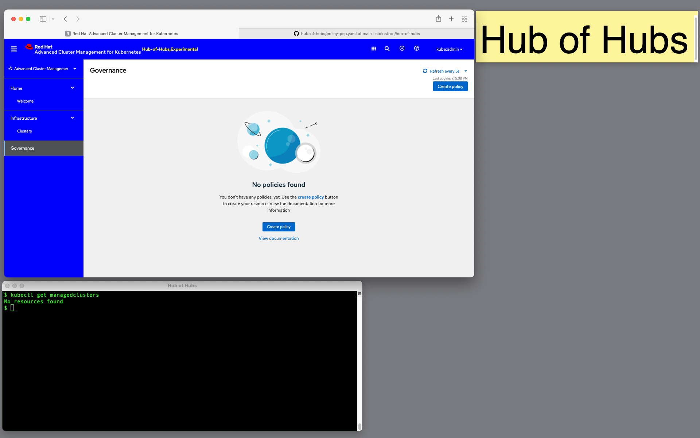

1.  Observe
    [the YAML of the policy, placement rule and placement binding](https://raw.githubusercontent.com/stolostron/hub-of-hubs/main/demos/policy-psp.yaml )
    you will apply in the next step as a Hub-of-Hubs user.

    Note that the ACM CRs (`Policy`, `PlacementRule` and `PlacementBinding`) are used for Hub of Hubs AS IS.
    The ACM policy in the YAML is an [ACM pod security policy](https://access.redhat.com/documentation/en-us/red_hat_advanced_cluster_management_for_kubernetes/2.4/html/governance/governance#pod-security-policy).
    The placement rule selects clusters with the `env=production` label.

    Note that the placement rule does not specify the ACM hubs, only the labels of the managed clusters. The ACM hubs
    are transparent to Hub-of-Hubs users, they are not represented in the Hub-of-Hubs Web console.

1.  As a Hub-of-Hubs user, create a policy, a placement rule and a placement binding by `kubectl`.

    ```
    $ kubectl apply -f https://raw.githubusercontent.com/stolostron/hub-of-hubs/main/demos/policy-psp.yaml
    policy.policy.open-cluster-management.io/policy-podsecuritypolicy created
    placementbinding.policy.open-cluster-management.io/binding-policy-podsecuritypolicy created
    placementrule.apps.open-cluster-management.io/placement-policy-podsecuritypolicy created
    ```

1.  Observe the policy in the Web console of Hub of Hubs, `hub1` and `hub2`.

    

    

    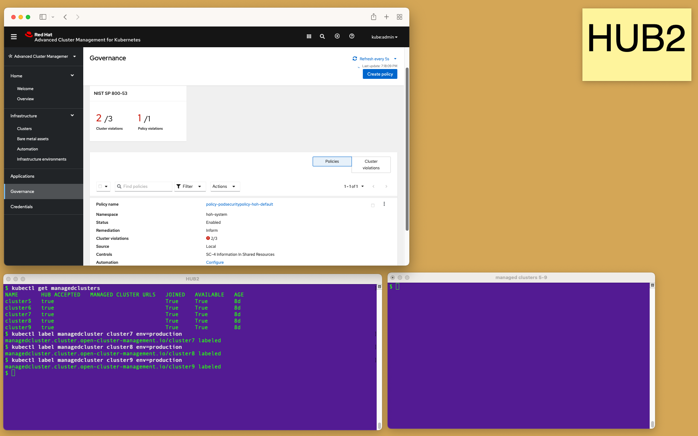

1.  Click on the _Cluster violations_ link in the Governance view of `hub1`, `hub2` and Hub of Hubs.
    Note that all the managed clusters labeled with `env=production` from both `hub1` and `hub2` appear in the Cluster
    violations view of Hub of Hubs. The Web console of Hub-of-Hubs shows aggregation of violations in all the
    managed clusters.

    

    

    

1.  Change compliance of one of the managed clusters of `hub2`. To make the managed cluster compliant, run:

    ```
    kubectl apply -f https://raw.githubusercontent.com/stolostron/hub-of-hubs/main/demos/psp.yaml --kubeconfig <a managed cluster config>
    ```

1.  Observe changes of the compliance status in the Web consoles of `hub2` and of Hub of Hubs. The screenshots below
    show `cluster9` made compliant.

    

    

1.  Change the remediation action in the Web console of Hub of Hubs to `enforce`.
    Observe propagation of the changes and the status in the Governance view of Hub of Hubs, `hub1` and `hub2`.

    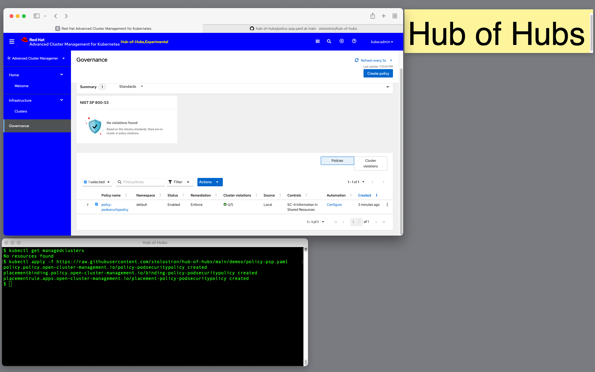

    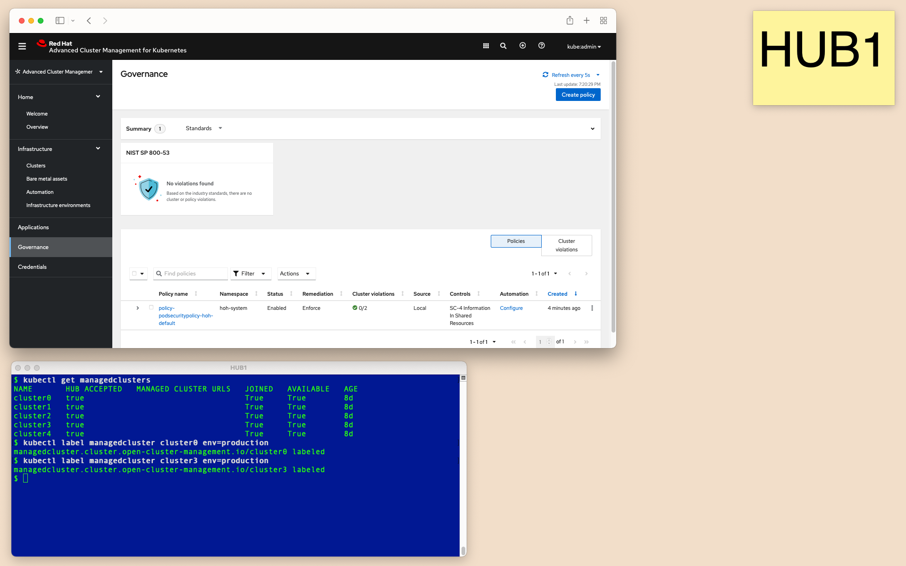

    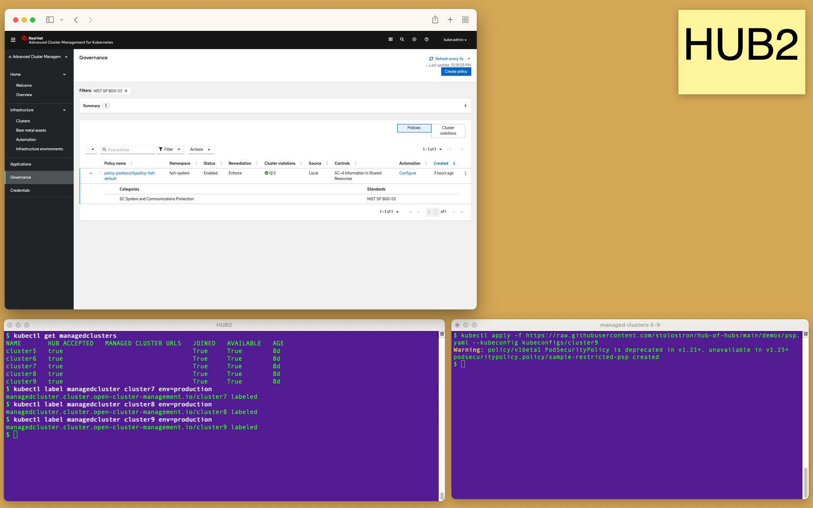

1.  Delete the policy in the Web console of Hub of Hubs. Observe propagation of the deletion to `hub1` and `hub2`.
