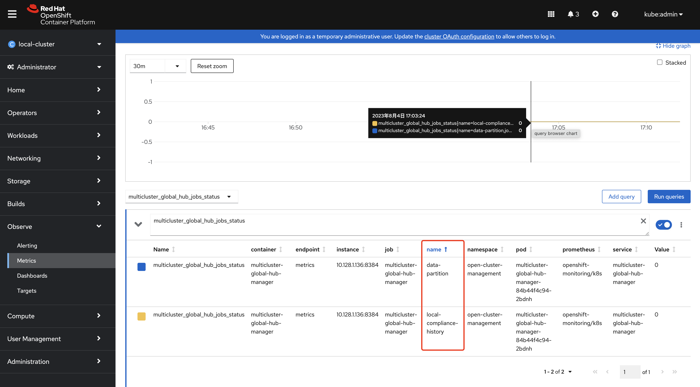

# Multicluster Global Hub

The multicluster global hub is a set of components that enable the management of multiple hub clusters from a single hub cluster. You can complete the following tasks by using the multicluster global hub:

- Deploy managed hub clusters
- List the managed clusters that are managed by all of the managed hub clusters

The multicluster global hub is useful when a single hub cluster cannot manage the large number of clusters in a high-scale environment. The multicluster global hub designates multiple managed clusters as multiple managed hub clusters. The global hub cluster manages the managed hub clusters.

- [Multicluster Global Hub](#multicluster-global-hub)
  - [Use Cases](./global_hub_use_cases.md)
  - [Architecture](#architecture)
    - [Multicluster Global Hub Operator](#multicluster-global-hub-operator)
    - [Multicluster Global Hub Manager](#multicluster-global-hub-manager)
    - [Multicluster Global Hub Agent](#multicluster-global-hub-agent)
    - [Multicluster Global Hub Observability](#multicluster-global-hub-observability)
  - [Workings of Global Hub](./how_global_hub_works.md)
  - [Quick Start](#quick-start)
    - [Prerequisites](#prerequisites)
      - [Support matrix](#support-matrix)
      - [Dependencies](#dependencies)
      - [Network configuration](#network-configuration)
    - [Installation](#installation)
      - [1. Install the multicluster global hub operator on a disconnected environment](#1-install-the-multicluster-global-hub-operator-on-a-disconnected-environment)
      - [2. Install the multicluster global hub operator from OpenShift console](#2-install-the-multicluster-global-hub-operator-from-openshift-console)
    - [Import a managed hub cluster in default mode (tech preview)](#import-a-managed-hub-cluster-in-default-mode-tech-preview)
    - [Access the grafana](#access-the-grafana)
    - [Grafana dashboards](#grafana-dashboards)
    - [Cronjobs and Metrics](#cronjobs-and-metrics)
  - [Troubleshooting](./troubleshooting.md)
  - [Development preview features](./dev-preview.md)
  - [Known issues](#known-issues)

## Use Cases

You can read about the use cases for multicluster global hub in [Use Cases](./global_hub_use_cases.md).

## Architecture


### Multicluster Global Hub Operator

The Multicluster Global Hub Operator contains the components of multicluster global hub. The Operator deploys all of the required components for global multicluster management. The components include `multicluster-global-hub-manager` in the global hub cluster and `multicluster-global-hub-agent` in the managed hub clusters.

The Operator also leverages the `manifestwork` custom resource to deploy the Red Hat Advanced Cluster Management for Kubernetes Operator on the managed cluster. After the Red Hat Advanced Cluster Management Operator is deployed on the managed cluster, the managed cluster becomes a standard Red Hat Advanced Cluster Management Hub cluster. This hub cluster is now a managed hub cluster.

### Multicluster Global Hub Manager

The Multicluster Global Hub Manager is used to persist the data into the `postgreSQL` database. The data is from Kafka transport. The manager also posts the data to the Kafka transport, so it can be synchronized with the data on the managed hub clusters.

### Multicluster Global Hub Agent

The Multicluster Global Hub Agent runs on the managed hub clusters. It synchronizes the data between the global hub cluster and the managed hub clusters. For example, the agent synchronizes the information of the managed clusters from the managed hub clusters with the global hub cluster and synchronizes the policy or application from the global hub cluster and the managed hub clusters.

### Multicluster Global Hub Observability

Grafana runs on the global hub cluster as the main service for Global Hub Observability. The Postgres data collected by the Global Hub Manager is its default DataSource. By exposing the service using the route called `multicluster-global-hub-grafana`, you can access the global hub Grafana dashboards by accessing the Red Hat OpenShift Container Platform console.

## Workings of Global Hub

To understand how Global Hub functions, see [How global hub works](how_global_hub_works.md).

## Quick Start

The following sections provide the steps to start using the Multicluster Global Hub.

### Prerequisites
#### Dependencies

- Red Hat Advanced Cluster Management for Kubernetes verison 2.7 or later must be installed and configured. [Learn more details about Red Hat Advanced Cluster Management](https://access.redhat.com/documentation/en-us/red_hat_advanced_cluster_management_for_kubernetes/2.8)

#### Sizing
[Sizing your Red Hat Advanced Cluster Management cluster](https://access.redhat.com/documentation/en-us/red_hat_advanced_cluster_management_for_kubernetes/2.7/html/install/installing#sizing-your-cluster)


#### Network configuration

The managed hub is also a managed cluster of global hub in Red Hat Advanced Cluster Management. The network configuration in Red Hat Advanced Cluster Management is necessary. See [Networking](https://access.redhat.com/documentation/en-us/red_hat_advanced_cluster_management_for_kubernetes/2.7/html/networking/networking) for Red Hat Advanced Cluster Management networking details.

1. Global hub networking requirements

| Direction | Protocol | Connection | Port (if specified) | Source address |	Destination address |
| ------ | ------ | ------ | ------ |------ | ------ |
|Inbound from browser of the user | HTTPS | User need to access the Grafana dashboard | 443 | Browser of the user | IP address of Grafana route |
| Outbound to Kafka Cluster | HTTPS | Global hub manager need to get data from Kafka cluster | 443 | multicluster-global-hub-manager-xxx pod | Kafka route host |
| Outbound to Postgres database | HTTPS | Global hub manager need to persist data to Postgres database | 443 | multicluster-global-hub-manager-xxx pod | IP address of Postgres database |

2. Managed hub networking requirements

| Direction | Protocol | Connection | Port (if specified) | Source address |	Destination address |
| ------ | ------ | ------ | ------ | ------ | ------ |
| Outbound to Kafka Cluster | HTTPS | Global hub agent need to sync cluster info and policy info to Kafka cluster | 443 | multicluster-global-hub-agent pod | Kafka route host |

#### Support matrix

Multicluster global hub has two main components:
- A server component called the "global hub cluster" where the management tools and user interface run 
- A client component that is installed on RHACM called the "managed hub" that can be managed by the "global hub cluster"

Supported platform for MCGH:
| Platform | Support for global hub cluster | Support for managed hub clusters |
| --- | --- | --- |
| Red Hat Advanced Cluster Management (RHACM) 2.9, and later 2.9.x releases | Y | Y |
| Red Hat Advanced Cluster Management (RHACM) 2.8, and later 2.8.x releases | Y | Y |
| Red Hat Advanced Cluster Management (RHACM) 2.7, and later 2.7.x releases | Y | Y |
| Red Hat Advanced Cluster Management (RHACM) 2.6, and former release | N | N |

Supported middleware for MCGH:
| Middleware | Support for multicluster global hub |
| --- | --- |
| Kafka 3.3, and later 3.3.x releases | Y |
| Postgres 14+ | Y |


### Installation

1. [Install the multicluster global hub operator on a disconnected environment](./disconnected_environment/README.md)

2. Install the multicluster global hub operator from the Red Hat OpenShift Container Platform console:

    1. Log in to the Red Hat OpenShift Container Platform console as a user with the `cluster-admin` role.
    2. Click **Operators** > OperatorHub icon in the navigation.
    3. Search for and select the `multicluster global hub operator`.
    4. Click `Install` to start the installation.
    5. After the installation completes, check the status on the *Installed Operators* page.
    6. Click **multicluster global hub operator** to go to the *Operator* page.
    7. Click the *multicluster global hub* tab to see the `multicluster global hub` instance.
    8. Click **Create multicluster global hub** to create the `multicluster global hub` instance.
    9. Enter the required information and click **Create** to create the `multicluster global hub` instance.

    **Notes:**
    * The multicluster global hub is only available for the x86 platform.

### Import a managed hub cluster in default mode (Technology Preview)

You must disable the cluster self-management in the existing Red Hat Advanced Cluster Management hub cluster. Set `disableHubSelfManagement=true` in the `multiclusterhub` custom resource to disable the automatic importing of the hub cluster as a managed cluster.

Import the managed hub cluster by completing the steps in [Import cluster](https://access.redhat.com/documentation/en-us/red_hat_advanced_cluster_management_for_kubernetes/2.8/html-single/clusters/index#importing-a-target-managed-cluster-to-the-hub-cluster).

After the managed hub cluster is imported, check the global hub agent status to ensure that the agent is running in the managed hub cluster by running the following command:

```
oc get managedclusteraddon multicluster-global-hub-controller -n ${MANAGED_HUB_CLUSTER_NAME}
```

### Access the Grafana data

The Grafana data is exposed through the route. Run the following command to display the login URL:

```
oc get route multicluster-global-hub-grafana -n <the-namespace-of-multicluster-global-hub-instance>
```

The authentication method of this URL is same as authenticating to the Red Hat OpenShift Container Platform console.

### Grafana dashboards

After accessing the global hub Grafana data, you can begin monitoring the policies that were configured through the hub cluster environments that are managed. From the global hub dashboard, you can identify the compliance status of the policies of the system over a selected time range. The policy compliance status is updated daily, so the dashboard does not display the status of the current day until the following day.


To navigate the global hub dashboards, you can choose to observe and filter the policy data by grouping them either by `policy` or `cluster`. If you prefer to examine the policy data by using the `policy` grouping, you should start from the default dashboard called `Global Hub - Policy Group Compliancy Overview`. This dashboard allows you to filter the policy data based on `standard`, `category`, and `control`. After selecting a specific point in time on the graph, you are directed to the `Global Hub - Offending Policies` dashboard, which lists the non-compliant or unknown policies at that time. After selecting a target policy, you can view related events and see what has changed by accessing the `Global Hub - What's Changed / Policies` dashboard.


Similarly, if you want to examine the policy data by `cluster` grouping, begin by using the `Global Hub - Cluster Group Compliancy Overview` dashboard. The navigation flow is identical to the `policy` grouping flow, but you select filters that are related to the cluster, such as managed cluster `labels` and `values`. Instead of viewing policy events for all clusters, after reaching the `Global Hub - What's Changed / Clusters` dashboard, you can view policy events related to an individual cluster.

### Grafana Alerts (Technology Preview)
#### Default Grafana Alerts
We have three alerts by default. These alerts are stored in configmap `multicluster-global-hub-default-alerting`. They will watch suspicious policies, suspicious clusters compliance status change and failed cron jobs.
1. Suspicious Policy Change
This Alert rule watches the suspicious policies change, if the following events occur more than 5 times in 1 hour, it becomes a firing alert.
- A policy was enabled/disabled
- A policy was updated

2. Suspicious Cluster Compliance Status Change
This alert watches the cluster compliance status and policy events for a cluster. There are two rules in this alert.
- Cluster compliance status change frequently
  If a cluster compliance status changes from `compliance` to `non-compliance` more than 3 times in 1 hour, it becomes a firing alert.
- Too many policy events in a cluster
  For a policy in a cluster, if there are more than 20 events in 5 minutes, it becomes a firing alert. If this alert is always firing, the data in the `event.local_policies` table will increase too fast.

3. Cron Job Failed
This alert watch the [Cron jobs](#Cronjobs-and-Metrics) failed events. There are two rules in this alert.
- Local Compliance Job Failed
  If this alert rule becomes firing, it means the [Local compliance status sync job](#Local-compliance-status-sync-job) failed. It may cause the data to be lost in the `history.local_compliance` table. Please check it and [manually run the job](./how_global_hub_works.md#running-the-summarization-process-manually)

- Data Retention Job Failed
  If this alert rule becomes firing, it means the [Data retention job](#data-retention-job) failed and you can also [run it manually](./troubleshooting.md#run-the-data-retetion-job-manually).

#### Delete Default Grafana Alert Rule
If you want to delete a default grafana alert rule, you need to create the [Customize Grafana Alerting Resources](#Customize-Grafana-Alerting-Resources) and include the `deleteRules`.

For deleting all default alerting, the config should be like:
```
    deleteRules:
      - orgId: 1
        uid: globalhub_suspicious_policy_change
      - orgId: 1
        uid: globalhub_cluster_compliance_status_change_frequently
      - orgId: 1
        uid: globalhub_high_number_of_policy_events
      - orgId: 1
        uid: globalhub_data_retention_job
      - orgId: 1
        uid: globalhub_local_compliance_job
```

#### Customize Grafana Alerts
##### Customize grafana.ini
Global hub support customize the grafana.ini files. You just need to create a secret in namespace `multicluster-global-hub`, and the secret name must be: `multicluster-global-hub-custom-grafana-config`, the secret data key must be: `grafana.ini`. The following is an example:
```yaml
apiVersion: v1
kind: Secret
metadata:
  name: multicluster-global-hub-custom-grafana-config
  namespace: multicluster-global-hub
type: Opaque
stringData:
  grafana.ini: |
    [smtp]
    enabled = true
    host = smtp.google.com:465
    user = example@google.com
    password = xxx
    ;cert_file =
    ;key_file =
    skip_verify = true
    from_address = example@163.com
    from_name = Grafana	
    # EHLO identity in SMTP dialog (defaults to instance_name)
    ;ehlo_identity = dashboard.example.com
```
Note: you can not config the section which already in `multicluster-global-hub-default-grafana-config` secret

##### Customize Grafana Alerting Resources 
Global hub support customize the alerting resources which [grafana support](https://grafana.com/docs/grafana/v9.5/alerting/set-up/provision-alerting-resources/file-provisioning/). You just need to create a configmap in namespace `multicluster-global-hub`, and the configmap name must be: `multicluster-global-hub-custom-alerting`, the configmap data key must be: `alerting.yaml`. The following is an example:

```yaml
apiVersion: v1
data:
  alerting.yaml: |
    contactPoints:
      - orgId: 1
        name: globalhub_policy
        receivers:
          - uid: globalhub_policy_alert_email
            type: slack
            type: email
            settings:
              addresses: example@redhat.com
              singleEmail: false
          - uid: globalhub_policy_alert_slack
            type: slack
            settings:
              url: <Slack Webhook URL>
              title: |
                {{ template "globalhub.policy.title" . }}
              text: |
                {{ template "globalhub.policy.message" . }}              
    policies:
      - orgId: 1
        receiver: globalhub_policy
        group_by: ['grafana_folder', 'alertname']
        matchers:
          - grafana_folder = Policy
        repeat_interval: 1d
    deleteRules:
      - orgId: 1
        uid: <Alert Rule Uid>
    muteTimes:
      - orgId: 1
        name: mti_1
        time_intervals:
          - times:
              - start_time: '06:00'
                end_time: '23:59'
                location: 'UTC'
            weekdays: ['monday:wednesday', 'saturday', 'sunday']
            months: ['1:3', 'may:august', 'december']
            years: ['2020:2022', '2030']
            days_of_month: ['1:5', '-3:-1']
kind: ConfigMap
metadata:
  name: multicluster-global-hub-custom-alerting
  namespace: multicluster-global-hub

```

### Cronjobs and Metrics

After installing the global hub operand, the global hub manager starts running and pull ups a job scheduler to schedule two cronjobs:

#### Local compliance status sync job

  At 0 o'clock every day, based on the policy status and events collected by the manager on the previous day. Running the job to summarize the compliance status and change frequency of the policy on the cluster, and store them to the `history.local_compliance` table as the data source of grafana dashboards. Please refer to [here](./how_global_hub_works.md) for more details.

#### Data retention job

  Some data tables in global hub will continue to grow over time. Generally, they fall into two categories: the policy event tables and the `history.local_compliance` growing every day, the tables containing soft deleted records. The former generates a large amount of data, we use range partitioning to break down the large tables into small partitions. Which helps in executing queries/deletions on these tables faster. The later has a small amount of data, and we add `deletedAt` indexes to these tables to obtain better hard delete performance.

  At the practical level, we run a scheduled job to delete expired data, so as to avoid the table being too large, and there is an additional task for it which is to create a buffer partition table for the next month.

  How long the job should keep the data can be configured through the [retention](https://github.com/stolostron/multicluster-global-hub/blob/main/operator/apis/v1alpha4/multiclusterglobalhub_types.go#L90) on the global hub operand. it's recommended minimum value is `1` month, default value is `18` months. Therefore, the execution interval of this job should be less than one month.

The above cronjobs are executed every time the global hub manager starts. The compliance sync job is run once a day and can be run multiple times within the day without changing the result. The partitioning job is run once a week and also can be run many times per month, the results will not change. 
These two jobs' status are saved in the metrics named `multicluster_global_hub_jobs_status`, as shown in the figure below from the console of the Openshift cluster. Where `0` means the job runs successfully, otherwise `1` means failure. 



If there is a failed job, then you can dive into the log tables(`history.local_compliance_job_log`, `event.data_retention_job_log`) for more details and decide whether to [running it manually](./troubleshooting.md/#cronjobs).

## Troubleshooting

For common Troubleshooting issues, see [Troubleshooting](troubleshooting.md).

## Known issues

1. If the database is empty, the Grafana dashboards show the error `db query syntax error for {dashboard_name} dashboard`. The error is resolved when there is data in the database. The top-level dashboards are populated only the day after data collection is started, as explained in [Workings of Global Hub](how_global_hub_works.md)

2. You cannot drill down by selecting the first datapoint from the `Policy Group Compliancy Overview` dashboard. You can drill down the `Offending Policies` dashboard when you click a datapoint from the `Policy Group Compliancy Overview` dashboard, but it is not working for the first datapoint in the list. This issue also applies to the `Cluster Group Compliancy Overview` dashboard.

3. A managed cluster that is not created successfully (clusterclaim `id.k8s.io` does not exist in the managed cluster) is not counted in global hub policy compliance database, but shows in the Red Hat Advanced Cluster Management policy console.
