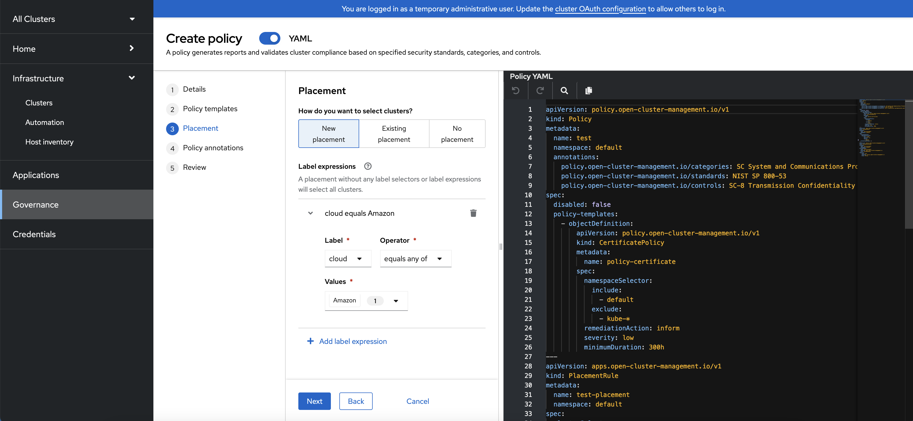

This document focuses on the features of the multicluster global hub provided in dev preview. It is not a final version, but a work in progress.

1. [Overview](#overview)
2. [Architecture](#architecture)
3. [Quick Start Guide](#quick-start)

## Overview

The multicluster global hub is to resolve the problem of a single hub cluster in high scale environment. Due to the limitation of the kubernetes, the single hub cluster can not handle the large number of managed clusters. The multicluster global hub is designed to solve this problem by splitting the managed clusters into multiple regional hub clusters. The regional hub clusters are managed by the global hub cluster.

The multicluster global hub is a set of components that enable the management of multiple clusters from a single hub cluster. It is designed to be deployed on a hub cluster and provides the following features:
- Deploy the regional hub clusters
- List the managed clusters in all the regional hub clusters
- Manage the policies and applications in all the regional hub clusters

## Architecture


### Multicluster Global Hub Operator
Operator is for multicluster global hub. It is used to deploy all required components for multicluster management. The components include multicluster-global-hub-manager in the global hub cluster and multicluster-global-hub-agent in the regional hub clusters.

The Operator also leverages the manifestwork to deploy the Advanced Cluster Management for Kubernetes in the managed cluster. So the managed cluster is switched to a standard ACM Hub cluster (regional hub cluster).

### Multicluster Global Hub Manager
The manager is used to persist the data into the postgreSQL. The data is from Kafka transport. The manager is also used to post the data to Kafka transport so that it can be synced to the regional hub clusters.

### Multicluster Global Hub Agent
The agent is running in the regional hub clusters. It is responsible to sync-up the data between the global cluster hub and the regional hub clusters. For instance, sync-up the managed clusters' info from the regional hub clusters to the global hub cluster and sync-up the policy or application from the global hub cluster to the regional hub clusters.

### Multicluster Global Hub Observability
Grafana runs on the global hub cluster, as the main service for Global Hub Observability. The Postgres data collected by the Global Hub Manager services as its default DataSource. By exposing the service via route(`multicluster-global-hub-grafana`), you can access the global hub grafana dashboards just like accessing the openshift console.

## Quick Start

### Prerequisites

#### Storage secret

Both the global hub manager and grafana services need a postgres database to collect and display data. The data can be accessed by creating a storage secret, which contains the following two fields.
- `database_uri`: Required, the URI user should have the permission to create the global hub database in the postgres.
- `ca.crt`: Optional, if your database service has TLS enabled, you can provide the appropriate certificate depending on the SSL mode of the connection. If the SSL mode is `verify-ca` and `verify-full`, then the `ca.crt` certificate must be provided.


### Installation

#### Install the multicluster global hub operator from OpenShift console

1. Log in to the OpenShift console as a user with cluster-admin role.
2. Click the Operators -> OperatorHub icon in the left navigation panel.
3. Search for the `multicluster global hub operator`.
4. Click the `multicluster global hub operator` to start the installation. You will see the prerequisites for the installation:
    - Red Hat Advanced Cluster Management for Kubernetes (RHACM) 2.7 or later needs to be installed.
    - PostgreSQL needs to be installed and you must create database for the multicluster global hub
    - Kafka needs to be installed, and you must create two topics: spec and status.
> Note: There are sample scripts provided to allow you to install PostgreSQL and Kafka easily.
5. Click the `Install` button to start the installation when you are ready.
6. Wait for the installation to complete. You can check the status in the `Installed Operators` page.
7. Click the `multicluster global hub operator` to go to the operator page.
8. Click the `multicluster global hub` tab to see the `multicluster global hub` instance.
9. Click the `Create multicluster global hub` button to create the `multicluster global hub` instance.
10. Fill in the required information and click the `Create` button to create the `multicluster global hub` instance.

> Note: the multicluster global hub is available for x86 platform only right now.


### Create a regional hub cluster
Refer to the original [Create cluster](https://access.redhat.com/documentation/en-us/red_hat_advanced_cluster_management_for_kubernetes/2.6/html/multicluster_engine/multicluster_engine_overview#creating-a-cluster) document to create the managed cluster in the global hub cluster. The new created managed cluster can be switched to be a regional hub cluster automatically. In other words, the latest released RHACM is installed in this managed cluster. You can get the ACM hub information in the cluster overview page.

### Import a reginal hub cluster
#### Import a regional hub cluster in default mode
It requires to disable the cluster self management in the existing ACM hub cluster. Set `disableHubSelfManagement=true` in the `multiclusterhub` CR to disable automatic import of the hub cluster as a managed cluster.

After that, follow the [Import cluster](https://access.redhat.com/documentation/en-us/red_hat_advanced_cluster_management_for_kubernetes/2.6/html/multicluster_engine/multicluster_engine_overview#importing-a-cluster) document to import the regional hub cluster.

#### Import a regional hub cluster in hosted mode

It does not require any changes before importing it. The ACM agent is running in a hosting cluster.
1. Import the cluster from the ACM console, add these annotations to the managedCluster, use the kubeconfig import mode, and disable all add-ons.
```
import.open-cluster-management.io/klusterlet-deploy-mode: Hosted
import.open-cluster-management.io/hosting-cluster-name: local-cluster
import.open-cluster-management.io/klusterlet-namespace: <customized ns>
addon.open-cluster-management.io/disable-automatic-installation: "true"
```

Click `Next` Button to complete the import process.

2. Enable work-manager addon after the imported cluster is available.
```
oc apply -f - <<EOF
apiVersion: addon.open-cluster-management.io/v1alpha1
kind: ManagedClusterAddOn
metadata:
  name: work-manager
  namespace: hub1
  annotations:
    addon.open-cluster-management.io/hosting-cluster-name: local-cluster
spec:
  installNamespace: open-cluster-management-hub1-addon-workmanager
EOF
```
You have to create a kubeconfig secret for the work-manager add-on via the following command:
```
oc create secret generic work-manager-managed-kubeconfig --from-file=kubeconfig=<your regional hub kubeconfig> -n open-cluster-management-hub1-addon-workmanager
```

#### Access the grafana
The grafana is exposed through Route, you can use the following command to get the login URL. The authentication method of this URL is the same as the openshift console, so you don't have to worry about using another authentication.
```bash
oc get route multicluster-global-hub-grafana -n <the-namespace-of-multicluster-global-hub-instance>
```

#### Create a global policy
You can navigate to `Governance` from the navigation menu, and then click the `Create policy` to create a global policy. The `policyset` is not supported yet.

If you want to create a global policy which can be propagated to regional hub clusters by transport, you need to add `global-hub.open-cluster-management.io/global-resource=""` manually for the Policy/PlacementRule/PlacementBinding.
#### Create a global application
You can navigate to `Applications` from the navigation menu, and then click the `Create application` to select `Subscription`. The `ApplicationSet` is not supported yet.
If you want to create a global application which can be propagated to regional hub clusters by transport, you need to add `global-hub.open-cluster-management.io/global-resource=""` manually for the Application/PlacementRule/Subscription.
#### Access the global resources via multicluster global hub APIs
Multicluster global hub APIs contains three resource categories: managed clusters, policies, application subscriptions. Each type of resource has two possible requests: list, get.

<strong>Prerequisites:</strong>
- You need log into the multicluster global hub cluster and retrieve the access token by running

    ```bash
    export TOKEN=$(oc whoami -t)
    ```
    to access the multicluster global hub APIs.

- Get the host of multicluster global hub API

```bash
export GLOBAL_HUB_API_HOST=$(oc -n open-cluster-management get route multicluster-global-hub-manager -o jsonpath={.spec.host})
```

1. List managed clusters:

```bash
curl -sk -H "Authorization: Bearer $TOKEN" "https://$GLOBAL_HUB_API_HOST/global-hub-api/v1/managedclusters"
curl -sk -H "Authorization: Bearer $TOKEN" "https://$GLOBAL_HUB_API_HOST/global-hub-api/v1/managedclusters?limit=2"
curl -sk -H "Authorization: Bearer $TOKEN" "https://$GLOBAL_HUB_API_HOST/global-hub-api/v1/managedclusters?labelSelector=env%3Dproduction"
curl -sk -H "Authorization: Bearer $TOKEN" "https://$GLOBAL_HUB_API_HOST/global-hub-api/v1/managedclusters?labelSelector=env%3Dproduction&limit=2"
```

2. Patch label for managed cluster:

```bash
curl -sk -H "Authorization: Bearer $TOKEN" -X PATCH "https://$GLOBAL_HUB_API_HOST/global-hub-api/v1/managedcluster/<managed_cluster_uid>" -d '[{"op":"add","path":"/metadata/labels/foo","value":"bar"}]'
```

3. List policies:

```bash
curl -sk -H "Authorization: Bearer $TOKEN" "https://$GLOBAL_HUB_API_HOST/global-hub-api/v1/policies"
curl -sk -H "Authorization: Bearer $TOKEN" "https://$GLOBAL_HUB_API_HOST/global-hub-api/v1/policies?limit=2"
curl -sk -H "Authorization: Bearer $TOKEN" "https://$GLOBAL_HUB_API_HOST/global-hub-api/v1/policies?labelSelector=env%3Dproduction"
curl -sk -H "Authorization: Bearer $TOKEN" "https://$GLOBAL_HUB_API_HOST/global-hub-api/v1/policies?labelSelector=env%3Dproduction&limit=2"
```

4. Get policy status with policy ID:

```bash
curl -sk -H "Authorization: Bearer $TOKEN" "https://$GLOBAL_HUB_API_HOST/global-hub-api/v1/policy/<policy_uid>/status"
```

5. List subscriptions:

```bash
curl -sk -H "Authorization: Bearer $TOKEN" "https://$GLOBAL_HUB_API_HOST/global-hub-api/v1/subscriptions"
curl -sk -H "Authorization: Bearer $TOKEN" "https://$GLOBAL_HUB_API_HOST/global-hub-api/v1/subscriptions?limit=2"
curl -sk -H "Authorization: Bearer $TOKEN" "https://$GLOBAL_HUB_API_HOST/global-hub-api/v1/subscriptions?labelSelector=env%3Dproduction"
curl -sk -H "Authorization: Bearer $TOKEN" "https://$GLOBAL_HUB_API_HOST/global-hub-api/v1/subscriptions?labelSelector=env%3Dproduction&limit=2"
```

6. Get subscription report with subscription ID:

```bash
curl -sk -H "Authorization: Bearer $TOKEN" "https://$GLOBAL_HUB_API_HOST/global-hub-api/v1/subscriptionreport/<sub_uid>"
```

### Access to the [provisioned postgres database](../operator/config/samples/storage/deploy_postgres.sh)

In combination with the type of service, three ways are provided here to access this database.

1. `ClusterIP`
```bash
# postgres connection uri
kubectl get secrets -n hoh-postgres hoh-pguser-postgres -o go-template='{{index (.data) "uri" | base64decode}}'
# sample
kubectl exec -it $(kubectl get pods -n hoh-postgres -l postgres-operator.crunchydata.com/role=master -o jsonpath='{.items..metadata.name}') -c database -n hoh-postgres -- psql -U postgres -d hoh -c "SELECT 1"
```

2. `NodePort`
```bash
# modify the service to NodePort, then the host will be the node IP and set the port to 32432
kubectl patch postgrescluster hoh -n hoh-postgres -p '{"spec":{"service":{"type":"NodePort", "nodePort": 32432}}}'  --type merge
# user/ password/ database
kubectl get secrets -n hoh-postgres hoh-pguser-postgres -o go-template='{{index (.data) "user" | base64decode}}'
kubectl get secrets -n hoh-postgres hoh-pguser-postgres -o go-template='{{index (.data) "password" | base64decode}}'
kubectl get secrets -n hoh-postgres hoh-pguser-postgres -o go-template='{{index (.data) "dbname" | base64decode}}'
```

3. `LoadBalancer`
```bash
# modify the service to LoadBalancer, default port is 5432
kubectl patch postgrescluster hoh -n hoh-postgres -p '{"spec":{"service":{"type":"LoadBalancer"}}}'  --type merge
# host/ user/ password/ database
kubectl get svc -n hoh-postgres hoh-ha -ojsonpath='{.status.loadBalancer.ingress[0].hostname}'
kubectl get secrets -n hoh-postgres hoh-pguser-postgres -o go-template='{{index (.data) "user" | base64decode}}'
kubectl get secrets -n hoh-postgres hoh-pguser-postgres -o go-template='{{index (.data) "password" | base64decode}}'
kubectl get secrets -n hoh-postgres hoh-pguser-postgres -o go-template='{{index (.data) "dbname" | base64decode}}'
```