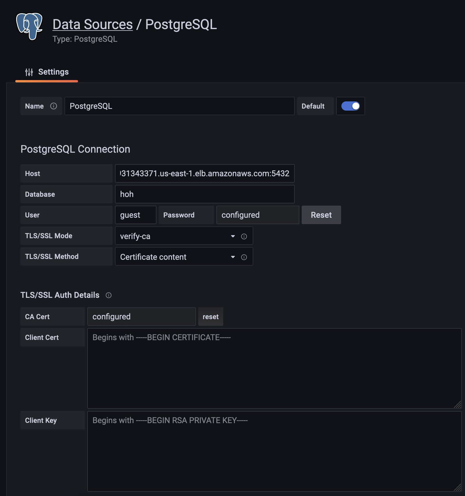

Multicluster global hub depends on the middleware (Kafka, Postgres) and observability platform (grafana) to provide the policy compliance view. Multicluster global hub has build-in Kafka, postgres and grafana, but you still can bring your own Kafka, postgres and grafana. This document focuses on how to bring your own.

## Bring your own Kafka

If you have your own Kafka, you can use it as the transport for multicluster global hub. You need to create a secret `multicluster-global-hub-transport` in `multicluster-global-hub` namespace. The secret contains the following fields:

- `bootstrap.servers`: Required, the Kafka bootstrap servers.
- `ca.crt`: Required, if you use the `KafkaUser` custom resource to configure authentication credentials, see [User authentication](https://strimzi.io/docs/operators/latest/deploying.html#con-securing-client-authentication-str) in the STRIMZI documentation for the steps to extract the `ca.crt` certificate from the secret.
- `client.crt`: Required, see [User authentication](https://strimzi.io/docs/operators/latest/deploying.html#con-securing-client-authentication-str) in the STRIMZI documentation for the steps to extract the `user.crt` certificate from the secret.
- `client.key`: Required, see [User authentication](https://strimzi.io/docs/operators/latest/deploying.html#con-securing-client-authentication-str) in the STRIMZI documentation for the steps to extract the `user.key` from the secret.

You can create the secret by running the following command:
```bash
kubectl create secret generic multicluster-global-hub-transport -n multicluster-global-hub \
    --from-literal=bootstrap_server=<kafka-bootstrap-server-address> \
    --from-file=ca.crt=<CA-cert-for-kafka-server> \
    --from-file=client.crt=<Client-cert-for-kafka-server> \
    --from-file=client.key=<Client-key-for-kafka-server> 
```

*Prerequisite:*  See the following requirements for bringing your own Kafka: 

- Unless you configured your Kafka to automatically create topics, you must manually create the transport topics `gh-spec`, `gh-migration`, and `gh-status`. By default, all managed hubs publish status to the shared topic `gh-status`. If you set a different `statusTopic` in `spec.dataLayer.kafka.topics`, create that topic instead. See [Kafka topics and ACLs](#kafka-topics-and-acls) below.

- Kafka 3.3 or later is tested.\

- Suggest to have persistent volume for your Kafka.

### Kafka topics and ACLs

Global Hub uses three Kafka topics for transport:

| Topic | Purpose |
|-------|---------|
| `gh-spec` | Policy and spec sync from the global hub manager to managed hub agents |
| `gh-migration` | Cluster migration deploying-phase bundles (source hub to target hub) |
| `gh-status` | Status and compliance events from managed hubs to the global hub manager (shared topic by default) |

When you manage Kafka ACLs yourself, grant permissions for your deployment:

| Principal | `gh-spec` | `gh-migration` | Status topic |
|-----------|-----------|----------------|--------------|
| Global hub manager | Describe, Read, **Write** | Describe, Read, **Write** | Describe, Read on `gh-status` (or on each custom status topic) |
| Managed hub agent | Describe, Read, Write | Describe, Read; **Write** on the source hub only while a cluster migration is in the Deploying phase | Describe, Read, **Write** on `gh-status` (or on a custom status topic if configured) |

Notes:

- The global hub manager publishes to `gh-spec`. Managed hub agents consume from `gh-spec`.
- During cluster migration, the source hub publishes deploying bundles to `gh-migration`. The target hub agent consumes from `gh-migration` as well as `gh-spec`.
- Grant **Write** on `gh-migration` to the source managed hub only for the duration of an active migration Deploying phase, then revoke it. With built-in Strimzi Kafka, the operator applies and removes that ACL automatically; with BYO Kafka, you must update ACLs yourself or through your Kafka administration tooling.
- For more information about cluster migration, see [Managed Cluster Migration](./migration/global_hub_cluster_migration.md).
- Built-in Strimzi Kafka uses per-hub status topics such as `gh-status.<cluster-name>` with a prefix ACL on `gh-status`. BYO Kafka uses the shared topic `gh-status` with a literal ACL unless you override `statusTopic`.

Example Strimzi `KafkaUser` ACL entries for the global hub transport user (BYO defaults shown):

```yaml
# gh-spec — manager publishes policy/spec sync
- operations: [Describe, Read, Write]
  resource:
    type: topic
    name: gh-spec
    patternType: literal
# gh-migration — manager oversight; source hub writes during migration Deploying
- operations: [Describe, Read, Write]
  resource:
    type: topic
    name: gh-migration
    patternType: literal
# gh-status — manager consumes status from the shared BYO topic (use literal unless you override statusTopic)
- operations: [Describe, Read]
  resource:
    type: topic
    name: gh-status
    patternType: literal
```

Managed hub agents also need **Read** on `gh-spec` and `gh-migration`, **Write** on `gh-status` (or on a custom status topic), and temporary **Write** on `gh-migration` when that hub is the source of an in-progress migration.

## Bring your own Postgres

If you have your own postgres, you can use it as the storage for multicluster global hub. You need to create a secret `multicluster-global-hub-storage` in `multicluster-global-hub` namespace. The secret contains the following fields:

- The `database_uri` format like `postgres://<user>:<password>@<host>:<port>/<database>?sslmode=<mode>`. It is used to create the database and insert data.
- The `database_uri_with_readonlyuser` format like `postgres://<user>:<password>@<host>:<port>/<database>?sslmode=<mode>`. it is used to query data by global hub grafana. It is an optional.
- `ca.crt` based on the [sslmode](https://www.postgresql.org/docs/current/libpq-connect.html#LIBPQ-CONNSTRING). It is an optional.

You can create the secret by running the following command:
```bash
kubectl create secret generic multicluster-global-hub-storage -n multicluster-global-hub \
    --from-literal=database_uri=<postgresql-uri> \
    --from-literal=database_uri_with_readonlyuser=<postgresql-uri-with-readonlyuser> \
    --from-file=ca.crt=<CA-for-postgres-server>
```
Please note that:
- The `host` must be accessible from global hub cluster. If your postgres is in a Kubernetes cluster, you can consider to use the service type with `nodePort` or `LoadBalancer` to expose. For more information, please refer to [this document](./troubleshooting.md#access-to-the-provisioned-postgres-database).
- Postgres 13 or later is tested.
- Require the storage size is at least 20Gb (store 3 managed hubs with 250 managed clusters and 50 policies per managed hub for 18 months).

## Bring your own Grafana
You have been relying on your own Grafana to get metrics from multiple sources (Prometheus) from different clusters and have to aggregate the metrics yourself. In order to get multicluster global hub data into your own Grafana, you need to configure the datasource and import the dashboards.

1. Get the postgres connection information from the multicluster global hub Grafana datasource secret
```
oc get secret multicluster-global-hub-grafana-datasources -n multicluster-global-hub -ojsonpath='{.data.datasources\.yaml}' | base64 -d
```
the output likes:
```
apiVersion: 1
datasources:
- access: proxy
  isDefault: true
  name: Global-Hub-DataSource
  type: postgres
  url: postgres-primary.multicluster-global-hub.svc:5432
  database: hoh
  user: guest
  jsonData:
    sslmode: verify-ca
    tlsAuth: true
    tlsAuthWithCACert: true
    tlsConfigurationMethod: file-content
    tlsSkipVerify: true
    queryTimeout: 300s
    timeInterval: 30s
  secureJsonData:
    password: xxxxx
    tlsCACert: xxxxx
```
2. Configure the datasource in your own Grafana

In your Grafana, add a source such as Postgres. And fill the fields with the information you got previously.


Required fields:
- Name: xxxxx
- Host: xxxxx
- Database: hoh
- User: guest
- Password: xxxxx
- TLS/SSL Mode: verify-ca
- TLS/SSL Method: Certiticate content
- CA Cert: xxxxx

Notes:
- if your own Grafana is not in the multicluster global hub cluster, you need to expose the postgres via loadbalancer so that the postgres can be accessed from outside. You can add 
```
    service:
      type: LoadBalancer
```
into `PostgresCluster` operand and then you can get the EXTERNAL-IP from `postgres-ha` service. for example: 
```
oc get svc postgres-ha -n multicluster-global-hub
NAME     TYPE           CLUSTER-IP      EXTERNAL-IP                                                               PORT(S)          AGE
postgres-ha   LoadBalancer   172.30.227.58   xxxx.us-east-1.elb.amazonaws.com   5432:31442/TCP   128m
```
After that, you can use `xxxx.us-east-1.elb.amazonaws.com:5432` as Postgres Connection Host.

3. Import the existing dashboards

- Follow the grafana official document to [export a dashboard](https://grafana.com/docs/grafana/latest/dashboards/manage-dashboards/#export-a-dashboard)
- Follow the grafana official document to [import a dashboard](https://grafana.com/docs/grafana/latest/dashboards/manage-dashboards/#import-a-dashboard)