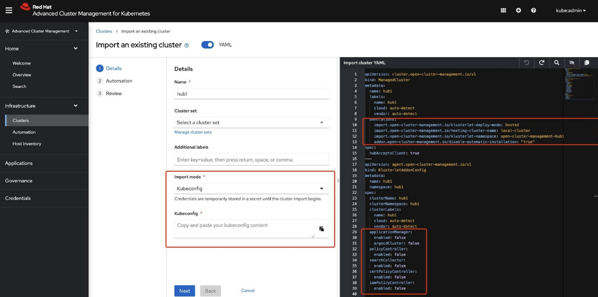
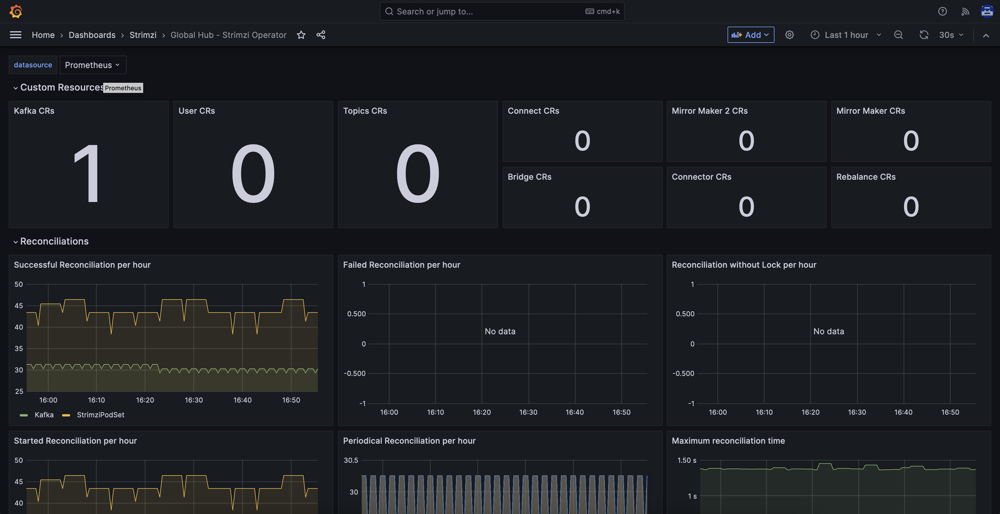
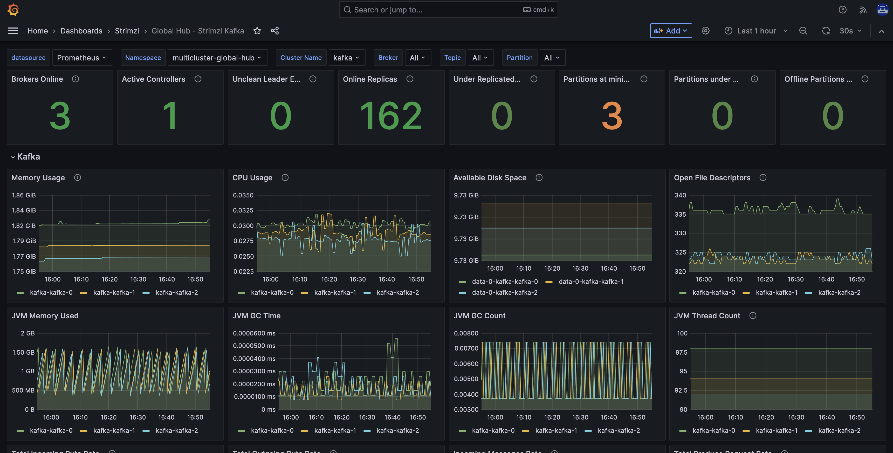
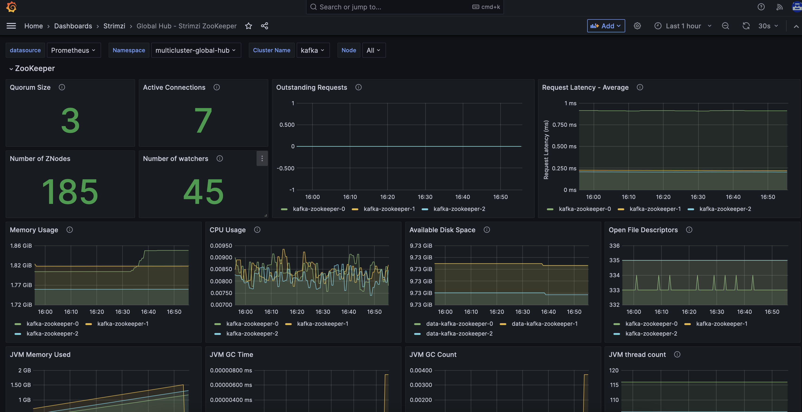
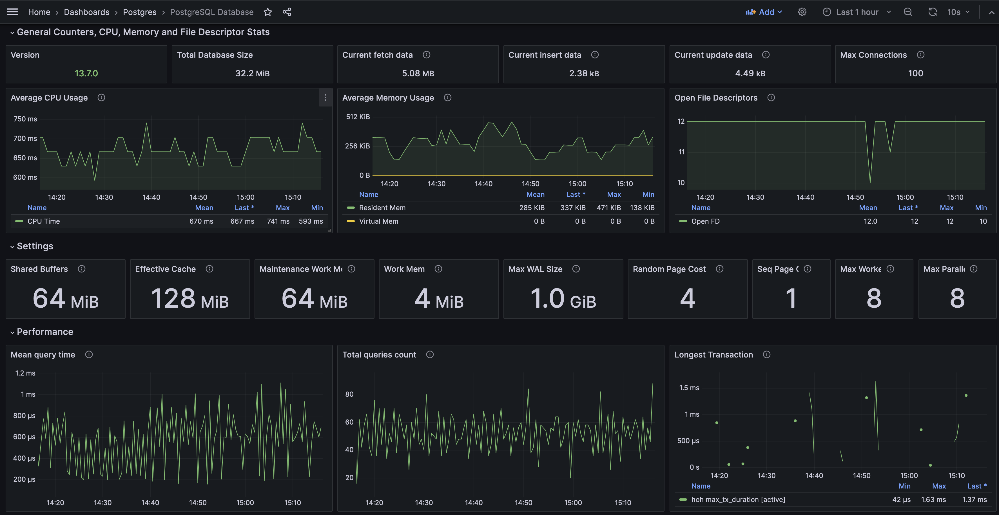

### Create a managed hub cluster (Developer Preview)
Refer to the original [Create cluster](https://access.redhat.com/documentation/en-us/red_hat_advanced_cluster_management_for_kubernetes/2.8/html/clusters/cluster_mce_overview#creating-a-cluster) document to create the managed cluster in the global hub cluster. Add the label of `global-hub.open-cluster-management.io/hub-cluster-install: ''` to the `managedcluster` custom resource and then the new created managed cluster can automatically be switched to be a managed hub cluster. In other words, the latest version of Red Hat Advanced Cluster Management for Kubernetes is installed in this managed cluster. You can get the Red Hat Advanced Cluster Management hub information in the cluster overview page.


### Import a managed hub cluster in hosted mode (Developer Preview)
A managed hub cluster does not require any changes before importing it. The Red Hat Advanced Cluster Management agent can be running in a hosting cluster.

1. Import the cluster from the Red Hat Advanced Cluster Management console by using `kubeconfig import mode`. Add these annotations to the `ManagedCluster` custom resource and disable all add-ons.

```
import.open-cluster-management.io/klusterlet-deploy-mode: Hosted
import.open-cluster-management.io/hosting-cluster-name: local-cluster
addon.open-cluster-management.io/disable-automatic-installation: "true"
```



2. Click `Next` to complete the import process.

3. Enable the work-manager addon after the imported cluster is available. The command likes:
```
cat << EOF | oc apply -f -
apiVersion: addon.open-cluster-management.io/v1alpha1
kind: ManagedClusterAddOn
metadata:
  name: work-manager
  namespace: managed-hub-1
  annotations:
    addon.open-cluster-management.io/hosting-cluster-name: local-cluster
spec:
  installNamespace: klusterlet-managed-hub-1
EOF
```
Notes:
- We need work-manager to tackle the manifestwork so that the global hub agent can be installed successfully.
- `managed-hub-1` is cluster namespace. You can specify what you want to use.
- `klusterlet-managed-hub-1` is the namespace where the global hub agent is installed. You can specify what you want to use.

4. We have an `external-managed-kubeconfig` secret generated in the `klusterlet-managed-hub-1` namespace. All addons can share it to access the managed hub cluster. You need to create `AddOnDeploymentConfig` to tell the addons to use the `external-managed-kubeconfig` secret. The command likes:
```
cat << EOF | oc apply -f -
apiVersion: addon.open-cluster-management.io/v1alpha1
kind: AddOnDeploymentConfig
metadata:
  name: addon-hosted-config
  namespace: multicluster-engine
spec:
  customizedVariables:
    - name: managedKubeConfigSecret
      value: external-managed-kubeconfig
EOF
```
Then patch work-manager with `oc patch clustermanagementaddon work-manager --type merge -p '{"spec":{"supportedConfigs":[{"defaultConfig":{"name":"addon-hosted-config","namespace":"multicluster-engine"},"group":"addon.open-cluster-management.io","resource":"addondeploymentconfigs"}]}}'`

5. Now, you can create the global hub agent to connect the managed hub cluster. You have to add the label to allow the global host agent running in Hosted mode by using
`oc label mcl managed-hub-1 global-hub.open-cluster-management.io/agent-deploy-mode=Hosted`. Then create global hub agent with the command:
```
cat <<EOF | oc apply -f - 
apiVersion: addon.open-cluster-management.io/v1alpha1
kind: ManagedClusterAddOn
metadata:
  name: multicluster-global-hub-controller
  namespace: managed-hub-1
  annotations:
    addon.open-cluster-management.io/hosting-cluster-name: local-cluster
spec:
  installNamespace: klusterlet-managed-hub-1
EOF
```

6. You can check the components in `klusterlet-managed-hub-1` namespace to ensure all the pods are running. The output likes:
```
NAME                                                           READY   STATUS    RESTARTS      AGE
klusterlet-addon-workmgr-65898cf697-dpc74                      1/1     Running   0             64m
klusterlet-managed-hub-1-registration-agent-7c76688f4d-vfjg9   1/1     Running   0             68m
klusterlet-managed-hub-1-work-agent-8576777749-2hf5v           1/1     Running   0             67m
multicluster-global-hub-agent-65d8d4947-gftzj                  1/1     Running   0             62m
```
### Enable Strimzi and Postgres Metrics
Collecting metrics is critical for understanding the health and performance of your Kafka deployment and postgres database. By monitoring metrics, you can actively identify issues before they become critical and make informed decisions about resource allocation and capacity planning. Without metrics, you may be left with limited visibility into the behavior of your Kafka deployment, which can make troubleshooting more difficult and time-consuming.

Globalhub set `enableMetrics: true` in the `spec` section by default.
After the kafka operator reconciling is completed, you can check the dashboards in global hub grafana. You will see the following dashboards under Strimzi folder:
- Global Hub - Strimzi Operator

- Global Hub - Strimzi Kafka

- Global Hub - Strimzi Zookeeper


The following dashboards will be in Postgres folder:
- Global Hub - PostgreSQL Database



