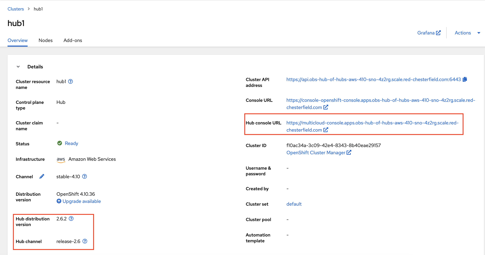
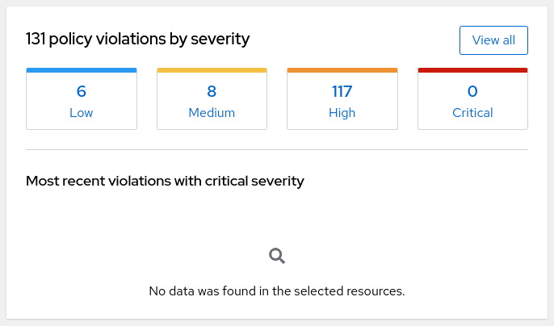
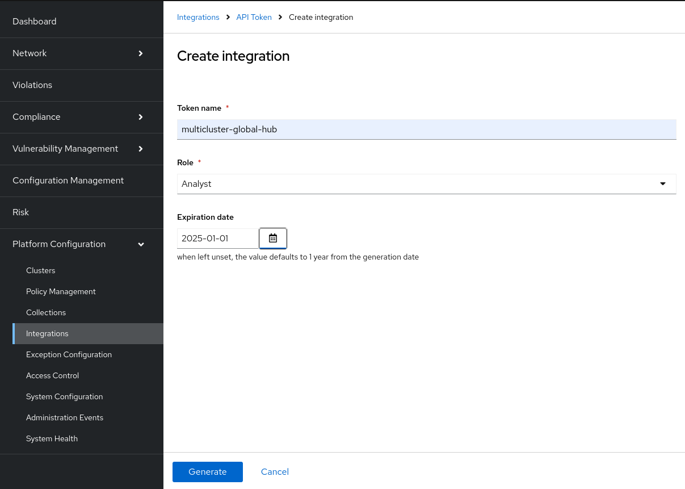
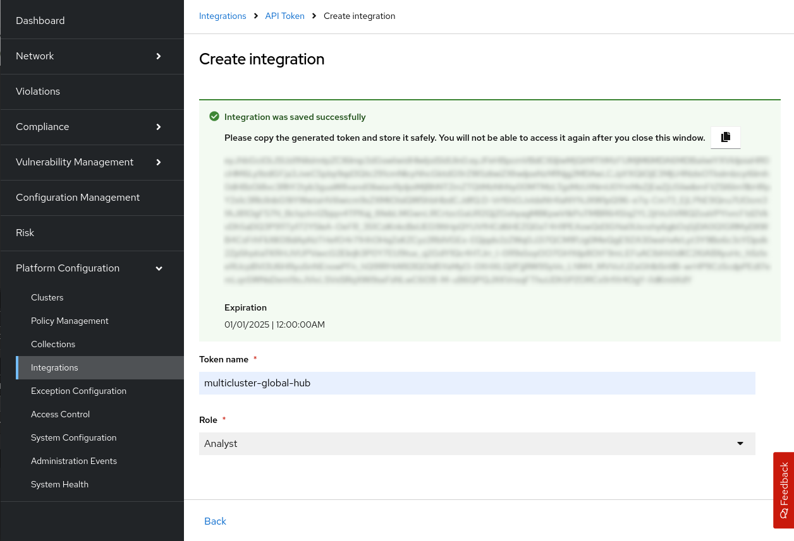

### Create a managed hub cluster (Developer Preview)
Refer to the original [Create cluster](https://access.redhat.com/documentation/en-us/red_hat_advanced_cluster_management_for_kubernetes/2.8/html/clusters/cluster_mce_overview#creating-a-cluster) document to create the managed cluster in the global hub cluster. Add the label of `global-hub.open-cluster-management.io/hub-cluster-install: ''` to the `managedcluster` custom resource and then the new created managed cluster can automatically be switched to be a managed hub cluster. In other words, the latest version of Red Hat Advanced Cluster Management for Kubernetes is installed in this managed cluster. You can get the Red Hat Advanced Cluster Management hub information in the cluster overview page.



### Enable RHACS integration

The [Red Hat Advanced Cluster
Security](https://www.redhat.com/en/technologies/cloud-computing/openshift/advanced-cluster-security-kubernetes)
platform is a security solution, which helps detecting and managing security risks and
vulnerabilities. Its _Central_ component offers detailed information about such security risks and
vulnerabilities in the form of a collection of _security violations_. The _Central_ web application
includes a dashboard that shows a summary of those security violations aggregated by severity:



The Global Hub can collect this information from the _Central_ instances that run inside the managed
hubs. The supported setup is to have a ACM Global Hub managing multiple instances of managed ACM
hubs. And each of these managed ACM hubs has one instance of _Central_ running.

The information is aggregated and presented in a new _Security Violations_ Grafana dashboard:


The integration requires one ACM Global Hub setup, with at least one ACM Managed Hub and one
RHACS _Central_ instance running inside each of the ACM Managed Hubs. Each RHACS _Central_
instance needs to manage at least one cluster, otherwise there will be no violations to report and
the dashboard will be empty.

The integration is disabled by default. In order to enable it is necessary to have an ACM Global Hub
setup, with at least one ACM Managed Global Hub and configure the Global Hub _multiclusterglobalhub_
object and the RHACS _Central_ objects.

#### Enabling the integration in the ACM Global Hub

The _multiclusterglobalhub_ object needs to have the
`global-hub.open-cluster-management.io/with-stackrox-integration` annotation. In a typical Global
Hub installation that can be achieved with a command like this:

```shell
$ oc annotate -n multicluster-global-hub multiclusterglobalhub multiclusterglobalhub \
global-hub.open-cluster-management.io/with-stackrox-integration=
```

The value of the annotation, an empty string in this example, isn't relevant; it just needs to be
present.

#### Configuring each ACM Managed Hub

##### Create the RHACS API token

In each ACM Managed Hub the Global Hub Agent needs a API token to connect to the _Central_ instance.
That token can be created using the _Central_ web application. Go to _Platform Configuration_,
_Integrations_ and scroll down to _API Token_. In the dialog select a name, role and expiration date
for the token, then click the _Generate_ button:



The _Token name_ is not really relevant, but better use something that will help you remember what
it is used for.

The _Role_ is important: you need to select one that grants permission to get the security
violations. _Analyst_ is a built-in role that has that permission, as well as other read only
permissions. You may want to create your own _Permission Set_ set and _Role_ instead, so that it
only has read permission for security violations.

The _Expiration date_ is also important: you will need repeat the process described here before it
expires, otherwise when it expires the Global Hub will stop to collect the data from this _Central_.

The token will be displayed like this:



Make sure to copy the token to a safe place, as you will not be able to see it again once you close
that dialog.

For more details about tokens check the [RHACS
documentation](https://docs.openshift.com/acs/4.5/configuration/configure-api-token.html).

##### Obtain the RHACS API CA certificate

In addition to the token you will also need to have the certificate of the CA that needs to be
trusted in order to connect to the _Central_ API server. In a typical RHACS installation that CA
is generated by the _Central_ component, and the details are stored in the `ca.pem` key of the
`central-tls` secret. You can use a command like this to obtain it:

```bash
$ oc get secret -n rhacs-operator central-tls -o json | \
jq -r '.data["ca.pem"] | @base64d'
```

The result should be something like this:

```
-----BEGIN CERTIFICATE-----
MIIB0zCCAXigAwIBAgIUVD2jLKbwVW4+2zuYVNPCbra6AUYwCgYIKoZIzj0EAwIw
...
-----END CERTIFICATE-----
```

##### Create the RHACS API connection details secret

Once you have the token and the CA certificate you will need to put them inside a Kubernetes secret,
and annotate the `central` object with an annotation containing its location. The token should be in
the `token` key, and the CA certificate in the `ca` key, so it should look like this:

```yaml
apiVersion: v1
kind: Secret
type: Opaque
metadata:
  namespace: multicluster-global-hub-agent
  name: rhacs-connection-details
stringData:
  token: eyJ...
  ca: |
    -----BEGIN CERTIFICATE-----
    MIIB0zCCAXigAwIBAgIUVD2jLKbwVW4+2zuYVNPCbra6AUYwCgYIKoZIzj0EAwIw
    ...
    -----END CERTIFICATE-----
```

Note that this example is using `stringData` to avoid base64 encode step. If you prefer to use
`data` then you will have to encode the values. See the [Kubernetes
documentation](https://kubernetes.io/docs/concepts/configuration/secret/) for details.

Create that secret, and then add the
`global-hub.open-cluster-management.io/with-stackrox-credentials-secret` annotation to the `central`
object:

```shell
$ oc annotate -n rhacs-operator central stackrox-central-services \
global-hub.open-cluster-management.io/with-stackrox-credentials-secret=multicluster-global-hub-agent/rhacs-connection-details
```

Note that the value of this annotation should be the namespace where you created the secret,
followed by a forward slash and then the name of the secret. The name of the secret is not relevant,
as long as you put it correctly in the value of the annotation. The secret must be in the namespace
the Global Hub Agent, typically `multicluster-global-hub-agent`.

Once the secret is created and the _central_ object annotated, the Global Hub Agent will
automatically detect the configuration, will apply it and will start to collect the information and
send it to the Global Hub Manager to populate the dashboard.

### Event Exporter(Standalone Agent)

To unlock the potential of the global hub agent and integrate ACM into the event-driven ecosystem, we propose running the agent in standalone mode environment. This will enable it to function as an event exporter, reporting resources to the specified target. For more detail, please [visit](./event-exporter/README.md)