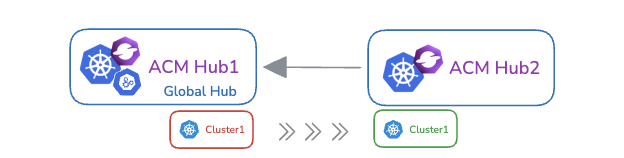

# 🧭 Managed Cluster Migration (Tech Preview)

## What Is It?

**Multicluster Global Hub** introduces **Managed Cluster Migration**, a feature that allows you to move managed clusters from one ACM hub cluster to another.

This provides a unified way to reorganize or rebalance workloads across multiple hub clusters without manual reconfiguration.


---

## Why Use It?

Multicluster Global Hub is built to manage large-scale fleets of clusters using an event-driven architecture. Traditionally, the Global Hub acts as a bridge between itself and managed hubs. With Managed Cluster Migration, it can now also act as a communication and orchestration layer between multiple hub clusters.

Because Global Hub is event-based, it can efficiently track, sync, and transfer cluster state across hubs, making it an ideal tool for cross-hub migration.

---

## How It Works?

### 🏗️ Architecture

The migration process involves coordination between a source hub and a target hub:

- The **Global Hub Manager** (`multicluster-global-hub-manager`) monitors `ManagedClusterMigration` resources and controls the migration flow.

- **The Global Hub Agent** (`multicluster-global-hub-agent`) performs migration tasks on the source and target hubs.

<details>
<summary> Migration Workflow </summary>

>

</details>


### 🔄 Migration Phases

Each migration goes through several phases, visible in the resource `status.phase` and `conditions`:

| Phase        | Description                                                                 |
|--------------|-----------------------------------------------------------------------------|
| Pending      | Only one migration can be handled at a time; others will remain pending     |
| Validating   | Verifies clusters and hubs are valid.                                       |
| Initializing | Prepares target hub (kubeconfig, RBAC) and source hub (`KubeletConfig`).    |
| Deploying    | Migrates selected clusters.                                                 |
| Registering  | Re-registers the cluster to the target hub.                                 |
| Cleaning     | Cleans up resources from both hubs. Also handles rollback if needed.                  |
| Completed    | Migration completed successfully.                                           |
| Failed       | Migration failed; error message included in status.                         |

---

## Deployment Modes

### Global Hub Installation Modes

- 🟢 Greenfield Mode

  

  - Deploy the **Global Hub** in a **separate ACM hub cluster**

- 🟤 Brownfield Mode

  

  - Deploy the Global Hub in **source** hub (hub1)
  - Deploy the Global Hub in the **target** hub (hub2)

### Importing Managed Hub Modes

Starting from Global Hub version 1.5.0, when importing an ACM hub into Global Hub, you must add the label `global-hub.open-cluster-management.io/deploy-mode` to indicate it is a Managed Hub. Without this label, the imported cluster will be treated as a standard managed cluster, meaning the Global Hub agent will not be installed.

Currently, the label supports two values: `default` and `hosted`. each suited for different scenarios:

* **`default`**: Use this when the ACM hub being imported does not have self-management enabled. In this case, both the Klusterlet and the Global Hub agent will be installed directly in the importing ACM hub cluster.

* **`hosted`**: Use this when the ACM hub being imported **has** self-management enabled. In default mode, the klusterlet from the `local-cluster` of Managed Hub may conflict with Global Hub. To avoid this, `hosted` mode should be used. However, there are two limitations within such mode:

  * The `kubeconfig` of the importing ACM hub cluster must never expire.
  * The Global Hub cluster must also have self-management enabled, so that the hosted Klusterlet can be properly reconciled by the operator from the `local-cluster` of Global Hub.

---

## 🧪 Recommended Way to Migrate (Brownfield & Hosted Mode)

**Recommended:** The preferred way to migrate is to install in a brownfield environment and import the cluster in hosted mode. The following example demonstrates this recommended approach.


### Step 1 – Deploy the Global Hub in Brownfield Mode

Install the Global Hub on `hub1`, and enable the agent running locally:

```yaml
  apiVersion: operator.open-cluster-management.io/v1alpha4
  kind: MulticlusterGlobalHub
  metadata:
    name: multiclusterglobalhub
    namespace: multicluster-global-hub
  spec:
    availabilityConfig: High
    installAgentOnLocal: true
  ```

> In this setup, the **Global Hub**, **source hub**, and `local-cluster` are all on `hub1`.

### Step 2 – Import the Managed Hub in Hosted Mode

Label `hub2` with the `hosted` deployment mode during importing:

```bash
global-hub.open-cluster-management.io/deploy-mode=hosted
```

### Step 3 – Create Migration Resource

Define the `ManagedClusterMigration` resource to move the cluster:

```yaml
apiVersion: global-hub.open-cluster-management.io/v1alpha1
kind: ManagedClusterMigration
metadata:
  name: migration-sample
spec:
  from: local-cluster
  includedManagedClusters:
    - cluster1
  to: hub2
```

#### Field Explanations:

- `from`: The source hub (in this case, `local-cluster` = `hub1`)
- `to`: Target hub (`hub2`)
- `includedManagedClusters`: Lists the clusters to be migrated. All cluster names must be unique across hubs.

---

### Step 4 – Sample Migration Status


```yaml
status:
  conditions:
    - type: ResourceValidated
      status: "True"
      message: Migration resources have been validated
    - type: ResourceInitialized
      status: "True"
      message: All source and target hubs have been initialized
    - type: ResourceDeployed
      status: "True"
      message: Resources have been successfully deployed to the target hub cluster
    - type: ClusterRegistered
      status: "True"
      message: All migrated clusters have been successfully registered
    - type: ResourceCleaned
      status: "True"
      message: Resources have been successfully cleaned up from the hub clusters
  phase: Completed
```

---

## ✅ Summary

Managed Cluster Migration helps you:

- Reorganize cluster ownership between ACM hub clusters
- Move clusters
- Automate re-registration and cleanup
- Track every step with detailed status updates

> ⚠️ **Note:** This feature is currently in **Tech Preview**. Feedback and contributions are welcome!