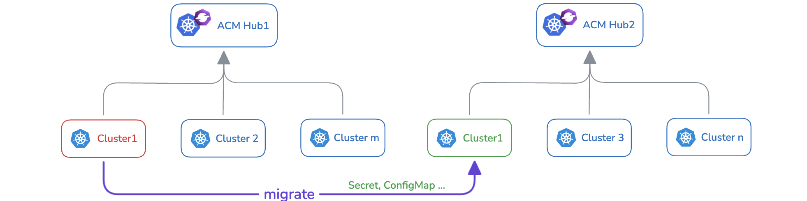
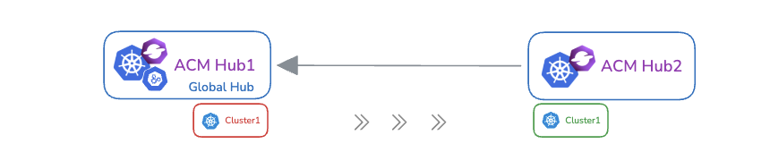

# 🧭 Managed Cluster Migration (Tech Preview)

## What Is It?

**Multicluster Global Hub** introduces **Managed Cluster Migration**, a feature that allows you to move managed clusters from one ACM hub cluster to another. In addition to clusters, it also supports migrating associated Kubernetes resources such as `ConfigMaps`, `Secrets`, and more.

This provides a unified way to reorganize or rebalance workloads across multiple hub clusters without manual reconfiguration.



---

## Why Use It?

Multicluster Global Hub is built to manage large-scale fleets of clusters using an event-driven architecture. Traditionally, the Global Hub acts as a bridge between itself and managed hubs. With Managed Cluster Migration, it can now also act as a communication and orchestration layer between multiple hub clusters.

Because Global Hub is event-based, it can efficiently track, sync, and transfer resources and cluster state across hubs, making it an ideal tool for cross-hub migration.

---

## How It Works?

### 🏗️ Architecture

The migration process involves coordination between a source hub and a target hub:

- The **Global Hub Manager** (`multicluster-global-hub-manager`) monitors `ManagedClusterMigration` resources and controls the migration flow.

- **The Global Hub Agent** (`multicluster-global-hub-agent`) performs migration tasks on the source and target hubs.

<details>
<summary> Migration Workflow </summary>

>

</details>


### 🔄 Migration Phases

Each migration goes through several phases, visible in the resource `status.phase` and `conditions`:

| Phase        | Description                                                                 |
|--------------|-----------------------------------------------------------------------------|
| Validating   | Verifies clusters and hubs are valid.                                       |
| Initializing | Prepares target hub (kubeconfig, RBAC) and source hub (`KubeletConfig`).   |
| Deploying    | Migrates selected clusters and resources.                                   |
| Registering  | Re-registers the cluster to the target hub.                                 |
| Cleaning     | Cleans up resources from both hubs. Also handles rollback if needed.        |
| Completed    | Migration completed successfully.                                           |
| Failed       | Migration failed; error message included in status.                         |

---

## Deployment Modes

>

### 🟢 Greenfield Mode

- Deploy the **Global Hub** in a **separate ACM hub cluster**.

### 🟤 Brownfield Mode

- Deploy the Global Hub in the **source** or **target hub**.
- To import managed hubs into the Global Hub using hosted mode, follow these steps:
  1. Enable the `ImportClusterInHosted` feature gate in the `MulticlusterGlobalHub` resource:
  ```yaml
  apiVersion: operator.open-cluster-management.io/v1alpha4
  kind: MulticlusterGlobalHub
  metadata:
    name: multiclusterglobalhub
    namespace: multicluster-global-hub
  spec:
    availabilityConfig: Basic
    installAgentOnLocal: true
    featureGates:
    - feature: ImportClusterInHosted
      mode: Enable
  ```

  2. Add the `hosted` label to the managed hub cluster:
  ```bash
  global-hub.open-cluster-management.io/agent-deploy-mode=Hosted
  ```

---

## 🧪 Example: Migrate `cluster1` from `hub1` to `hub2` (Brownfield)

>

### Step 1 – Deploy the Global Hub

Install the Global Hub on `hub1` and enable the local agent to run the `multicluster-global-hub-agent` in the current hub.

> In this setup, the **Global Hub**, **source hub**, and `local-cluster` are all on `hub1`.

### Step 2 – Create Migration Resource

```yaml
apiVersion: global-hub.open-cluster-management.io/v1alpha1
kind: ManagedClusterMigration
metadata:
  name: migration-sample
spec:
  from: local-cluster
  includedManagedClusters:
    - cluster1
  includedResources:
    - configmap/default/foo
    - secret/cluster1/bar
  to: hub2
```

#### Field Explanations:

* `from`: The source hub (in this case, `local-cluster` = `hub1`)
* `to`: Target hub (`hub2`)
* `includedManagedClusters`: Lists the clusters to be migrated. All cluster names must be unique across hubs.
* `includedResources`: Specifies the Kubernetes resources to migrate, using the format `kind/namespace/name`. 

---

### Step 3 – Sample Migration Status


```yaml
status:
  conditions:
    - type: ResourceValidated
      status: "True"
      message: Migration resources have been validated
    - type: ResourceInitialized
      status: "True"
      message: All source and target hubs have been initialized
    - type: ResourceDeployed
      status: "True"
      message: Resources have been successfully deployed to the target hub cluster
    - type: ClusterRegistered
      status: "True"
      message: All migrated clusters have been successfully registered
    - type: ResourceCleaned
      status: "True"
      message: Resources have been successfully cleaned up from the hub clusters
  phase: Completed
```

---

## ✅ Summary

Managed Cluster Migration helps you:

* Reorganize cluster ownership between ACM hub clusters
* Move clusters and resources together
* Automate re-registration and cleanup
* Track every step with detailed status updates

> ⚠️ **Note:** This feature is currently in **Tech Preview**. Feedback and contributions are welcome!