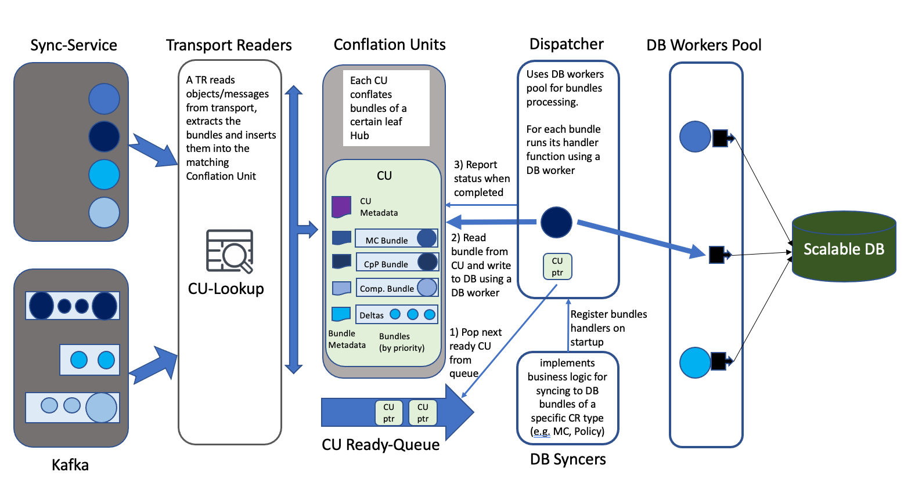
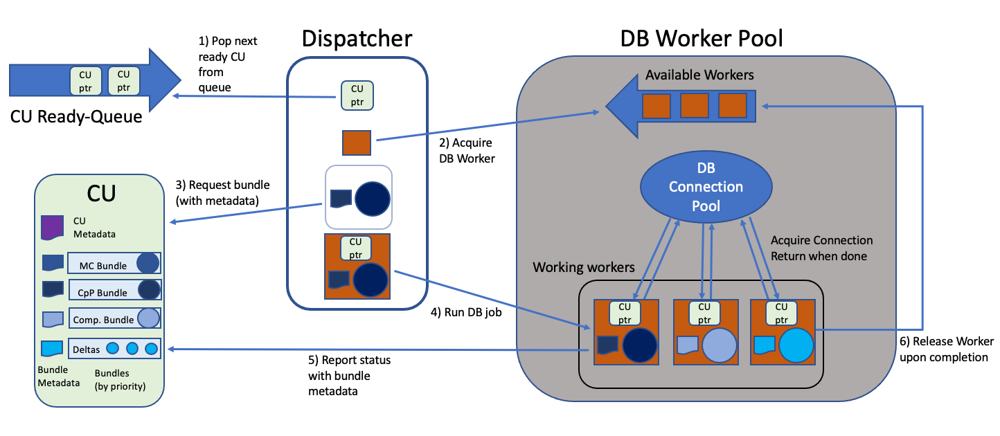
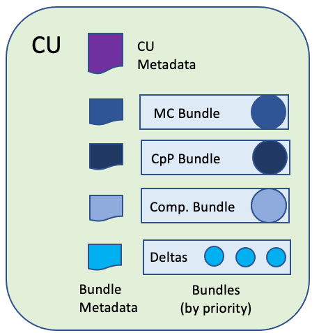
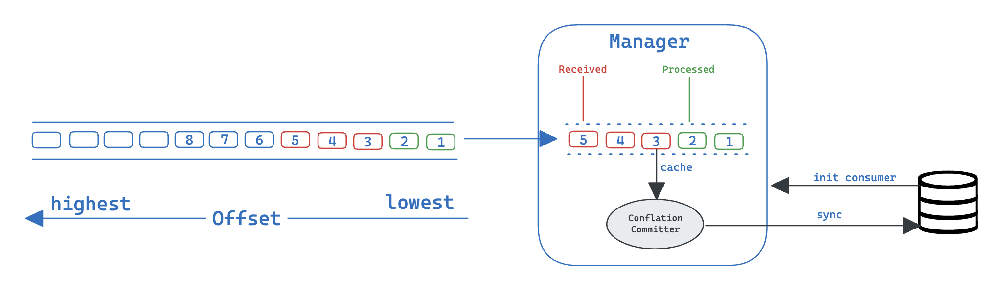

# Status Transport Bridge Design Document

## Design Goals 

The Multicluster-Global Hub Status Transport Bridge (STB) is a critical component in terms of global hub performance. It is responsible for reading status updates of all Managed Hubs (MHs) from the Transport, processing these updates, and writing them to the main database that is used to store all the information maintained by the global hub.
The design of the STB aims to achieve the following goals.

- Provide efficient, Transport independent, conflation of data while writing to the database is slower than the rate of data received by the global hub Transport.

- Maintain stability and consistent performance under high load and overload.    

- Optimize parallel updates to the database by multiple go routines each handling a different MHs (or even groups of independent bundles from the same MH) while preserving correctness.

- Minimize database update failures due to missing dependent updates that have not been written to the database.

- Minimize the delay of updating the database with the latest status reported by MHs.  

- Minimize contention between the multiple go routines to enhance performance.

- Support easy extensions for new data types that the STB should handle (e.g., new bundle types). 

- Ensure correct STB startup when the database already contains information.        

## Design Overview 

The Status Transport Bridge is made of the following main components.

- Transport Readers (TR) - Each reader reads bundles from the transport and pushes them into the matching Conflation Unit.

- DB Syncers (DBS) – A DB syncer is responsible for implementing the business logic for syncing to DB bundles of a specific CR type (e.g., MCs, Policies). 

- DB Workers (DBW) – a generalized pool of DB workers running in parallel. A DBW gets a DB job (a job that includes DB interaction) to invoke and uses internally a DB connection pool for managing the DB connections (liveness, graceful shutdown, etc.).

- Dispatcher – responsible for reading bundles from the Conflation Units and delegating bundles processing to DB workers, using handler functions from DB Syncers.

- Conflation Units (CU) - A component that performs conflation on bundles that are submitted to it (by Transport Readers) and provides ready bundles to be processed upon request.

- CU Ready Queue (CU-RQ) - A queue that holds the IDs of CUs that have bundles ready to be processed.

Additional components include

- Offset Committer - Responsible for committing offsets to Kafka and (possibly) marking sync-service objects as consumed. 


Figure 1: Global Hub Status Transport Bridge design overview


### Transport Readers (TR)

A TR is implemented as a go routine that constantly reads objects/messages from the transport (cloudevents or Kafka). When an object is read it is parsed and gets the basic information that is required by the Conflation Unit, which includes the originating Managed Hub (MH), and Bundle Type. The bundle is then inserted into the matching CU. To find the matching CU for a bundle TRs use a CU-Lookup data structure (e.g., a hash table).  
Initially there will be a single TR which is going to use a single consumer client. When we get to address horizontal scalability, multiple TRs will be used.

### DB Syncers (DBS)

A DB Syncer implements the business logic needed for handling its bundles (might handle more than one bundle, e.g., for policies the same DBS is used to handle bundles of type Cluster-per-Policy, Compliance, and Compliance-Deltas).
A DBS registers its handler functions per bundle type within the dispatcher upon STB startup. 

### DB Workers (DBW)

The DB Worker Pool is initialized with its database client and creates a connection pool. Each DB worker in the pool is implemented as a go routine that writes bundles to the database. 
The number of DBWs is initialized to be the size of the connection pool. The reasons for this setting are :

1. We want to assure a DBW will always have an available DB connection when it requests for it from the connection pool (reason that num of DBW <= connection pool size).

2. Maximize parallel updates to the DB by multiple workers each handling a different MH (reason that DBW pool size should be as large as possible).

3. There is no point creating more DBW than the DB connection pool size, otherwise workers will compete on the DB connections and will get blocked (Hence the reason for setting the number of DBWs to the connection pool size).

For each DB job the DBW receives (a bundle to handle) from the dispatcher it performs the following:
1. DBW gets the DB job. The DB job includes the bundle (with metadata) and its handler function and a pointer to the CU.

2. DBW acquires DB connection from connection pool.
DBW runs the handler function (bundle processing) and reports result to CU.

3. DBW release DB connection back to the connection pool and returns to worker pool.


### Dispatcher

A dispatcher is implemented as a go routine that constantly tries to read ready to be processed bundles and delegate their processing to DB workers. The dispatcher is responsible for acquiring DB worker from the pool to run the handler functions and report back to CUs about the results.

After the dispatcher is initialized with the DB workers pool and the mapping of bundle type to handler function, it performs the following sequence:

1. Get a CU ID from the CU Ready-Queue. If the CU-RQ is empty block/wait (on pop from the queue or elsewhere) until a new CU ID becomes available.

2. Acquire DB worker from the DB worker pool. If no worker is available block/wait until a worker becomes available.

3. Access the CU by its ID and request a bundle to process. The CU returns the next bundle to process with bundle metadata (the metadata is used by the CU to identify the bundle, committing offsets, and other purposes).  

4. Delegate bundle processing (with CU pointer) to the DB worker.

5. Once processing is completed – DB worker will report to the CU that the bundle processing completed and provide the bundle's metadata and processing result (success/failure with reason) and return to the workers pool (this step is not part of the dispatcher, but here for completeness).

6. Go back to step 1.


Figure 2: Global Hub Status Transport Bridge Dispatcher

### CU Ready-Queue (CU-RQ)

A simple FIFO queue where each element in the queue holds the ID/pointer of a CU. The CU-RQ is used to hold the IDs of CUs that have at least one bundle that is ready to be processed by the dispatcher (i.e., to be inserted to the DB). 
A CU pushes its ID into the end of the queue when two conditions are met

- The CU has a bundle that is ready to be processed.

- The CU ID is not already in the CU-RQ and is not being served a DBW.

  This means that after the CU ID was inserted to the CU-RQ the following insert can occur only after the dispatcher obtained a bundle from the CU and then reported that the bundle processing has been completed (successfully or not). 

The dispatcher will block if the queue is empty. 

### Conflation Units (CU)

A CU is a logical component that is used to conflate bundles inserted by TRs and provide ready bundles to the dispatcher. Initially a CU will be created to manage all the bundles from a single MH. In the future more CUs can be created for independent bundles from the same MH (e.g., Local policies, App. LCM, etc.).  

There are 4 main GRC bundle types (ignoring Status aggregation and local policies) that each MH reports with dependency relations among them. 

- Managed Clusters bundle (MCs)

- Cluster-per-Policy bundle (CpP) [implicit dependency on MC bundle]

- Compliance bundle [explicit dependency on Cluster-per-Policy bundle]

- Compliance Delta (Kafka only) [explicit dependency on Compliance bundle]

   Explicit dependency means that the dependent base bundle is indicated in the bundle/delta itself. Implicit dependency exists only between Cluster-per-Policy and MC bundles; it means that the Cluster-per-Policy bundle does not indicate the dependent MC bundle, but the database update of a Cluster-per-Policy bundle cannot be completed until the dependent MC bundle has been processed. Due to these dependencies the CU always tries to deliver bundles according to the order they are listed above, i.e., MC bundles first and Delta bundles last. A CU does not consider a bundle ready if the bundle it depends on has not been successfully processed.

Each CU stores (in memory) the latest unprocessed bundle of each type and (if present) a collection of delta updates. For each bundle type the CU maintains metadata to assist with management tasks such as indicate if the bundle has been processed (successfully or not), offset commit, etc.  


Figure 3: Global Hub Status Transport Bridge Conflation Unit


The CU implements the following functions

- **InsertBundle** - Invoked by a TR which provides, in addition to the bundle itself, it may include basic bundle transport metadata (e.g. kafka offset). When a new bundle is inserted, it replaces the bundle of the same type (if present) and the bundle's metadata is updated accordingly. When a Compliance bundle of generation X is received all the Deltas that depend on Compliance bundle generations smaller than X are removed. If the necessary conditions are met (the bundle is ready to be processed and the CU is not already in the queue) the CU inserts its ID to the CU-RQ.   

- **GetBundle** - Invoked by the dispatcher to get the next bundle to process. The CU provides a copy of the next bundle to be processed along with its metadata. The reason for providing a copy of the bundle (or a copy of the reference) is to allow the CU to be updated while the DBW is processing the bundle. The CU provides the next ready bundle according to bundle type priority, that is, MC bundle first, then Cluster-per-Policy, Compliance, and finally Delta bundles. Deltas are provided as a group (new bundle type) of all the new deltas that should be processed.

- **ReportBundleProcessed** - Invoked by the DB workers to report that a bundle has been processed. The DBW provides the bundles metadata (obtained in GetBundle) and an indication of whether the bundle processing has been completed successfully or not. If the CU has a bundle that is ready to be processed it inserts its ID to the CU-RQ (optionally we can allow the CU to decide whether to instruct the DBW to call GetBundle again and in that case not insert the ID into the CU-RQ). If the DBW reports success and the bundle that has been processed has not changed (i.e., not replaced by a newer version) the bundle data is deleted from the CU but its metadata is preserved. Failure reports need special attention, but the details are not discussed here. 


**CU initialization on Status Transport Bridge start up**

On startup the CUs do not exist, but the database may have already been updated in previous runs. Thus, some information may have to be restored to ensure that the bundles that are being delivered are processed with the correct dependencies observed. The problem is addressed differently depending on the transport. 

- For Kafka it is safe to continue to process the bundles from the last committed offset since the order between Cluster-per-Policy, Compliance, and Compliance Delta bundles is preserved. We ignore message loss since the probability is very low. 

  - The CUs should be initialized with lastGenerationProcessed set to INITIAL_NO_DEPENDENCY_GEN which means dependency is initially not a restriction. As bundles get processed the actual generation numbers are updated. 

  - There is an issue that while messages are read from the last offset there could be updates that would take the database backward in time. There are several ways to avoid the issue, for example, start the dispatcher only after the messages have been processed to the initial offset during startup time or by recording the information about processed generations in the DB.

- ~~For sync-service the current assumption is that all the bundles are stored in the CSS and will be reapplied. MC bundles (no dependency) and Cluster-per-Policy bundles (implicit dependency on MC) can always be processed but Compliance bundles must wait until the Cluster-per-Policy bundle is processed.~~

  - ~~The CUs should be initialized with lastGenerationProcessed set to INITIAL_DEPENDENCY_GEN which means the dependent bundle cannot be processed.~~

  - ~~The issue of setting the database backward in time does not exist with the sync-service since all bundles are at their latest version.~~

At a later stage we may want to consider the following. To create a more general and robust mechanism we may want to store generation information in the database. This would require an additional database update per new generation but can help make the restart procedure simpler and safer, especially as more bundles get added.

**Managing CUs**

CUs are created and deleted dynamically as the Status Transport Bridge discovers new MHs or deletes old/inactive MHs. A global CU-Lookup data structure is used to hold references to all CUs and enable TRs to quickly find the right CU to work with when processing a bundle. The CU-Lookup can be implemented using a hash table with the MH name (and possibly bundle type) as the key.   

The following CU management functions are implemented 

- CreateCU - Creates a new Conflation Unit. A CU is created by a TR when the first bundle of a MH that doesn't yet have a CU (not in CU-Lookup) is processed. The CU is created and initialized according to the transport being used and then inserted to the CU-Lookup.

- DeleteCU - A CU may be deleted when its corresponding MH is removed from the global hub. The current global hub implementation does not support this so initially we will not implement this function.

- FindCU - Find the matching CU for a MH (and possibly a bundle type). This function is used by TRs to find the matching CU for a bundle and is implemented using the CU-Lookup.   


**Concurrency Control**

CUs are used by the dispatcher (read bundles), DB workers (report status) and one or more TRs (write bundles). To ensure correctness each CU includes a lock, and all CU functions are called holding this lock. Since CU functions are short this has no impact on performance. When the dispatcher obtains a bundle (GetBundle) it is provided with a copy (of the bundle or its reference) so the CU data can continue to be updated.
The CU-Lookup implements a read-write lock that is used to create new CUs. A TR attempts to FindCU under the read lock and only if the CU is not found it obtains a write lock and creates a new CU (the rw-lock is actually required only for multiple TRs). 

### Bundle Version

The bundles are used to transfer the status from the Managed Hubs to the Global Hub. In order to reduce repeated processing of messages, thereby reducing additional work load for global hub manager. Bundle version is introduced here to solve the above problem. Which is made up of two parts:

- `Incarnation`: Every time the Global Hub Agent is restarted(may happen due to a failure), incarnation is increased.

- `Generation`: Every time the Global Hub Agent sends a message, the generation of the corresponding bundle will be incremented by 1.

This Bundle Version are used to determine whether a given bundle is newer than a different bundle on the Global Hub Manager.

### Conflation Committer

The conflation committer, it's only for the kafka transport protocol, is introduced to improve the robustness of the message consumption for the Global Hub Manager. Specifically, it means that when the manager crashes due to the some reason and reconnect afterward, it can continue consuming the message that was not processed before the crash, without duplicate consumption or data loss.



The whole process can be divided into 2 steps:

1. Backup the unprocessed message position(offset)

    The conflation committer will first get the lowest unprocessed message from the conflation manager. Then it synchronizes the offset database periodically. To minimize the workload on the database, the committer holds the max offset it persisted into database and only interact with database when the new larger offset is cached.
    ```pgsql
    hoh=# select * from status.transport ;
          name       |            payload             |        created_at         |         updated_at
    ------------------+--------------------------------+---------------------------+----------------------------
    status.kind-hub1 | {"offset": 15, "partition": 0} | 2024-01-04 02:37:05.56802 | 2024-01-05 01:04:12.245678
    status.kind-hub2 | {"offset": 15, "partition": 0} | 2024-01-04 02:37:05.56802 | 2024-01-05 01:04:27.245368
    (2 rows)
    ```

2. Initialize the consumer from the persisted position

    Actually, The kafka itself has such feature to start consumption from the last commit offset. Then we can start a goroutine to commit the message offset into the transport(kafka) manually. That means we have to save the offset on the kafka and it's also a good option for the message confirmation. However, since the postgres database is the source of truth for the Global Hub, We choose another option to commit the offset into the database. The consumer will choose to replay the message from the persisted offset each time it restarting.


### Additional Aspects (TBD)

Conflating deltas on InsertDelta.
Handling failure reports in ReportBundleProcessed.
Offset Commit 
Deleting CUs.
Initial conflation during Status Transport Bridge startup 
Handling database issues (unable to connect to DB, DB slow, DB data loss, ...)
Performance optimizations (allow minimal batching time, grouping batches from multiple CUs, ...)
Horizontal scalability

## Reference

- [Status Trnasport Bridge Design Document](https://docs.google.com/document/d/1BowtzMLsZ9AQKO1GgG_r5POcq3K1VlDm/edit)