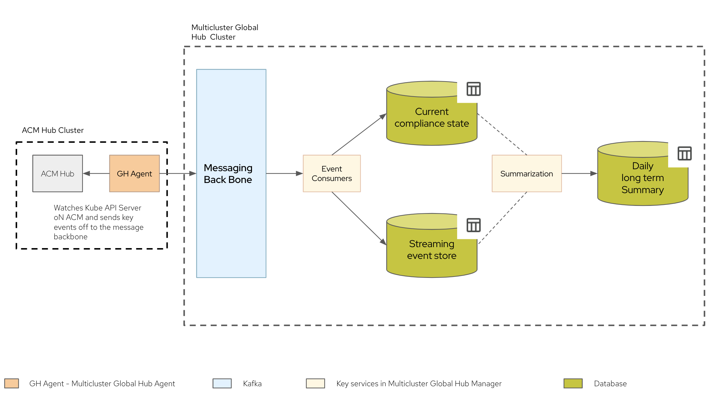

# How does Global Hub Work
Focus here will be on 2 key set of microservices in [architecture](./README.md) of the Multicluster Global Hub:
- Multicluster Global Hub Manager
- Multicluster Global Hub Agent

and how do they concretely create the high level summary of the many policies deployed across many clusters.

## Scenario
Let us imagine a possible installation scenario.
1. There are 700 managed clusters managed by multiple ACM hubs
1. Each of these managed clusters have around 30 policies deployed on them.
1. There are a total of 100 policies.
1. And a Multicluster Global Hub is added deliver these [Use Cases](./global_hub_use_cases.md)


### Summarization Process
How to summarize a single line that shows policy compliance across time. From the above, there are 21,000 (700*30) cluster-policy status-es that needs to be summarized. 

#### Key Steps
1. Events for 
    - policy creation
    - policy propapagtion to managed clusters and 
    - policy compliance for each of the managed cluster 
    
    [flows](#dataflow) into Global Hub
1. The raw events are saved in the database.
1. The current status of each policies is also saved in the database.
1. Each night - 00:00:00 hrs as per the clock of the cluster on which multicluster global hub runs - there is a summarization routine that kicks off. It is summarizes `a policy running on a cluster` to be `compliant or non-compliant or pending` for the past day. And this is done for all policies. This calculation is done on the basis of :
    - compliance state of the `policy on the cluster` at *end of the previous day*
    - changes(aka events) to the `policy on the cluster` *during the previous day*
    - compliance state of a cluster is a logical AND of daily summarized status of all polcies on the cluster.

#### Summarization Rule
|State of Policy on a cluster at end of previous day|Events related to the Policy on the cluster during the previous day| Calculated Summarized state for the previous day|
|---|---|---|
|compliant| No non-compliant event have come during the day| compliant|
|compliant| Even one Non-compliant event have come during the day| non-compliant|
|non-compliant| does not matter| non-compliant|
|pending| does not matter| pending|

In the long run, the desired state is full compliance. If daily variations as captured above continues to persist, it needs to be investigated. And this will also bring out anamolous behaviour if any - that is: the fleet is largely compliant barring a few outliers.


#### Dataflow    

Note:
- multicluster global hub operator controls the life cycle of the multicluster global hub manager and global hub agent
- kafka and database can run on the Global cluster or outside it
- ACM hub also runs on the multicluster global hub cluster, but does not participate in the daily functioning of the global hub.

### Run the Summarization Process manually
Usually, we don't need to run summary process manually. However, unexpected errors may occur when running the compliance job, so it is necessary for us to manually log in to the database to perform the whole summary process to recover the data that is not generated.

Before starting, the first thing you need to know is that the process of this summary consists of two subtasks:
- Insert the cluster policy data of that day from  [Materialized View](https://www.postgresql.org/docs/current/rules-materializedviews.html)  `local_compliance_view_<yyyy_MM_dd>` to `history.local_compliance`.
- Add the `compliance` and policy flip `frequency` of that day to `history.local_compliance` based on `event.local_policies`.

#### Execution steps

1. Connect to the database
   
   You can use clients such as pgAdmin, tablePlush, etc. to connect to the Global Hub database to execute the SQL statements involved in the next few steps. If your postgres database is installed through [this script](../operator/config/samples/storage/deploy_postgres.sh), you can directly connect to the database on the cluster through the following command.
   ```bash
   kubectl exec -it $(kubectl get pods -n hoh-postgres -l postgres-operator.crunchydata.com/role=master -o jsonpath='{.items..metadata.name}') -n hoh-postgres -c database -- psql -d hoh
   ```
       
2. Determine the date that needs to be executed, take `2023-07-06` as an example

    If you find on the dashboard that there is no any compliance information on `2023-07-06`, then find the the job failure information of the day after this day, that is `2023-07-07`, in `history.local_compliance_job_log`. In this way, it can be determined that `2023-07-06` is the date we need to manually execute the summary processes.


3. Check whether the Materialized View `history.local_compliance_view_2023_07_06` exists
    ```sql
    select * from history.local_compliance_view_2023_07_06
    ```
    The View `history.local_compliance_view_2023_07_06` is necessary to run the following steps.

4. Load the view records to `history.local_compliance`
    ```sql
    -- create the insert func
    CREATE OR REPLACE FUNCTION history.job_insert_local_compliance(
        view_date text
    )
    RETURNS void AS $$
    BEGIN
        EXECUTE format('
            INSERT INTO history.local_compliance (policy_id, cluster_id, leaf_hub_name, compliance, compliance_date)
            (
                SELECT policy_id, cluster_id, leaf_hub_name, compliance, %2$L 
                FROM history.local_compliance_view_%1$s
                ORDER BY policy_id, cluster_id
            )
            ON CONFLICT (policy_id, cluster_id, compliance_date) DO NOTHING',
            view_date, view_date);
    END;
    $$ LANGUAGE plpgsql;

    -- exec the insert func for that day '2023_07_06'
    SELECT history.job_insert_local_compliance('2023_07_06');
    ```

5. Add the `compliance` and `frequency` information of that day to `history.local_compliance`
    ```sql
    -- create the update func
    CREATE OR REPLACE FUNCTION history.job_update_local_compliance(start_date_param text, end_date_param text)
    RETURNS void AS $$
    BEGIN
        EXECUTE format('
            INSERT INTO history.local_compliance (policy_id, cluster_id, leaf_hub_name, compliance_date, compliance, compliance_changed_frequency)
            WITH compliance_aggregate AS (
                SELECT cluster_id, policy_id, leaf_hub_name,
                    CASE
                        WHEN bool_and(compliance = ''compliant'') THEN ''compliant''
                        ELSE ''non_compliant''
                    END::local_status.compliance_type AS aggregated_compliance
                FROM event.local_policies
                WHERE created_at BETWEEN %1$L::date AND %2$L::date
                GROUP BY cluster_id, policy_id, leaf_hub_name
            )
            SELECT policy_id, cluster_id, leaf_hub_name, %1$L, aggregated_compliance,
                (SELECT COUNT(*) FROM (
                    SELECT created_at, compliance, 
                        LAG(compliance) OVER (PARTITION BY cluster_id, policy_id ORDER BY created_at ASC) AS prev_compliance
                    FROM event.local_policies lp
                    WHERE (lp.created_at BETWEEN %1$L::date AND %2$L::date) 
                        AND lp.cluster_id = ca.cluster_id AND lp.policy_id = ca.policy_id
                    ORDER BY created_at ASC
                ) AS subquery WHERE compliance <> prev_compliance) AS compliance_changed_frequency
            FROM compliance_aggregate ca
            ORDER BY cluster_id, policy_id
            ON CONFLICT (policy_id, cluster_id, compliance_date)
            DO UPDATE SET
                compliance = EXCLUDED.compliance,
                compliance_changed_frequency = EXCLUDED.compliance_changed_frequency',
            start_date_param, end_date_param);
    END;
    $$ LANGUAGE plpgsql;

    -- exec the update func with condition between '2023-07-06' and '2023-07-07'
    SELECT history.job_update_local_compliance('2023_07_06', '2023_07_07');
    ```
6. Once the above steps are successfully executed, you can delete the Materialized View `history.local_compliance_view_2023_07_06` safely.
    ```sql
    DROP MATERIALIZED VIEW IF EXISTS history.local_compliance_view_2023_07_06
    ```
