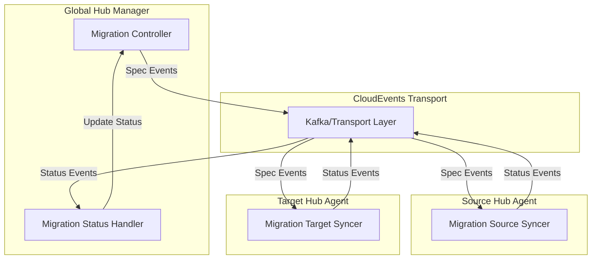
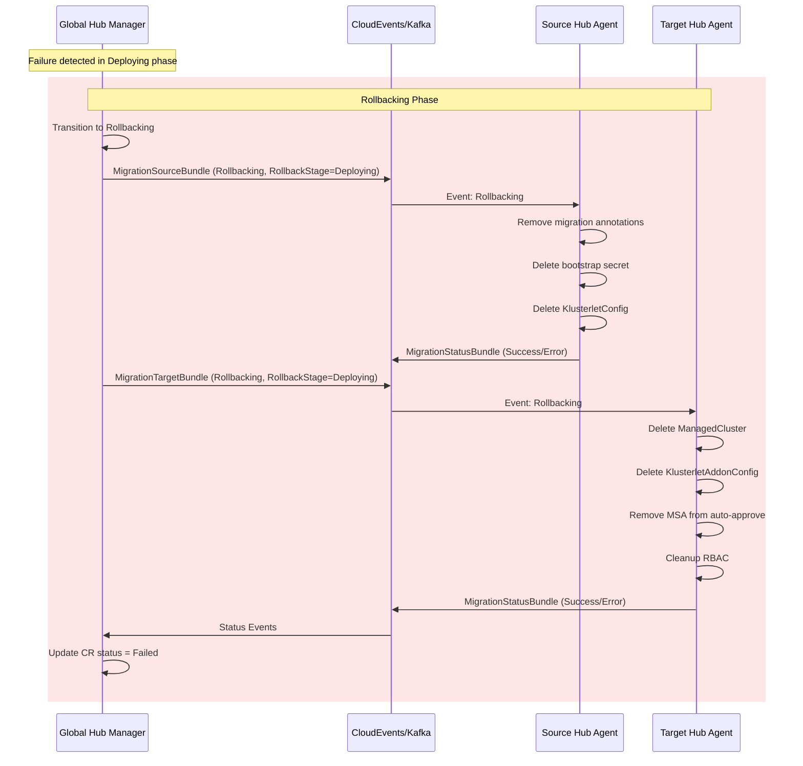

# Global Hub Migration 流程图

## 架构概览



## 完整迁移流程时序图

```mermaid
sequenceDiagram
    participant User
    participant Manager as Global Hub Manager
    participant Kafka as CloudEvents/Kafka
    participant SourceAgent as Source Hub Agent
    participant TargetAgent as Target Hub Agent

    User->>Manager: Create ManagedClusterMigration CR

    rect rgb(240, 248, 255)
    Note over Manager,TargetAgent: Phase 1: Validating
    Manager->>Manager: Validate source/target hubs
    Manager->>Kafka: MigrationSourceBundle (Validating)
    Kafka->>SourceAgent: Event: Validating
    SourceAgent->>SourceAgent: Get clusters from Placement
    SourceAgent->>SourceAgent: Validate clusters (not hosted, available, etc.)
    SourceAgent->>Kafka: MigrationStatusBundle (Success/Error)

    Manager->>Kafka: MigrationTargetBundle (Validating)
    Kafka->>TargetAgent: Event: Validating
    TargetAgent->>TargetAgent: Check cluster name conflicts
    TargetAgent->>Kafka: MigrationStatusBundle (Success/Error)

    Kafka->>Manager: Status Events
    Manager->>Manager: Update CR status
    end

    rect rgb(255, 250, 240)
    Note over Manager,TargetAgent: Phase 2: Initializing
    Manager->>Manager: Create ManagedServiceAccount
    Manager->>Manager: Get bootstrap kubeconfig
    Manager->>Kafka: MigrationSourceBundle (Initializing + BootstrapSecret)
    Kafka->>SourceAgent: Event: Initializing
    SourceAgent->>SourceAgent: Create bootstrap secret
    SourceAgent->>SourceAgent: Create KlusterletConfig
    SourceAgent->>SourceAgent: Add annotations to ManagedCluster
    SourceAgent->>Kafka: MigrationStatusBundle (Success/Error)

    Manager->>Kafka: MigrationTargetBundle (Initializing + MSA info)
    Kafka->>TargetAgent: Event: Initializing
    TargetAgent->>TargetAgent: Enable ClusterManager auto-approval
    TargetAgent->>TargetAgent: Create RBAC for MSA
    TargetAgent->>Kafka: MigrationStatusBundle (Success/Error)

    Kafka->>Manager: Status Events
    Manager->>Manager: Update CR status
    end

    rect rgb(240, 255, 240)
    Note over Manager,TargetAgent: Phase 3: Deploying
    Manager->>Kafka: MigrationSourceBundle (Deploying)
    Kafka->>SourceAgent: Event: Deploying
    SourceAgent->>SourceAgent: Collect ManagedCluster resources
    SourceAgent->>SourceAgent: Collect KlusterletAddonConfig
    SourceAgent->>Kafka: MigrationResourceBundle (Direct to Target)
    Kafka->>TargetAgent: Event: MigrationResourceBundle
    TargetAgent->>TargetAgent: Create ManagedCluster on target
    TargetAgent->>TargetAgent: Create KlusterletAddonConfig
    TargetAgent->>Kafka: MigrationStatusBundle (Success/Error)

    Kafka->>Manager: Status Events
    Manager->>Manager: Update CR status
    end

    rect rgb(255, 240, 245)
    Note over Manager,TargetAgent: Phase 4: Registering
    Manager->>Kafka: MigrationSourceBundle (Registering)
    Kafka->>SourceAgent: Event: Registering
    SourceAgent->>SourceAgent: Set HubAcceptsClient=false
    SourceAgent->>Kafka: MigrationStatusBundle (Success/Error)

    Manager->>Kafka: MigrationTargetBundle (Registering)
    Kafka->>TargetAgent: Event: Registering
    TargetAgent->>TargetAgent: Wait for cluster re-registration
    TargetAgent->>TargetAgent: Check ManifestWork status
    TargetAgent->>Kafka: MigrationStatusBundle (Success/Error)

    Kafka->>Manager: Status Events
    Manager->>Manager: Update CR status
    end

    rect rgb(255, 255, 240)
    Note over Manager,TargetAgent: Phase 5: Cleaning
    Manager->>Kafka: MigrationSourceBundle (Cleaning)
    Kafka->>SourceAgent: Event: Cleaning
    SourceAgent->>SourceAgent: Delete bootstrap secret
    SourceAgent->>SourceAgent: Delete KlusterletConfig
    SourceAgent->>SourceAgent: Delete ManagedCluster (if HubAcceptsClient=false)
    SourceAgent->>Kafka: MigrationStatusBundle (Success/Error)

    Manager->>Kafka: MigrationTargetBundle (Cleaning)
    Kafka->>TargetAgent: Event: Cleaning
    TargetAgent->>TargetAgent: Remove MSA from auto-approve list
    TargetAgent->>TargetAgent: Cleanup migration RBAC
    TargetAgent->>Kafka: MigrationStatusBundle (Success/Error)

    Kafka->>Manager: Status Events
    Manager->>Manager: Update CR status = Completed
    end

    User->>Manager: Check migration status
    Manager->>User: Status: Completed
```



## 失败回滚流程



## CloudEvents 消息类型详解

### 1. Spec Events (Manager → Agents)

#### MigrationSourceBundle
从 Manager 发送到 Source Hub Agent 的指令事件。

```go
type MigrationSourceBundle struct {
    MigrationId      string          // 迁移任务唯一标识
    Stage            string          // 当前阶段: Validating/Initializing/Deploying/Registering/Cleaning/Rollbacking
    ManagedClusters  []string        // 待迁移的集群列表
    ToHub            string          // 目标 Hub 名称
    PlacementName    string          // Placement 名称 (用于 Validating 阶段)
    BootstrapSecret  *corev1.Secret  // Bootstrap kubeconfig secret (Initializing 阶段)
    RollbackStage    string          // 回滚到哪个阶段 (Rollbacking 时使用)
}
```

**CloudEvent 属性:**
- `Type`: `migration.open-cluster-management.io/managedclustermigration.source`
- `Source`: `global-hub` (Manager)
- `Subject`: `<source-hub-name>` (Target Agent)
- `Topic`: Spec Topic

#### MigrationTargetBundle
从 Manager 发送到 Target Hub Agent 的指令事件。

```go
type MigrationTargetBundle struct {
    MigrationId                           string   // 迁移任务唯一标识
    Stage                                 string   // 当前阶段
    ManagedClusters                       []string // 待迁移的集群列表
    ManagedServiceAccountName             string   // MSA 名称
    ManagedServiceAccountInstallNamespace string   // MSA 安装命名空间
    RegisteringTimeoutMinutes             int      // 注册超时时间 (分钟)
    RollbackStage                         string   // 回滚阶段
}
```

**CloudEvent 属性:**
- `Type`: `migration.open-cluster-management.io/managedclustermigration.target`
- `Source`: `global-hub` (Manager)
- `Subject`: `<target-hub-name>` (Target Agent)
- `Topic`: Spec Topic

#### MigrationResourceBundle
从 Source Hub Agent 直接发送到 Target Hub Agent 的资源事件 (Deploying 阶段)。

```go
type MigrationResourceBundle struct {
    MigrationId               string                      // 迁移任务唯一标识
    MigrationClusterResources []MigrationClusterResource  // 每个集群的资源列表
}

type MigrationClusterResource struct {
    ClusterName string                        // 集群名称
    ResouceList []unstructured.Unstructured   // 资源列表 (ManagedCluster, KlusterletAddonConfig等)
}
```

**CloudEvent 属性:**
- `Type`: `migration.open-cluster-management.io/managedclustermigration.target`
- `Source`: `<source-hub-name>` (Source Agent)
- `Subject`: `<target-hub-name>` (Target Agent)
- `Topic`: Spec Topic

### 2. Status Events (Agents → Manager)

#### MigrationStatusBundle
从 Agent 发送到 Manager 的状态反馈事件。

```go
type MigrationStatusBundle struct {
    MigrationId     string            // 迁移任务唯一标识
    Stage           string            // 完成的阶段
    ErrMessage      string            // 错误信息 (如果失败)
    ManagedClusters []string          // 集群列表 (仅 Validating 阶段)
    ClusterErrors   map[string]string // 每个集群的错误信息
    Resync          bool              // 是否为重新同步事件
}
```

**CloudEvent 属性:**
- `Type`: `migration.open-cluster-management.io/managedclustermigration`
- `Source`: `<hub-name>` (Source/Target Agent)
- `Extension[clustername]`: `global-hub` (发送到 Manager)
- `Topic`: Status Topic
- `Version`: Incremental version number

## 各阶段详细说明

### Phase 1: Validating (验证阶段)

**Manager 职责:**
- 验证 ManagedClusterMigration CR 的有效性
- 检查 source hub 和 target hub 是否存在
- 发送 Validating 事件到 source 和 target agents

**Source Agent 职责:**
- 如果提供了 `PlacementName`,从 PlacementDecision 获取集群列表
- 验证每个集群:
  - 不是 hosted 模式
  - 不是 local-cluster
  - 状态为 Available
  - 不是 managed hub
- 报告验证结果和集群列表

**Target Agent 职责:**
- 检查待迁移的集群名称是否已存在于 target hub
- 报告验证结果

**失败处理:**
- 验证失败直接进入 `Failed` 状态,不进行回滚

### Phase 2: Initializing (初始化阶段)

**Manager 职责:**
- 创建 ManagedServiceAccount (MSA) 在 target hub
- 等待 MSA token secret 生成
- 提取 bootstrap kubeconfig
- 发送 Initializing 事件 (包含 bootstrap secret) 到 agents

**Source Agent 职责:**
- 创建 bootstrap secret (包含 target hub 的 kubeconfig)
- 创建 KlusterletConfig (配置 bootstrap secret)
- 更新 ManagedCluster annotations:
  - `agent.open-cluster-management.io/klusterlet-config`: 指向 KlusterletConfig
  - `global-hub.open-cluster-management.io/migrating`: 标记为迁移中

**Target Agent 职责:**
- 在 ClusterManager 中启用 `ManagedClusterAutoApproval` feature gate
- 添加 MSA user 到 AutoApproveUsers 列表
- 创建 RBAC 资源:
  - ClusterRole: `global-hub-migration-<msa-name>-sar` (SubjectAccessReview 权限)
  - ClusterRoleBinding: 绑定 MSA 到 SubjectAccessReview role
  - ClusterRoleBinding: 绑定 MSA 到 `open-cluster-management:managedcluster:bootstrap:agent-registration`

**失败处理:**
- 失败进入 `Rollbacking` 阶段,清理初始化资源

### Phase 3: Deploying (部署阶段)

**Manager 职责:**
- 发送 Deploying 事件到 source agent

**Source Agent 职责:**
- 收集每个集群的资源:
  - ManagedCluster (清理 metadata 和 spec.managedClusterClientConfigs)
  - KlusterletAddonConfig (可选)
- 构造 MigrationResourceBundle
- **直接发送到 Target Hub Agent** (不经过 Manager)

**Target Agent 职责:**
- 创建集群命名空间
- 在 target hub 创建:
  - ManagedCluster
  - KlusterletAddonConfig
- 报告部署结果

**失败处理:**
- 失败进入 `Rollbacking` 阶段,删除已部署的资源

### Phase 4: Registering (注册阶段)

**Manager 职责:**
- 发送 Registering 事件到 agents

**Source Agent 职责:**
- 将 ManagedCluster 的 `spec.hubAcceptsClient` 设置为 `false`
- 触发 klusterlet 重新注册到 target hub

**Target Agent 职责:**
- 轮询等待集群重新注册完成 (默认 10 分钟超时)
- 检查每个集群的 ManifestWork (`<cluster-name>-klusterlet`) 状态
- 等待 `WorkApplied` condition 为 `True`

**失败处理:**
- 失败进入 `Rollbacking` 阶段
- Source agent 将 `spec.hubAcceptsClient` 恢复为 `true`

### Phase 5: Cleaning (清理阶段)

**Manager 职责:**
- 发送 Cleaning 事件到 agents

**Source Agent 职责:**
- 删除 bootstrap secret
- 删除 KlusterletConfig
- 删除 ManagedCluster (仅当 `spec.hubAcceptsClient=false` 时)

**Target Agent 职责:**
- 从 ClusterManager AutoApproveUsers 列表中移除 MSA user
- 删除迁移相关的 RBAC 资源:
  - ClusterRole: `global-hub-migration-<msa-name>-sar`
  - ClusterRoleBinding: `global-hub-migration-<msa-name>-sar`
  - ClusterRoleBinding: `global-hub-migration-<msa-name>-registration`

**失败处理:**
- 清理失败**仍然**进入 `Completed` 状态
- 在 conditions 中添加 warning 信息
- 可能需要手动清理残留资源

### Rollbacking Phase (回滚阶段)

**触发条件:**
- Initializing/Deploying/Registering 任何阶段失败

**Manager 职责:**
- 设置 `RollbackStage` 字段标识从哪个阶段回滚
- 发送 Rollbacking 事件到 agents
- 回滚**总是**最终进入 `Failed` 状态

**Source Agent 职责:**
根据 RollbackStage 执行不同操作:
- **Initializing**: 删除 bootstrap secret, KlusterletConfig, 移除集群 annotations
- **Deploying**: 执行 Initializing rollback
- **Registering**: 执行 Deploying rollback + 恢复 `spec.hubAcceptsClient=true`

**Target Agent 职责:**
根据 RollbackStage 执行不同操作:
- **Initializing**: 移除 MSA auto-approve, 清理 RBAC
- **Deploying**: 删除 ManagedCluster, KlusterletAddonConfig + 执行 Initializing rollback
- **Registering**: 执行 Deploying rollback

## Event Flow 总结

```
Manager                 Kafka                   Source Agent              Target Agent
   |                      |                          |                         |
   |---Spec Event-------->|                          |                         |
   |  (Source Bundle)     |---Spec Event------------>|                         |
   |                      |                          |                         |
   |                      |                          |---Status Event--------->|
   |                      |<--Status Event-----------|                         |
   |<--Status Event-------|                          |                         |
   |                      |                          |                         |
   |---Spec Event-------->|                          |                         |
   |  (Target Bundle)     |---Spec Event--------------------------->|          |
   |                      |                          |              |          |
   |                      |                          |              |--Status Event-->|
   |                      |<--Status Event--------------------------+          |
   |<--Status Event-------|                          |                         |
   |                      |                          |                         |
   |  (Deploying phase: Source → Target directly)    |                         |
   |                      |                          |                         |
   |                      |                          |---Resource Event------->|
   |                      |                          |  (MigrationResourceBundle)|
```

## 关键设计要点

1. **事件驱动架构**: 所有通信通过 CloudEvents/Kafka,支持异步处理和解耦
2. **双向状态同步**: Manager 发送 spec events, Agents 反馈 status events
3. **直接资源传输**: Deploying 阶段 Source Agent 直接将资源发送给 Target Agent,避免大量数据经过 Manager
4. **幂等性**: 所有操作使用 `CreateOrUpdate` 模式,支持重试
5. **版本控制**: Status events 使用递增版本号,确保顺序性
6. **错误隔离**: 每个集群的错误独立记录在 `ClusterErrors` 中
7. **渐进式迁移**: 通过多个阶段逐步完成迁移,每个阶段可独立验证
8. **清理保证**: Cleaning 阶段总是完成,即使部分清理失败也标记为 Completed (带 warning)
