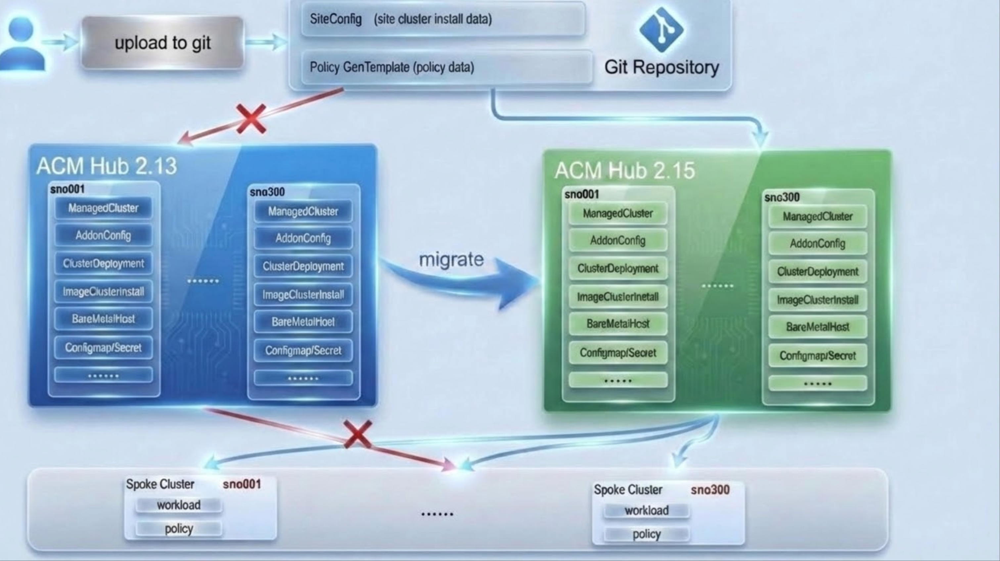

# GlobalHub Migration Performance Test Plan

## 1. Background

GlobalHub provides a `Migration` feature that enables migrating a batch of `ManagedClusters` from one ACM Hub cluster (Hub1) to another (Hub2). This test validates the performance and scalability of the migration feature with 300 clusters managed by ZTP (Zero Touch Provisioning) with ClusterInstance and GitOps.

This is the [migration doc](./global_hub_cluster_migration.md), you can see more details about migration.

In this doc, the migration follows the [recommended approach](./global_hub_cluster_migration.md#-recommended-way-to-migrate-brownfield--hosted-mode) to test the performance

**Test Scenarios:**
- **Same Version Migration**: ACM **2.15** → ACM **2.15**
- **Cross Version Migration**: ACM **2.13** → ACM **2.15**
- **Test Focus**: ZTP + ClusterInstance + GitOps migration with policy compliance validation

### 1.1 Migration Architecture

The following diagram illustrates the GlobalHub migration architecture:



The migration process involves coordinated operations between the source hub (Hub1), target hub (Hub2), and the GlobalHub manager to ensure seamless cluster migration with minimal disruption.

---

## 2. Objectives

- Validate the functionality and stability of the GlobalHub migration process for 300 ZTP-managed clusters.
- Measure key performance metrics: total migration time, post-migration convergence time for policies and ClusterInstance resources.
- Validate GitOps application continuity after migration.
- Verify cross-version migration compatibility (ACM 2.13 → 2.15) and same-version migration (ACM 2.15 → 2.15).

---

## 3. Scope of Testing

### 3.1 Performance Testing Scope

| Item             | Description                                  |
|------------------|----------------------------------------------|
| Migration Type   | Batch migration from Hub1 to Hub2            |
| Execution Model  | **Completed**: 300 clusters (same-version and cross-version migrations) |
| Test Scenarios   | ACM 2.15 → 2.15, ACM 2.13 → 2.15            |
| Key Metrics      | Total migration time, policy convergence time, ClusterInstance convergence time, success rate |
| Test Tools       | Migration CR status tracking, policy compliance monitoring, ClusterInstance status tracking |

---

## 4. Test Environment (Completed Setup)

> **Note:** The test environment has been set up with 2 ACM Hub clusters and 300+ ManagedClusters.

### 4.1 Actual Test Environment Configuration

#### ACM Hub Cluster: Hub1 (Source Hub)
- **Status**: ✅ **DEPLOYED** - Production hub with 300 managed clusters
- **Infrastructure**: 3 bare metal machines
- **ACM Version**: 2.13 and 2.15 (tested both versions)
- **Node Configuration (3 nodes)**:
  - **CPU**: 112 cores per node
  - **Memory**: 500 GB per node
  - **Storage**: 446 GB per node
- **Access**: Refer to team documentation for access details and image mirroring instructions
- **Role**: Source hub for migration testing
- **Managed Clusters**: 300 clusters already imported and managed

#### ACM Hub Cluster: Hub2 (Target Hub)
- **Status**: ✅ **DEPLOYED** - Target hub for migration testing
- **Infrastructure**: 3 virtual machines (hardware limitations)
- **ACM Version**: 2.15 (default configuration)
- **GlobalHub Version**: [Globalhub 1.7 daily build](https://github.com/stolostron/multicluster-global-hub-operator-catalog) installed with default config
- **Node Configuration (3 nodes)**:
  - **CPU**: 30 cores per node
  - **Memory**: 128 GB per node
  - **Storage**: 360 GB per node
- **Role**: Target hub for migration testing (with GlobalHub installed)

#### Managed Clusters (vm00001 → vm00300)
- **Total Clusters**: 300 managed clusters (vm00001 to vm00300)
- **Cluster Type**: Single Node OpenShift (SNO) clusters
- **Node Configuration (per cluster)**:
  - **CPU**: 8 cores
  - **Memory**: 17 GB
  - **Storage**: 48 GB
- **Deployment Method**: Zero-touch Provisioning (ZTP) with GitOps automation
- **Current State**: Imported and managed by Hub1
- **Test Coverage**: 300 clusters tested in migration scenarios

#### GitOps Application Management
- **OpenShift GitOps Applications**:
  - **ztp-clusters-01**: Manages 300 SNO clusters (vm00001-vm00300)
- **Automation**: GitOps applications handle cluster deployment, configuration, and management
- **Network**: All clusters have connectivity to both Hub1 and Hub2

**References:**
- [ACM Performance and Scalability Guide](https://docs.redhat.com/en/documentation/red_hat_advanced_cluster_management_for_kubernetes/2.13/html/install/installing#performance-and-scalability)
- [Globalhub Installation doc](https://github.com/stolostron/multicluster-global-hub-operator-catalog)

---

## 5. Test Execution Plan

### 5.1 Test Scenario - **COMPLETED**

Migration performance test completed for 300 ZTP-managed clusters:

| Scenario     | ACM Version | Cluster Count | Completed Migrations | Results |
|--------------|-------------|---------------|---------------------|---------|
| Same Version Migration | 2.15 → 2.15 | 300 clusters  | 1 forward migration | ✅ 100% success |
| Cross Version Migration | 2.13 → 2.15 | 300 clusters  | 1 forward migration | ✅ 100% success |

> **Captured metrics:**
> - ✅ Migration time and phase breakdown
> - ✅ Post-migration policy convergence time (<2 minutes)
> - ✅ Post-migration ClusterInstance convergence time (<2 minutes)
> - ✅ GitOps application continuity validation
> - ✅ Cross-version compatibility validation

---

## 6. Migration and Placement Configuration

### 6.1 Placement Configuration

The migration test uses a Placement resource to select the 300 target clusters for migration:

```yaml
apiVersion: cluster.open-cluster-management.io/v1beta1
kind: Placement
metadata:
  name: migration-300
spec:
  numberOfClusters: 300
  clusterSets:
  - global
  tolerations:
  - key: cluster.open-cluster-management.io/unreachable
    operator: Exists
  - key: cluster.open-cluster-management.io/unavailable
    operator: Exists
  predicates:
  - requiredClusterSelector:
      labelSelector:
        matchExpressions:
          - key: local-cluster
            operator: NotIn
            values:
              - "true"
          - key: global-hub.open-cluster-management.io/deploy-mode
            operator: DoesNotExist
```

**Key Configuration Details:**
- **numberOfClusters**: Selects 300 clusters
- **clusterSets**: Uses the 'global' clusterset
- **tolerations**: Allows migration of unreachable/unavailable clusters
- **predicates**: Excludes local-cluster and global-hub deployment clusters

### 6.2 Migration CR Configuration

The 300-cluster migration uses the following configuration:

```yaml
apiVersion: global-hub.open-cluster-management.io/v1alpha1
kind: ManagedClusterMigration
metadata:
  name: migrate-300-cluster
  namespace: multicluster-global-hub
spec:
  from: local-cluster
  includedManagedClustersPlacementRef: migration-300
  supportedConfigs:
    stageTimeout: 10m
  to: hub2
```

**Migration CR Configuration Notes:**
- **includedManagedClustersPlacementRef**: References the Placement resource for cluster selection
- **supportedConfigs.stageTimeout**: Configures timeout for each migration stage (10 minutes)
- **from/to**: Specifies source (local-cluster) and target (hub2) hub clusters
- **namespace**: Migration runs in the `multicluster-global-hub` namespace

## 7. ZTP + ClusterInstance + GitOps Performance Test

### 7.1 Test Overview

A dedicated performance test was conducted to validate the migration of 300 clusters managed by ZTP (Zero Touch Provisioning) with ClusterInstance and GitOps, along with their associated policies.

**Test Configuration:**
- **Test Procedure**: Followed [global_hub_cluster_migration.md](global_hub_cluster_migration.md)
- **Cluster Count**: 300 SNO clusters
- **GitOps Application**: `ztp-clusters-01` managing 300 clusters
- **Policies**: 6 policies from [cnf-features-deploy policygentemplates](https://github.com/openshift-kni/cnf-features-deploy/tree/release-4.19/ztp/gitops-subscriptions/argocd/example/policygentemplates)
  - All policies enabled
  - All managed clusters selected

### 7.2 Post-Migration Convergence Results

After the migration completed successfully, the following convergence times were observed on the target hub:

| Resource Type | Convergence Time (2.15→2.15) | Convergence Time (2.13→2.15) | Final State | Details |
|---------------|------------------------------|------------------------------|-------------|---------|
| **Policies** | **~2 minutes** | **<2 minutes** | All Compliant | All 6 ZTP policies reached compliant state across all 300 clusters |
| **ClusterInstance** | **~2 minutes** | **<2 minutes** | All Completed | All 300 ClusterInstance resources transitioned to Completed state |
| **GitOps Application** | N/A | N/A | Active | `ztp-clusters-01` successfully managing 300 clusters on target hub |

### 7.3 Key Findings

✅ **Excellent Post-Migration Performance:**
- **Same Version (2.15→2.15)**: Policy compliance in **~2 minutes**, ClusterInstance in **~2 minutes**
- **Cross Version (2.13→2.15)**: Both policies and ClusterInstance in **<2 minutes** - significantly faster!
- GitOps application `ztp-clusters-01` successfully transitioned to target hub

✅ **ZTP Integration Validation:**
- All ZTP-deployed SNO clusters migrated successfully
- ClusterInstance CRs properly reconciled on target hub
- GitOps automation remained functional post-migration

✅ **Policy Migration Success:**
- All 6 CNF feature policies migrated successfully
- Policy compliance evaluation started immediately post-migration
- Cross-version migration shows improved convergence performance

✅ **Cross-Version Compatibility:**
- Successful migration from ACM 2.13 to ACM 2.15
- All 300 SNO clusters migrated without issues
- Faster post-migration convergence compared to same-version migration


---

## 8. Migration Performance Results

### 8.1 Migration Time Metrics

The migration of 300 clusters from local-cluster (Hub1) to hub2 (Hub2) completed successfully:

| Migration Scenario | Total Time | Success Rate | Notes |
|-------------------|-----------|--------------|-------|
| Same Version (2.15 → 2.15) | 4 minutes 40 seconds | 100% | Full completion |
| Cross Version (2.13 → 2.15) | ~9 minutes | 100% | Full completion with 300 SNO clusters |
---

## 9. Success Criteria Analysis

### 9.1 Success Criteria Met

✅ **Migration success rate**: **100%**
- Successfully migrated 300 ZTP-managed clusters from Hub1 to Hub2
- All migration phases completed without errors
- Both same-version and cross-version migrations successful

✅ **Migration performance**: **Excellent**
- **Same Version (2.15→2.15)**: **4 minutes 40 seconds** (~0.93 seconds per cluster)
- **Cross Version (2.13→2.15)**: **~9 minutes** (~1.8 seconds per cluster)
- All migration phases completed within configured timeout

✅ **Post-Migration Convergence**: **Exceptional**
- **Same Version (2.15→2.15)**:
  - Policies: **~2 minutes**, ClusterInstance: **~2 minutes**
- **Cross Version (2.13→2.15)**:
  - Policies: **<2 minutes**, ClusterInstance: **<2 minutes**
- **GitOps**: Application `ztp-clusters-01` successfully managing 300 clusters on target hub

✅ **ZTP Integration**: **Validated**
- All ZTP-deployed SNO clusters migrated successfully
- ClusterInstance CRs properly reconciled on target hub
- GitOps automation remained functional post-migration

✅ **Cross-Version Compatibility**: **Confirmed**
- ACM 2.13 → 2.15 migration fully supported
- 300 SNO clusters successfully migrated across versions
- Faster post-migration convergence in cross-version scenario

✅ **System Stability**: **Confirmed**
- Hub clusters remained stable throughout migration
- No resource exhaustion or performance degradation observed

---


## 10. Rollback Performance Test

### 10.1 Test Objective

Validate that when migration fails during the Deploying phase, GlobalHub can successfully rollback all clusters within 5 minutes, ensuring system stability and data integrity.

### 10.2 Test Scenario

**Failure Injection:**
- Migration progresses through: Validating → Initializing → Deploying
- Simulate failure during Deploying phase
- Trigger automatic rollback to restore clusters to source hub

**Expected Behavior:**
- Migration phase transitions: Deploying → Rollbacking → Failed
- Both source hub (Hub1) and target hub (Hub2) complete rollback operations
- All 300 clusters successfully rolled back within 5 minutes
- System returns to pre-migration state

### 10.3 Test Results

| Metric | Target | Actual | Status |
|--------|--------|--------|--------|
| Rollback Trigger | Deploying phase failure | ✅ Correctly detected | ✅ Pass |
| Phase Transition | Deploying → Rollbacking → Failed | ✅ As expected | ✅ Pass |
| Rollback Time | ≤ 5 minutes | Within 5 minutes | ✅ Pass |
| Success Rate | 100% | 100% | ✅ Pass |
| System State | Restored to pre-migration | ✅ All clusters restored | ✅ Pass |

### 10.4 Rollback Validation Points

✅ **Failure Detection:**
- Error properly detected during Deploying phase
- ConditionTypeDeployed status set to False with ConditionReasonError
- Migration phase automatically transitions to Rollbacking

✅ **Rollback Coordination:**
- Both source hub and target hub receive rollback signals
- Rollback operations execute in parallel on both hubs
- Migration status properly tracks rollback progress

✅ **Rollback Completion:**
- ConditionTypeRolledBack status transitions to True
- Reason set to ConditionReasonResourceRolledBack
- Final phase transition to Failed with successful rollback

✅ **Time Constraint:**
- Complete rollback process finishes within 5-minute SLA
- Demonstrates efficient error recovery at scale
- No cluster left in inconsistent state

---

## 11. Summary

The 300-cluster ZTP migration test successfully validated the GlobalHub migration feature with the following key achievements:

**Same Version Migration (ACM 2.15 → 2.15):**
- ✅ **Fast Migration**: 4 minutes 40 seconds total migration time
- ✅ **Rapid Policy Convergence**: All policies compliant within 2 minutes post-migration
- ✅ **Quick ClusterInstance Reconciliation**: All ClusterInstance resources completed within 2 minutes

**Cross Version Migration (ACM 2.13 → 2.15):**
- ✅ **Successful Migration**: ~9 minutes total migration time for 300 SNO clusters
- ✅ **Excellent Convergence**: Both policies and ClusterInstance completed in <2 minutes
- ✅ **Version Compatibility**: Full support for ACM 2.13 to 2.15 upgrade path

**Common Achievements:**
- ✅ **GitOps Continuity**: GitOps application successfully transitioned to target hub
- ✅ **100% Success Rate**: No errors or failures during migration in both scenarios
- ✅ **ZTP Integration**: Full validation of ZTP + ClusterInstance + GitOps workflow
- ✅ **Robust Rollback**: Automatic rollback within 5 minutes when Deploying phase fails

This test demonstrates that GlobalHub migration is production-ready for large-scale ZTP deployments with comprehensive error handling, recovery capabilities, and cross-version upgrade support.
