# Simulation at High Scale

## Environment

This simulation requires a **Red Hat OpenShift Container Platform clusters**. And also you need a virtual machine to create the KinD cluster and managed hub. Then we will mock the resources on the KinD cluster and observe the status on the database. The overall architecture is shown in the figure below.


You can use the scale test environment to simulate a large-scale cluster. Since the transport status path is very sensitive to the performance and represents a scale larger than the spec path.

There are two main metrics to express the scalability of global hubs:

- Initialization: The time to load all managed clusters and Policies to the Global Hub
- Policy status rotation: Rotate all the policies on the managed hubs and verify status changes on the database and observe the CPU and Memory consumption of the components.

## Initialization 

- Initialize the clusters for global hub, managed hubs and managed clusters

  You can execute the following scipt to create the hub clusters and join them into the global hub. To join these clusters to it, You must set the `KUBECONFIG` environment variable to enable these hubs can connect to the global hub. Besides, you also need to provide serveral parameters for the script:

  ```bash
  ./doc/simulation/setup-cluster.sh 5 300
  ```
  - `$1` - How many managed hub clusters will be created
  - `$2` - How many managed cluster will be created on per managed hub

  That means create `5` managed hubs and each has `300` managed clusters. You can also run `./doc/simulation/managed-clusters/cleanup-cluster.sh 300` on each hub cluster to cleanup the generated managed clusters.

- Create the policies on the managed hub clusters

  Running the following script to create the policies on all the managed hubs.
  ```bash
  ./doc/simulation/setup-policy.sh 5 50 300
  ```
  - `$1` - How many managed hub clusters to mock the polices
  - `$2` - How many root policy will be created per managed hub cluster
  - `$3` - How many managed cluster the root policy will be propagated to on each hub cluster

  That means the operation will run on the `5` managed hub concurrently. Each of them will create `50` root policies and propagate to the `300` managed clusters. So there will be `15000` replicas polices on the managed hub cluster. Likewise, you can execute `./doc/simulation/local-policies/cleanup-policy.sh 50 300` on each managed hub to delete the created polices.

- Start the `stopwatch` to count the records synced to database
  
  This scenario specifies how much time it took to send all of the clusters, policies and events in the first time. We can run a queries to count the numbers of these tables. The time between the first data appearance in the database and the expected `COUNT` is the test result. 

  We provide a [count script](stopwatch-initialization.sh) for the cluster, policies and events. You can optimize and enhance it to make it more of what you need.

  ```bash
  $ ./doc/simulation/stopwatch-initialization.sh
  ```

  The expected result should be:

  - `1500` Managed Cluster: 5 managed hubs each with `300` clusters
  - `150` Root Policies and `75000` Replicas Policies: each hub with `50` root policies and `50 * 300` replicas policies
  - `75000` Events: each replicas polices with `1` event

- Add the label `vendor: OpenShift` to the hub clusters to start the `multicluster-global-hub-agent` on each managed hub
  
  ```bash
  kubectl label mcl hub1 vendor=OpenShift --overwrite
  kubectl label mcl hub2 vendor=OpenShift --overwrite
  kubectl label mcl hub3 vendor=OpenShift --overwrite
  kubectl label mcl hub4 vendor=OpenShift --overwrite
  kubectl label mcl hub5 vendor=OpenShift --overwrite
  ```

- Observe the count of records in the tables

  ```bash
  $ ./doc/simulation/stopwatch-initialization.sh
  KUBECONFIG=/tmp/myan-global-hub
  database pod hoh-pgha1-zkz9-0

  2023-09-08 01:10:27 | cluster    |   300

  2023-09-08 01:12:12 | cluster    |   300

  ...
  2023-09-08 01:12:17 | compliance | 15000
  2023-09-08 01:12:17 | cluster    |   300

  ...
  2023-09-08 01:12:25 | compliance | 15000
  2023-09-08 01:12:25 | cluster    |   600

  ...
  2023-09-08 01:13:11 | event      | 15000
  2023-09-08 01:13:11 | compliance | 30000
  2023-09-08 01:13:11 | cluster    |   900

  ...
  2023-09-08 01:13:15 | event      | 30000
  2023-09-08 01:13:15 | compliance | 30000
  2023-09-08 01:13:15 | cluster    |   900

  ...
  2023-09-08 01:13:46 | event      | 30000
  2023-09-08 01:13:46 | compliance | 60000
  2023-09-08 01:13:46 | cluster    |   900

  ...
  2023-09-08 01:13:50 | event      | 30000
  2023-09-08 01:13:50 | compliance | 60000
  2023-09-08 01:13:50 | cluster    |  1200

  ...
  2023-09-08 01:13:55 | event      | 60000
  2023-09-08 01:13:55 | compliance | 60000
  2023-09-08 01:13:55 | cluster    |  1200

  ...
  2023-09-08 01:14:28 | event      | 60000
  2023-09-08 01:14:28 | compliance | 75000
  2023-09-08 01:14:28 | cluster    |  1200

  ...
  2023-09-08 01:14:32 | event      | 60000
  2023-09-08 01:14:32 | compliance | 75000
  2023-09-08 01:14:32 | cluster    |  1500

  ...
  2023-09-08 01:14:40 | compliance | 75000
  2023-09-08 01:14:40 | event      | 75000
  2023-09-08 01:14:40 | cluster    |  1500
  ```
  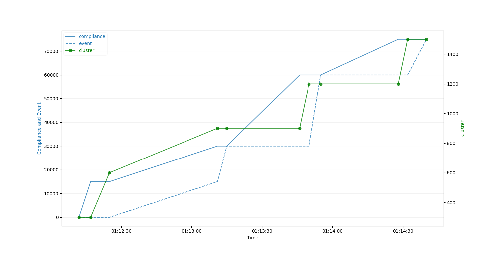

  The results above illustrate the growth of records in the databasae over time, indicating that these 5 managed hubs took approximately 5 minutes from initially receiving data to synchronizing all compliance status and clusters with the database.

- Check the CPU consumption

  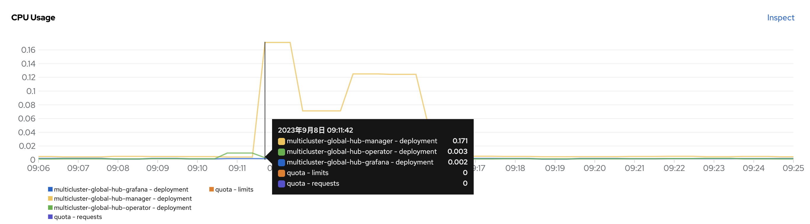
  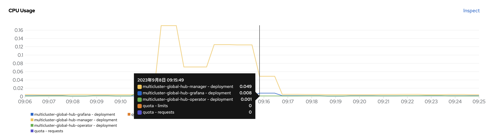

  It can be seen from the above graph that the CPU changes with the amount of data. The `multicluster-global-hub-grafana` CPU exhibits minor fluctuations, basically keep below `10m`. However, the `multicluster-global-hub-manager` CPU shows significant ups and downs in reponse to the data changes. It reaches its peak at `171 m`, and as the processing data decreases, it will be as low as `5 m` or less.

- Check the Memory consumption

  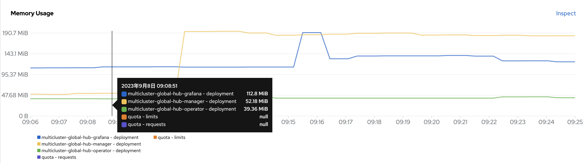
  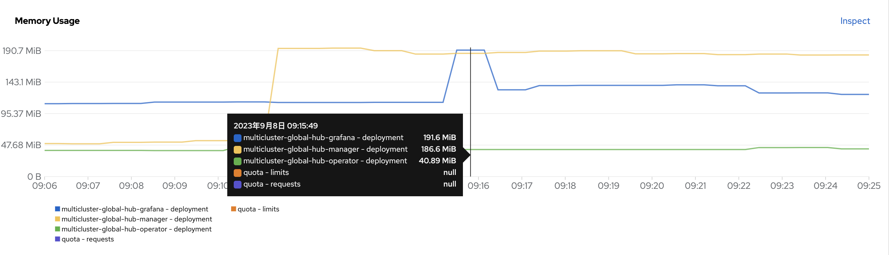

  Unlike the CPU consumption, the memory consumption remains relatively consistent without frequent fluctuations. After all the data was inserted into the database, the consumption of  `multicluster-global-hub-grafana` memory reaches its peak at `186 MiB` and subsequently remained around `143 MiB`. Without processing any data, the `multicluster-global-hub-manager` has a memory usage of approximately `52 MiB`, Afther caching all the necessary data from the managed hub, its memory usage increased to around `190 MiB`.

## Policy Status Rotation

We are using the `./local-policies/rotate-policy.sh` to update the status of the replicas policies on each managed hub. Every time the status of `5000` replicas policies is updated, wait `10` minutes before continuing, so that the compliance status in the database can be regularly found to be updated at intervals of `5000`. 

- Update the policy status on managed hub

```bash
# update the 50 root policy on the 300 cluster, and update the status to Compliant(default NonCompliant)
$ ./doc/simulation/local-policies/rotate-policy.sh 50 300 "Compliant"
# $ ./doc/simulation/local-policies/rotate-policy.sh 50 300 "NonCompliant"
```

- Observe the status count of the compliance from database.
```bash
$ ./doc/simulation/stopwatch-compliance.sh 2>&1 | tee ./doc/simulation/compliance.log
```

- The CPU and Memory consumption of the `multicluster-global-hub`
 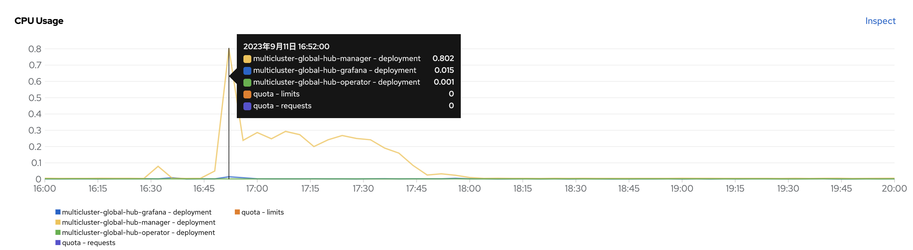
 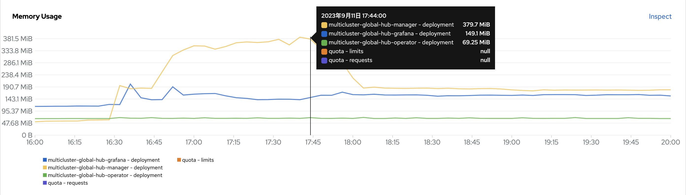

  We can see that the  `multicluster-global-hub-manager` need more CPU resource when updating all the policy status. The maximum value can be up to `800m`, the rest are fluctuating around `250m`. After processing the all the rotation policies, keep it to about `6m`.

  The memory consumption of `multicluster-global-hub-manager` stay around `370 MiB` when rotating the policies. And then fall back to about `180 MiB` after updating all the policy status.

- The CPU and Memory consumption of the Postgres Pods
  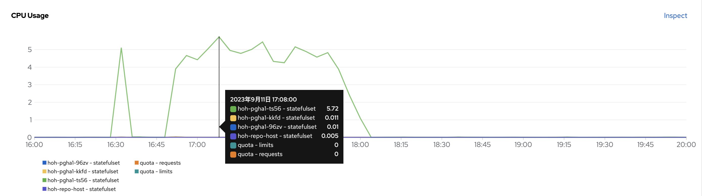
  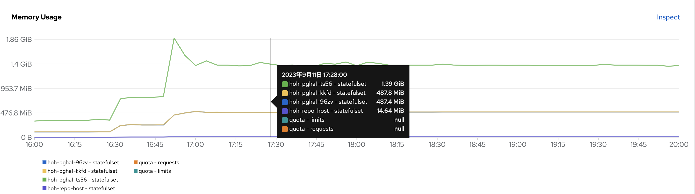

- The CPU and Memory consumption of the Kafka pods
  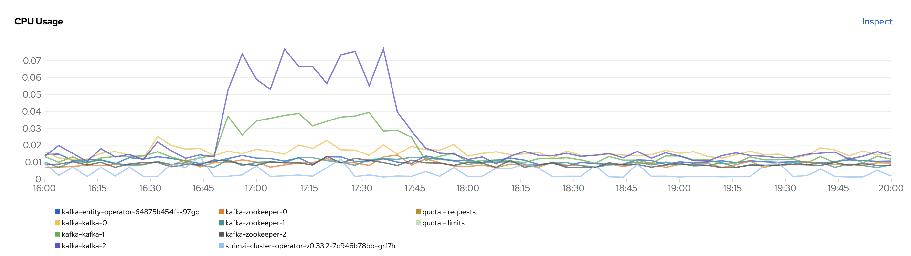
  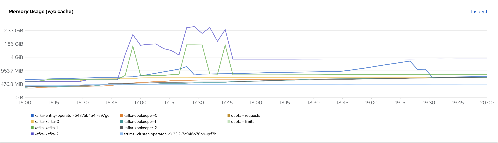

## Related Material

- [Red Hat Advanced Cluster Management Hub-of-hubs Scale and Performance Tests](https://docs.google.com/presentation/d/1z6hESoacKRHuBQ-7I8nqWBuMnw7Z6CAw/edit#slide=id.p1)
- [Replace Global Hub Transport with Cloudevents](https://github.com/stolostron/multicluster-global-hub/issues/310)
