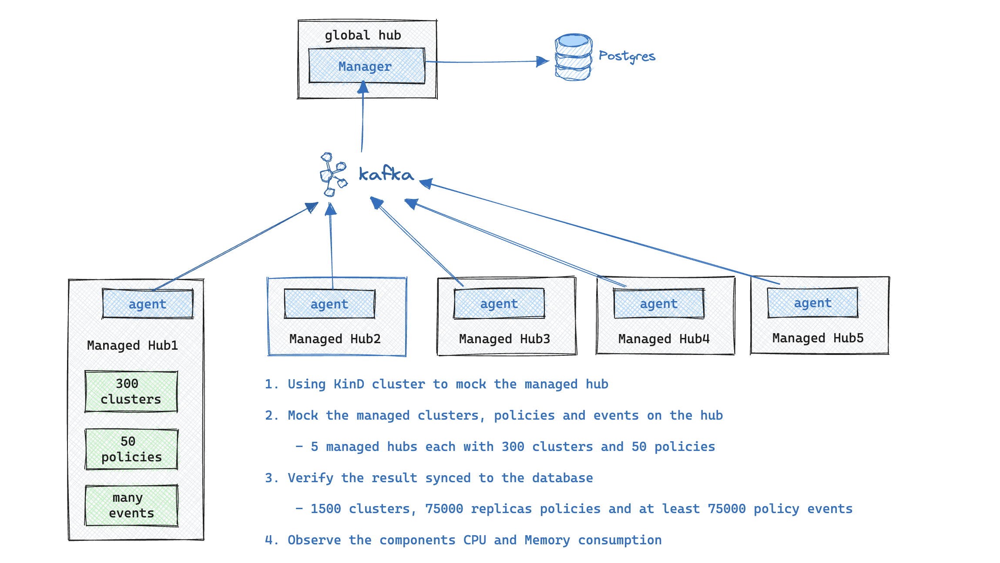

# Simulation at High Scale

## Environment

This simulation requires a **Red Hat OpenShift Container Platform clusters**. And also you need a virtual machine to create the KinD cluster and managed hub. Then we will mock the resources on the KinD cluster and observe the status on the database. The overall architecture is shown in the figure below.

You can use the scale test environment to simulate a large-scale cluster. Since the transport status path is very sensitive to the performance and represents a scale larger than the spec path.

There are several points we need to consider when simulating the global hub at large scale:

- Initialization: The time to load all managed clusters and Policies to the Global Hub
- Policy status rotation: Rotate all the policies on the managed hubs and verify status changes on the database and observe the CPU and Memory consumption of the components.

## Steps

You can setup the environment by following the [setup guidance](./setup/README.md). Then run the global hub [inspector](./inspector/README.md) to view the data from database, and analysis the CPU and Memory consumptions of the global hub components.

The simulation steps are as follows:

1. Install the global hub and then join the simulated managed hubs into it.

2. Deploy the **multicluster-global-hub-agent** to the hub clusters and then rotating all the policies to update status from one to another, Like changing the all the status from `Complianct` to `NonCompliant`

3. After the step 2, apply the **agent** to others, then rotating all the status.

Through the above steps, we can see the changing trends of the global hub metrics under different scales.

## Scenario

- [Initialize 6,000 clusters to Global Hub](./scenario/Scenario1:%206000_clusters.md)
- [Manage 1,500 clusters and 250 policies(75,000 replicated policies)](./scenario/Scenario2:%201500_clusters_250_policies.md)
- [Manage 3,000 clusters and 500 policies(150,000 replicated policies)](./scenario/Scenario3:%203000_clusters_500_policies.md)

## Related Material

- [acm-inspector](https://github.com/bjoydeep/acm-inspector)
- [Red Hat Advanced Cluster Management Hub-of-hubs Scale and Performance Tests](https://docs.google.com/presentation/d/1z6hESoacKRHuBQ-7I8nqWBuMnw7Z6CAw/edit#slide=id.p1)
- [Replace Global Hub Transport with Cloudevents](https://github.com/stolostron/multicluster-global-hub/issues/310)
