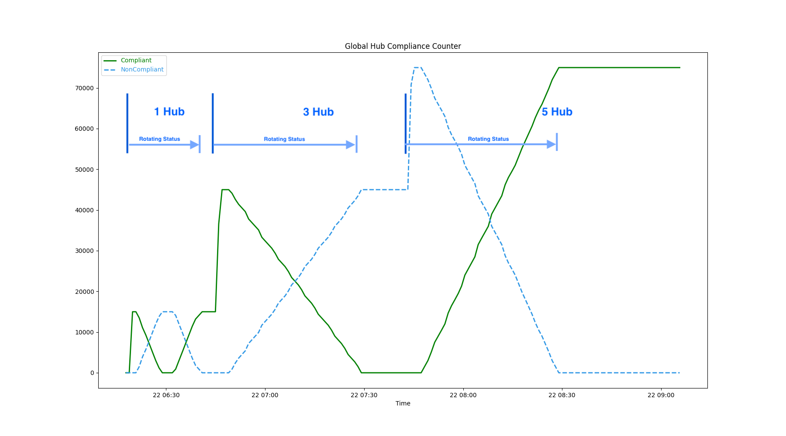
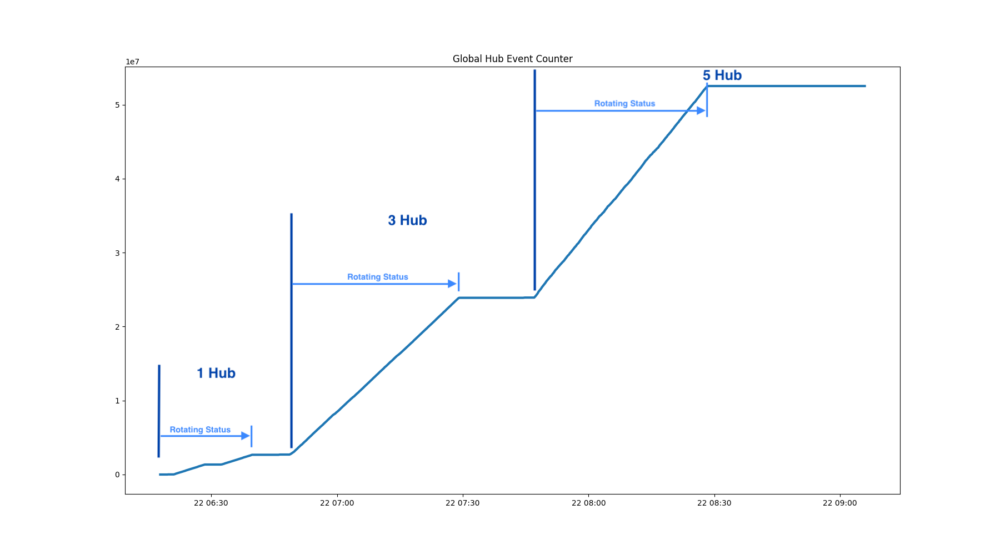
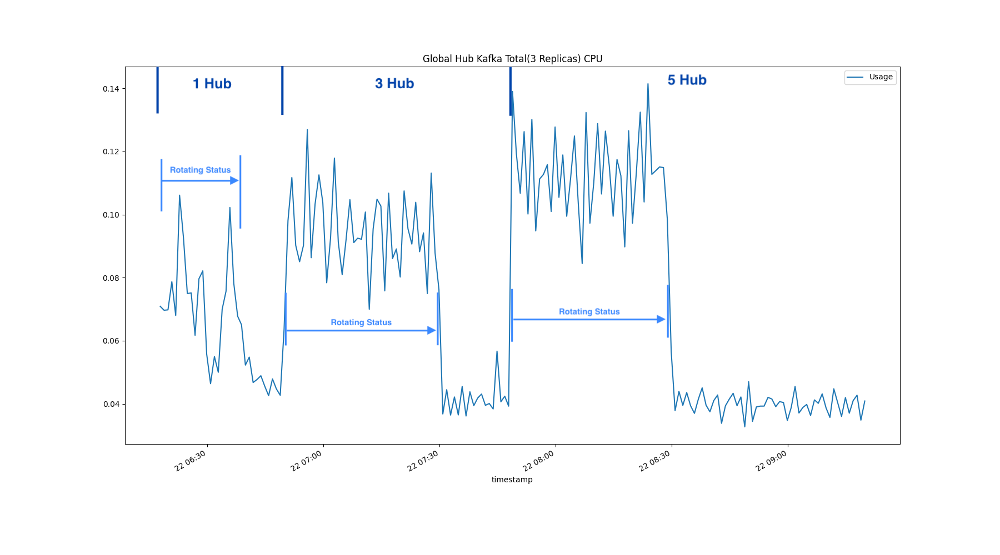
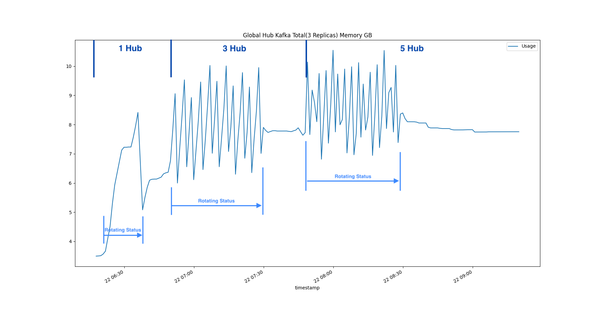
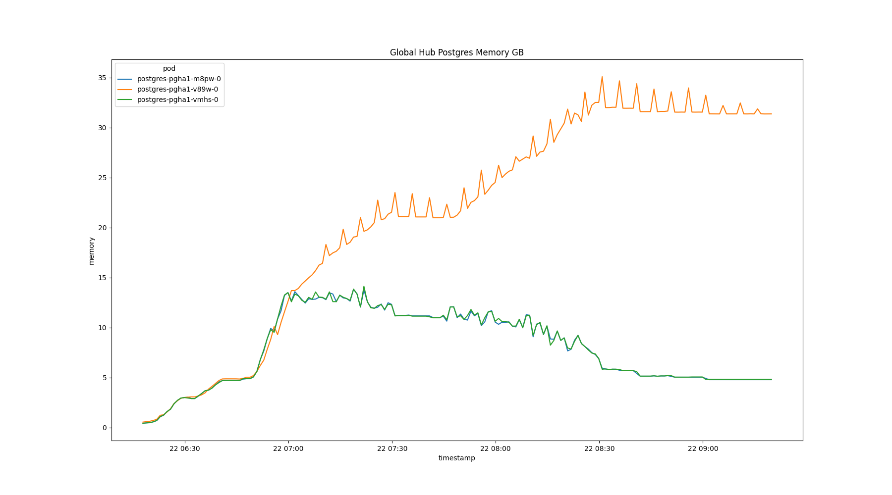

# Simulation at High Scale

## Environment

This simulation requires a **Red Hat OpenShift Container Platform clusters**. And also you need a virtual machine to create the KinD cluster and managed hub. Then we will mock the resources on the KinD cluster and observe the status on the database. The overall architecture is shown in the figure below.

You can use the scale test environment to simulate a large-scale cluster. Since the transport status path is very sensitive to the performance and represents a scale larger than the spec path.

There are two main metrics to express the scalability of global hubs:

- Initialization: The time to load all managed clusters and Policies to the Global Hub
- Policy status rotation: Rotate all the policies on the managed hubs and verify status changes on the database and observe the CPU and Memory consumption of the components.

## Analysis

You can setup `5` hubs, each with `300` clusters, `15000` replicas policies and at least `15000` policy events, by following the [document](./setup/README.md). Then run the global hub [inspector](./inspector/README.md) to `analysis` the CPU and `Memory` consumptoin of the components.

The steps we simulate here are as follows:

1. Install the global hub and then join the `5` simulated managed hubs into it.

2. Deploy the `multicluster-global-hub-agent` to the `hub1` cluster and then rotating all the polcies status from `Complianct` to `NonCompliant`, or vice versa.

3. After the step 2, apply the `agent` to `hub2` and `hub3`, then roating all the status from `NonCompliant` to `Compliant`.

4. At last, install the `agent` to `hub4` and `hub5`

Through the above steps, we can see the metrics changing trends of the global hub components under the management of `1`, `3` and `5` hubs

### The Count of the Global Hub Data from database

The mulitcluster global hub counters are used to count the managed clusters, compliances and policy events from database over time. 

- The Managed Clusters

- The Compliances

- The Policy Events

### The CPU and Memory Consumption of the Global Hub Components

- Multicluster Global Hub Manager

- Multicluster Global Hub Grafana

- Multicluster Global Hub Operator

### The CPU and Memory Consumption of the Middlewares

- Multicluster Global Hub Kafka

- Multicluster Global Hub Postgres

## Related Material

- [acm-inspector](https://github.com/bjoydeep/acm-inspector)
- [Red Hat Advanced Cluster Management Hub-of-hubs Scale and Performance Tests](https://docs.google.com/presentation/d/1z6hESoacKRHuBQ-7I8nqWBuMnw7Z6CAw/edit#slide=id.p1)
- [Replace Global Hub Transport with Cloudevents](https://github.com/stolostron/multicluster-global-hub/issues/310)