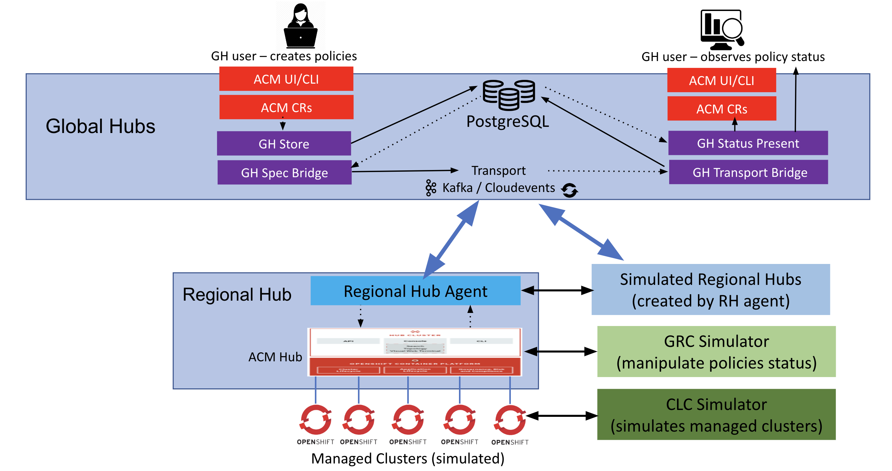

# Simulation at High Scale

## Environment

This simulation requires **two Red Hat OpenShift Container Platform clusters**. One cluster serves as the global hub, and the other serves as a managed hub with agent. In the managed hub, the [CLC simulator](https://github.com/hanqiuzh/acm-clc-scale) simulates a specific number of managed clusters. The [GRC simulator](https://github.com/stolostron/grc-simulator) continuously flips the compliant or noncompliant status of the policies. 



You can use the scale test environment to simulate a large-scale cluster. Since the transport status path is very sensitive to the performance and represents a scale larger than the spec path, we simulate this path. The following two ways are combined to achieve a large-scale global hub environment.

- Use the [CLC simulator](https://github.com/hanqiuzh/acm-clc-scale) to generate batches of managed clusters on the managed hub, for example, 1000.
- Simulate the global hub agent by changing the `leafHubName` when it sends messages to the global hub manager, or status path. Use [the snippet](https://github.com/stolostron/leaf-hub-status-sync/blob/51cffef679da0a38a2bb888bd3828b9782dfbb4c/pkg/controller/generic/generic_status_sync_controller.go#L255-L272) of the agent sending bundle to manger code for reference.

There are two main metrics to express the scalability of global hubs:

- Initialization: Time  to load all managed clusters and Policy to the Global Hub.
- Policy status rotation: Time to complete the compliance status rotation on all policies.

## Mock batch clusters on a KinD Managed Hub

- Join the KinD cluster to the global hub

- Mock the environment so that the global hub agent can running on the KinD cluster

  - Initialize a KinD cluster as managed hub cluster
  
    ```bash
    kind create cluster --name hub1
    ```

  - Create the related namespace(kubectl version must be 1.24+)
  
    ```bash
    kubectl create ns multicluster-global-hub --dry-run=client -oyaml | kubectl apply -f -
    kubectl create ns application-system --dry-run=client -oyaml | kubectl apply -f -
    ```
  
  - Apply the CRDs
  
    ```bash
    kubectl apply --server-side=true --validate=false -f pkg/testdata/crds
    ```
  
  - Mock the MultiClusterHub operand

    ```bash
    kubectl apply -f doc/simulation/managd-clusters/multiclusterhub.yaml 
    ```

- Mock the managed cluster clusters

  - Setup the available managed clusters

    You can run `setup-cluster.sh` followed with a parameter to set up multiple simulated managed clusters, you can also append another parameter with that will the the prefix of the clusterID. For example, set up 250 simulated managed clusters with clusterID prefix 1(means the first managed hub), by the following command:

    ```bash
    $ ./doc/simulation/managd-clusters/setup-cluster.sh 250 1                                         
    Creating Simulated managedCluster managedcluster-1...
    managedcluster.cluster.open-cluster-management.io/managedcluster-1 created
    managedcluster.cluster.open-cluster-management.io/managedcluster-1 patched
    managedcluster.cluster.open-cluster-management.io/managedcluster-1 patched
    Creating Simulated managedCluster managedcluster-2...
    managedcluster.cluster.open-cluster-management.io/managedcluster-2 created
    managedcluster.cluster.open-cluster-management.io/managedcluster-2 patched
    managedcluster.cluster.open-cluster-management.io/managedcluster-2 patched
    ...
    Creating Simulated managedCluster managedcluster-5...
    managedcluster.cluster.open-cluster-management.io/managedcluster-5 created
    managedcluster.cluster.open-cluster-management.io/managedcluster-5 patched
    managedcluster.cluster.open-cluster-management.io/managedcluster-5 patched
    ```

    Check if all the managed cluster are set up successfully in ACM hub cluster:

    ```bash
    $ kubectl get managedcluster | grep managedcluster
    NAME                 HUB ACCEPTED   MANAGED CLUSTER URLS   JOINED   AVAILABLE   AGE
    managedcluster-1     true                                  True     True        11m
    managedcluster-10    true                                  True     True        11m
    ...
    managedcluster-99    true                                  True     True        10m
    $ oc get mcl | wc -l
    251
    ```

  - Cleanup the available managed clusters

    ```bash
    $ ./doc/simulation/managd-clusters/cleanup-cluster.sh 250
    Deleting Simulated managedCluster managedcluster-1...
    managedcluster.cluster.open-cluster-management.io "managedcluster-1" deleted
    Deleting Simulated managedCluster managedcluster-2...
    managedcluster.cluster.open-cluster-management.io "managedcluster-2" deleted
    ...
    Deleting Simulated managedCluster managedcluster-250...
    managedcluster.cluster.open-cluster-management.io "managedcluster-250" deleted
    ```

## Mock batch policy resources on the managed clusters

- Initialize the policy on the above clusters

    You can run `setup-policy.sh` followed with two parameter to many policies deploy on many clusters. For example, deploy 10 policies on the above 250 simulated managed clusters with the following command:

    ```
    $ ./doc/simulation/local-policies/setup-policy.sh 10 250
    Creating Simulated Rootpolicy rootpolicy-1...
    policy.policy.open-cluster-management.io/rootpolicy-1 created
    Creating Simulated ReplicasPolicy default.rootpolicy-1 on managedcluster-1...
    namespace/managedcluster-1 created
    policy.policy.open-cluster-management.io/default.rootpolicy-1 created
    policy.policy.open-cluster-management.io/default.rootpolicy-1 patched
    Creating Simulated ReplicasPolicy default.rootpolicy-1 on managedcluster-2...
    ...
    namespace/managedcluster-250 configured
    policy.policy.open-cluster-management.io/default.rootpolicy-10 created
    policy.policy.open-cluster-management.io/default.rootpolicy-10 patched
    policy.policy.open-cluster-management.io/rootpolicy-10 patched
    ```

- Cleanup the mocked polices.

    ```
    $ ./doc/simulation/local-policies/cleanup-policy.sh 10 250
    Creating Simulated Rootpolicy rootpolicy-1...
    policy.policy.open-cluster-management.io/rootpolicy-1 created
    Creating Simulated ReplicasPolicy default.rootpolicy-1 on managedcluster-1...
    namespace/managedcluster-1 created
    policy.policy.open-cluster-management.io/default.rootpolicy-1 created
    policy.policy.open-cluster-management.io/default.rootpolicy-1 patched
    Creating Simulated ReplicasPolicy default.rootpolicy-1 on managedcluster-2...
    ...
    namespace/managedcluster-250 configured
    policy.policy.open-cluster-management.io/default.rootpolicy-10 created
    policy.policy.open-cluster-management.io/default.rootpolicy-10 patched
    policy.policy.open-cluster-management.io/rootpolicy-10 patched
    ```

## Initialization

- Join the KinD cluster to the managed
  
- Start the `stopwatch` to count the records
  
  This scenario specifies how much time it took to send all of the clusters, policies and events in the first time. When the database is empty, you can start sync resource from agent to manager. We can run queries to count the numbers of these tables. The time between the first data appearance in the database and the expected `COUNT` is the test result. 

  We provide a [count script](stopwatch.sh) for the cluster, policies and events. You can optimize and enhance it to make it more of what you need.

  ```bash
  ./doc/simulation/stopwatch.sh
  ```

- Add the label `vendor: OpenShift` to the KinD cluster to start `multicluster-global-hub-agent` 
  
  ```bash
  kubectl label mcl hub1 vendor=OpenShift --overwrite
  ```

- Check the CPU and Memory consumption of the `multicluster-global-hub-manager`
  
  ```bash
  oc adm top pod -n multicluster-global-hub
  ```
  
- Observe the count of records and time in the tables

  ```bash

  ```

## Policy Status Rotation

Suppose that 1M policies on 100K managed clusters with 100 managed hubs are simulated to get the Policy status Rotation. You can simulate this by completing the following steps:

1. Build a managed hub, and then generate 1000 managed clusters by using the CLC simulator.
2. Create 10 policies on Global, and wait for them to be scheduled to the 1000 managed clusters, up until here we get 10K policies.
3. Update the code to simulate 100 managed hub by changing the `leafHubName` to 100 different values when sending the bundle.
4. Wait until both 100K managed clusters and 1M Policies are sent to the database. 
5. Start running the GRC simulator on managed hub (as the `startTime`) and change the 10K policies status from `non-compliant` to `compliant`. the `endTime` should be 1M `compliant` policies found in the database of global hub.
6. The time of Policies status rotation = `endTime` - `starTime`.

## Related Material

- [Red Hat Advanced Cluster Management Hub-of-hubs Scale and Performance Tests](https://docs.google.com/presentation/d/1z6hESoacKRHuBQ-7I8nqWBuMnw7Z6CAw/edit#slide=id.p1)
- [Replace Global Hub Transport with Cloudevents](https://github.com/stolostron/multicluster-global-hub/issues/310)

**Note:** Thanks to [Nir Rozenbaum](https://github.com/nirrozenbaum) and [Maroon Ayoub](https://github.com/vMaroon) for their support.