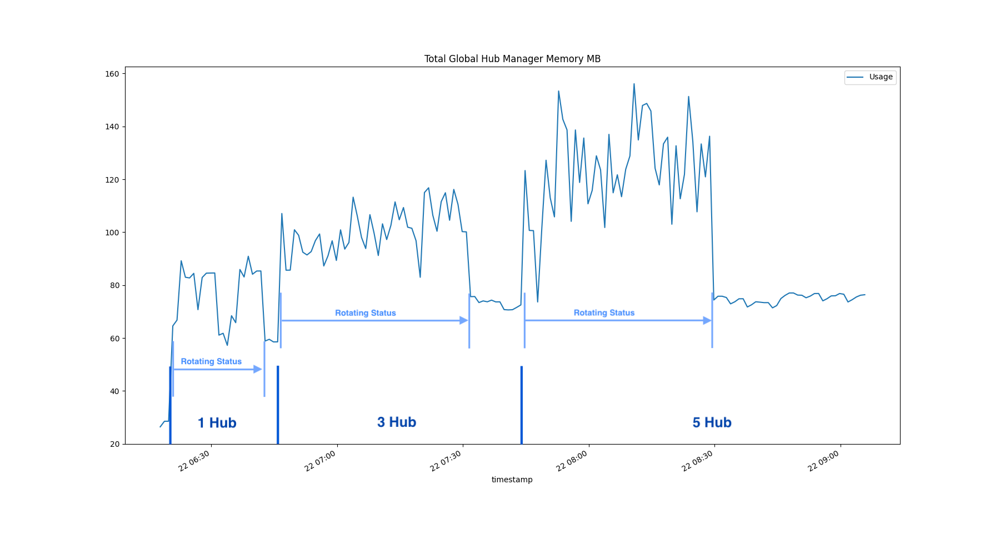
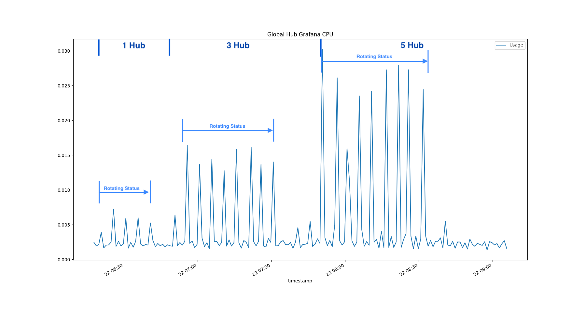
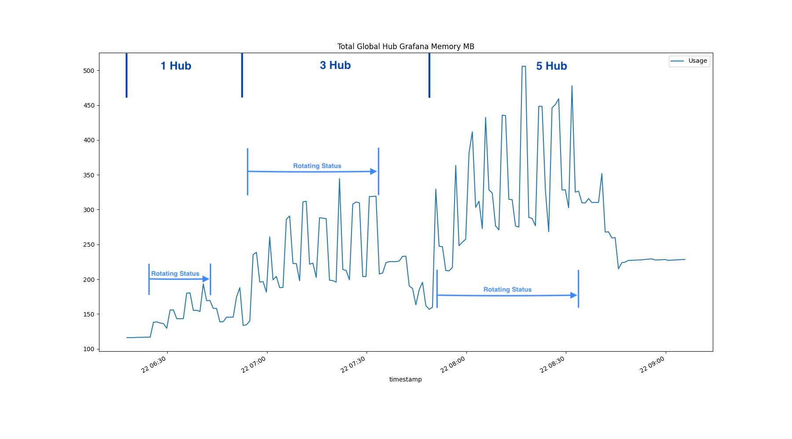
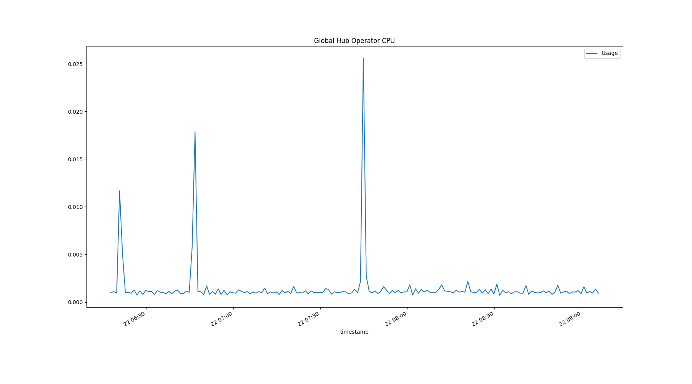
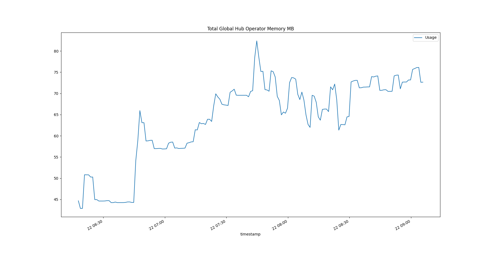
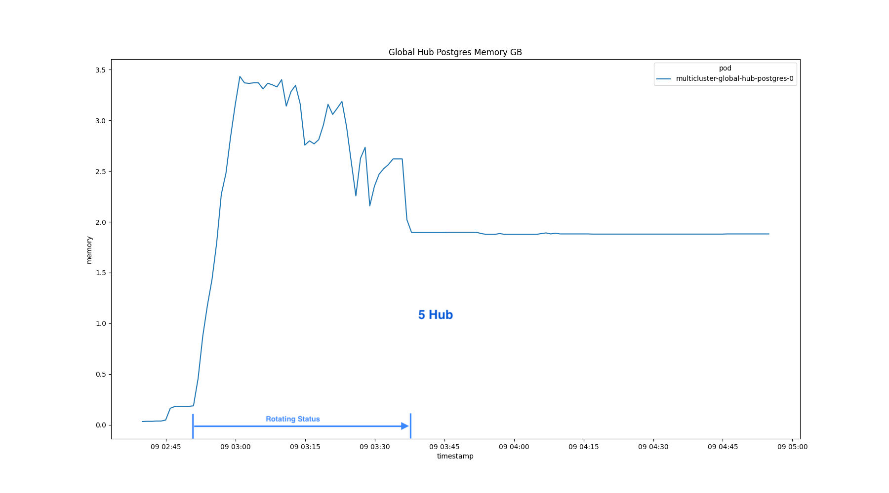

# Scenario 2: Manage 1500 clusters and 150 policies(75,000 replicated policies)

## Scale

- 5 Managed Hubs, Each with 300 Managed Clusters, 50 Policies
- 1500 Managed Clusters
- 150 Policies, 75k Replicated Policies

## Step

1. Install the global hub and then join the 5 simulated managed hubs into it

2. Deploy the `multicluster-global-hub-agent` to the `hub1` cluster and then rotating all the policies to update status, Like changing the all the status from `Compliant` to `NonCompliant`

3. After the step 2, apply the agent to `hub2` and `hub3`, then rotating all the status.

4. At last, repeat the step 3 to deploy the agent to `hub4` and `hub5`, and updating the status.

Through the above steps, we can see the changing trends of the global hub metrics under the management of 1, 3 and 5 hubs.

## Statistics and Analysis

### The Count of the Global Hub Data from database

The global hub counters are used to count the managed clusters, compliances and policy events from database over time. 

- The Managed Clusters

- The Compliances

- The Policy Events

### The CPU and Memory Consumption of the Global Hub Components

- Multicluster Global Hub Manager

- Multicluster Global Hub Grafana

- Multicluster Global Hub Operator

- Multicluster Global Hub Agent on Managed Hub

### The CPU and Memory Consumption of the Middlewares

- Multicluster Global Hub Kafka Broker

- Multicluster Global Hub Kafka Zookeeper

- Multicluster Global Hub Postgres

- CPU and Memory Summary

  ---
  | Type               | Manager | Agent | Operator | Grafana | Postgres | Kafka Broker | Kafka Zookeeper |
  |---|---|---|---|---|---|---|---|
  | Request CPU(m)     | 100     | 10    | 1   | 5    | 4000   | 4      | 10  |
  | Limit CPU(m)       | 500     | 50    | 50  | 50   | 4000   | 200    | 30  |
  | Request Memory(Mi) | 100     | 300   | 60  | 150  | 4000   | 1.5 Gi | 800 |
  | Limit Memory(Mi)   | 300     | 1000  | 200 | 800  | 4000   | 5 Gi   | 2 Gi|
