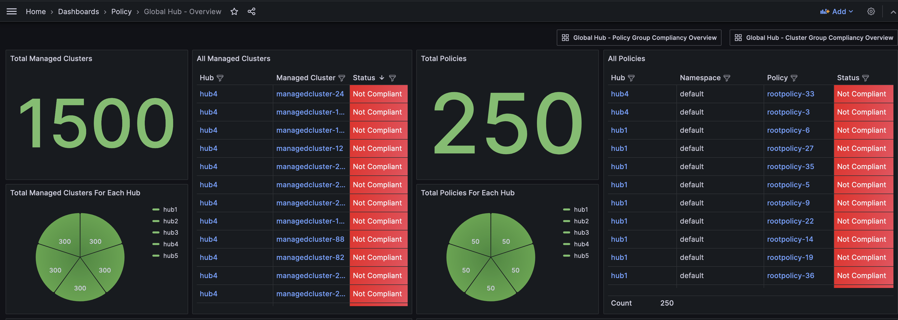
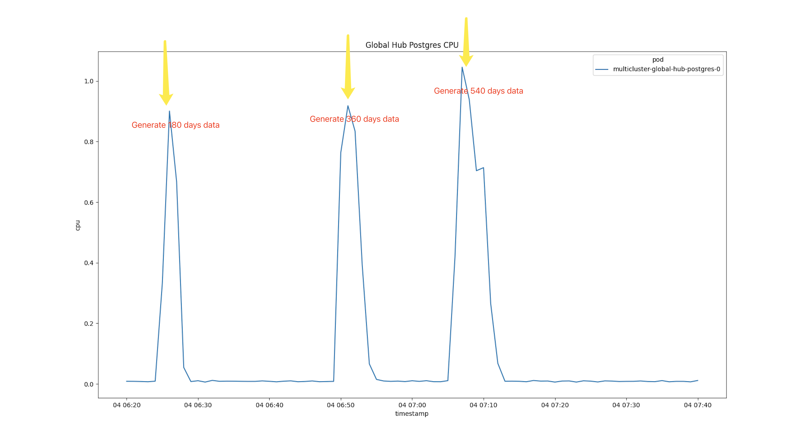
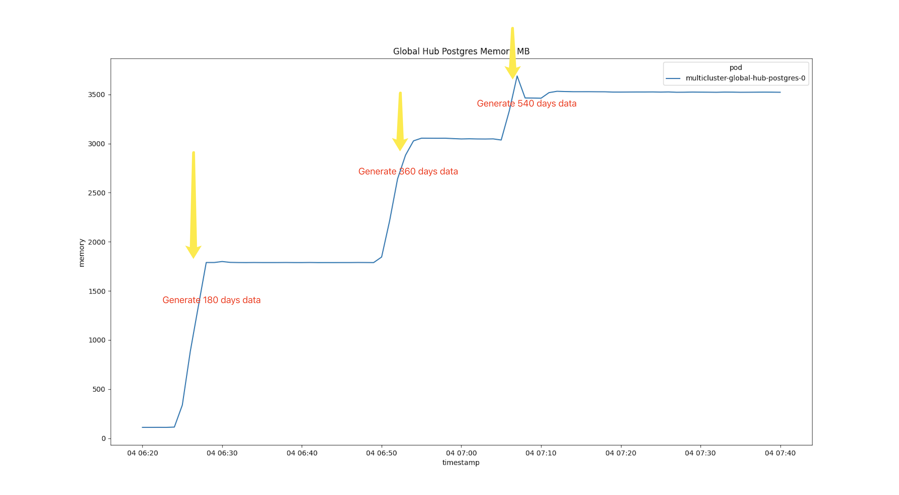
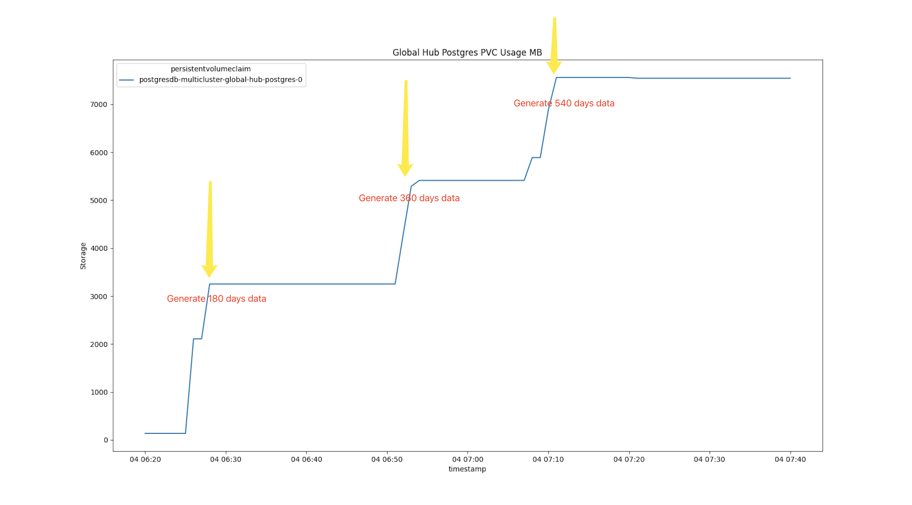
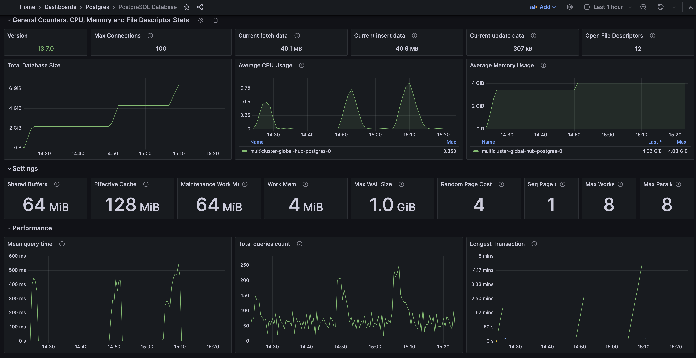
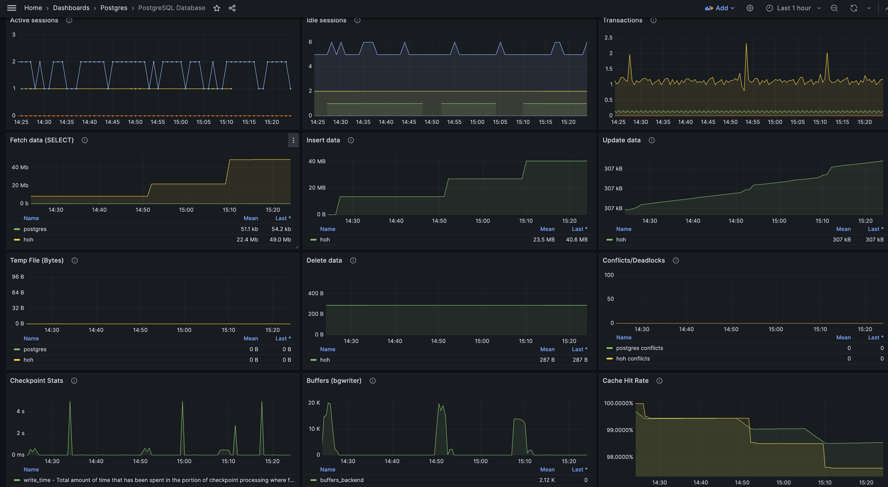

# Scenario 5: Postgres Metrics(release-2.11/globalhub-1.2)

## Scale

- 5 Managed Hubs, Each with 300 Managed Clusters, 50 Policies
- 1500 Managed Clusters
- 250 Policies, 75,000 Replicated Policies

## Environment

1. Install the global hub and then join the 5 simulated managed hubs(Each hub has 300 managedclusters and 50 policies) into it

2. Deploy the `multicluster-global-hub-agent` to the `hub1` ~ `hub5` cluster

3. Generate 180/360/540 days data in `history.local_compliance`

4. Observe the metrics from the dashboard.

## Postgres Setting

- Check the Postgres statefulset and Dashboards for More Detail
  - Postgres statefulset

    ```yaml
    apiVersion: apps/v1
    kind: StatefulSet
    metadata:
      name: multicluster-global-hub-postgresql
      namespace: multicluster-global-hub
    spec:
      persistentVolumeClaimRetentionPolicy:
        whenDeleted: Retain
        whenScaled: Retain
      podManagementPolicy: OrderedReady
      replicas: 1
      revisionHistoryLimit: 10
      template:
        spec:
          containers:
          - env:
            - name: POSTGRESQL_SHARED_BUFFERS
              value: 64MB
            - name: POSTGRESQL_EFFECTIVE_CACHE_SIZE
              value: 128MB
            - name: WORK_MEM
              value: 16MB
            image: quay.io/stolostron/postgresql-16:9.5-1732622748
            imagePullPolicy: Always
            name: multicluster-global-hub-postgresql
            resources:
              requests:
                cpu: 25m
                memory: 128Mi
          - args:
            - --config.file=/etc/postgres_exporter.yml
            - --web.listen-address=:9187
            - --collector.stat_statements
            image: quay.io/prometheuscommunity/postgres-exporter:v0.15.0
            imagePullPolicy: Always
            name: prometheus-postgres-exporter
          terminationGracePeriodSeconds: 30
      volumeClaimTemplates:
      - apiVersion: v1
        kind: PersistentVolumeClaim
        metadata:
          name: postgresdb
        spec:
          accessModes:
          - ReadWriteOnce
          resources:
            requests:
              storage: 25Gi
          volumeMode: Filesystem

    ```

  - Postgres Config
  ```yaml
      postgresql.conf: |
      ssl = on
      ssl_cert_file = '/opt/app-root/src/certs/tls.crt' # server certificate
      ssl_key_file =  '/opt/app-root/src/certs/tls.key' # server private key
      shared_preload_libraries = 'pg_stat_statements'
      pg_stat_statements.max = 10000
      pg_stat_statements.track = all
  ```

## Initializing and Rotating Policies

### Generate clusters and policies
 

### Simulate 180/360/540 days data
We use [script](./local-policies/history_local_compliance.sql) to simulate 180/360/540 days data in `history.local_compliance`. Then check some metrics about postgres.

1. CPU usage


2. Memory usage


3. PVC usage


4. Other metrics




### Summarize
1. Generate 180 Days data in `history.local_compliance`

- Data Count in `history.local_compliance`: 13,500,000
- Postgres Pod Memory Usage: 1.8 GB
- Postgres PVC Usage: 3.2 GB

2. Generate 360 Days data in `history.local_compliance`

- Data Count in `history.local_compliance`: 27,000,000
- Postgres Pod Memory Usage: 3.1 GB
- Postgres PVC Usage: 5.8 GB

3. Generate 540 Days data in `history.local_compliance`

- Data Count in `history.local_compliance`: 40,500,000
- Postgres Pod Memory Usage: 3.6 GB(Set memory limit as 4G in postgres pod)
- Postgres PVC Usage: 7.6 GB
