# Scenario 6: Manage 3,000 clusters and 500 policies(release-2.13)

## Note

- Switch the Kafka cluster to Kraft mode.
- Operator Image:  `quay.io/stolostron/multicluster-global-hub-operator@sha256:26217377636f37d407dfeb03a553ec7d354cc95c4db3396d35ed439cf773061b`

## Scale

- 10 Managed Hubs, Each with 300 Managed Clusters, 50 Policies
- 3,000 Managed Clusters
- 500 Policies, 150,000 Replicated Policies

## Simulation workflow

1. Initialize 2 Virtual Machines, each with 5 KinD clusters

2. Join the above the 10 clusters into the Global Hub

3. Deploy the `multicluster-global-hub-agent` to the `hub1` cluster using:

  ```bash
  kubectl label mcl hub1 vendor=OpenShift --overwrite
  ```

4. Rotate all the policies to update their statuess, e.g., changing all the statuses from `Compliant` to `NonCompliant`

5. Repeat steps 3 and 4, apply the agent to `hub2`, `hub3`, `hub4`, and `hub5`, and then rotate all the statuses.

6. Repeat steps 3 and 4 to deploy agent to `hub6` through `hub10`, and update the statuses accordingly.

Through the above steps, we can see the changing trends of the global hub metrics under the management of 1, 5 and 10 hubs.

## Statistics and Analysis

### The Count of the Global Hub Data from database

The global hub counters are used to count the managed clusters, compliances and policy events from database over time. 

- The Managed Clusters and Compliance
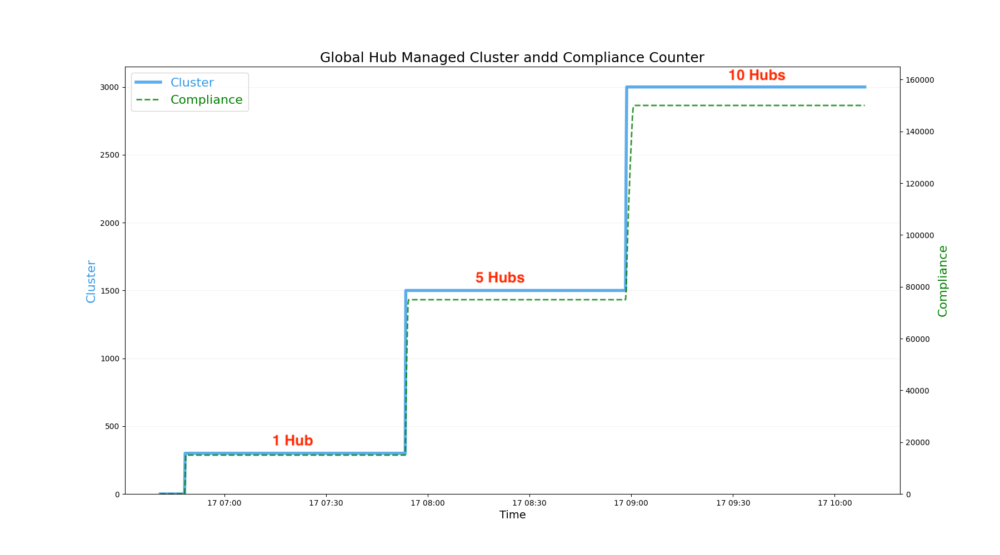

- The Changes of Compliance
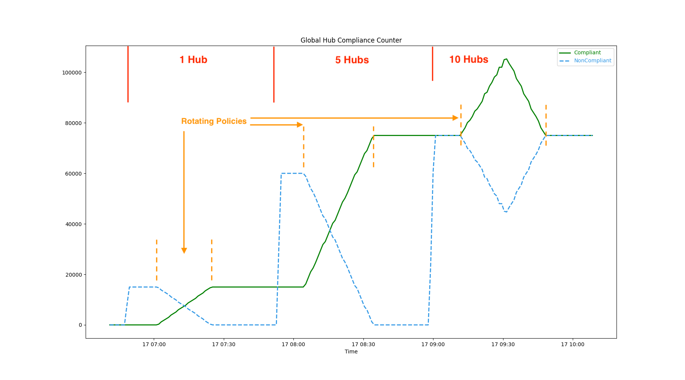

### The CPU and Memory Consumption of the Global Hub Components

- Multicluster Global Hub Manager

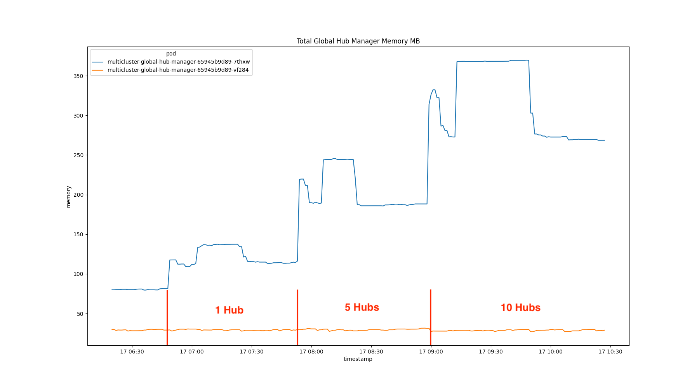
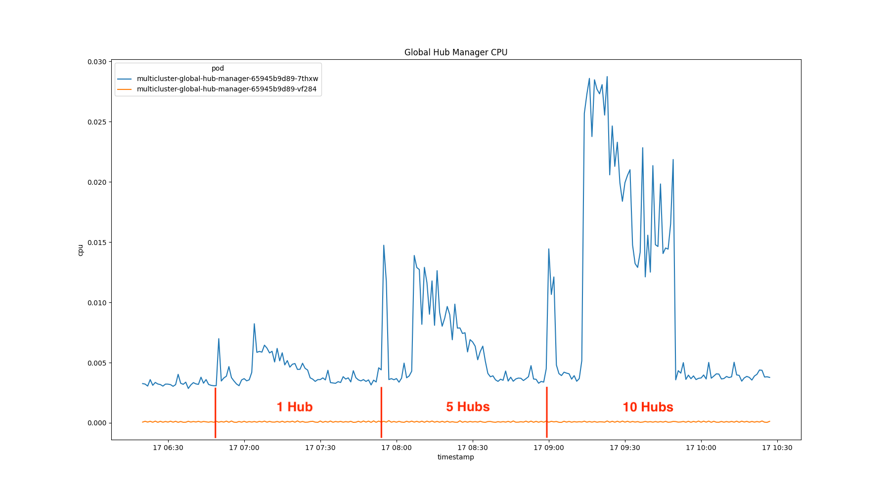

- Multicluster Global Hub Grafana

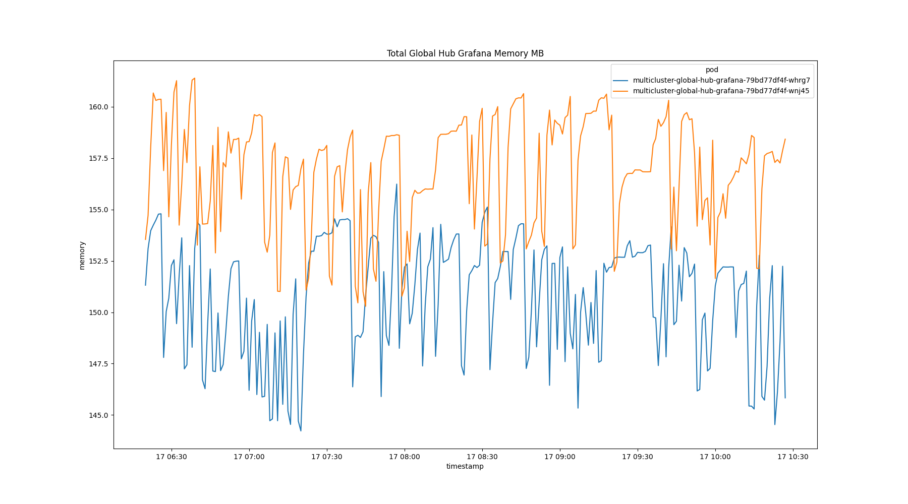
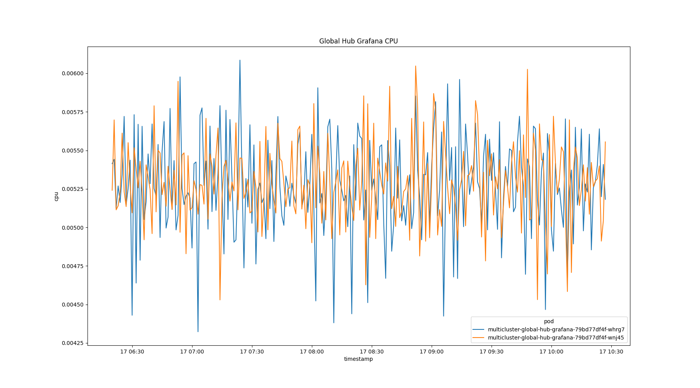

- Multicluster Global Hub Operator

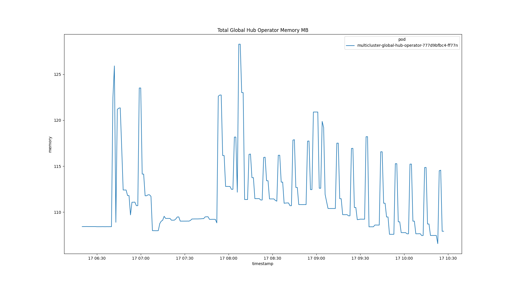
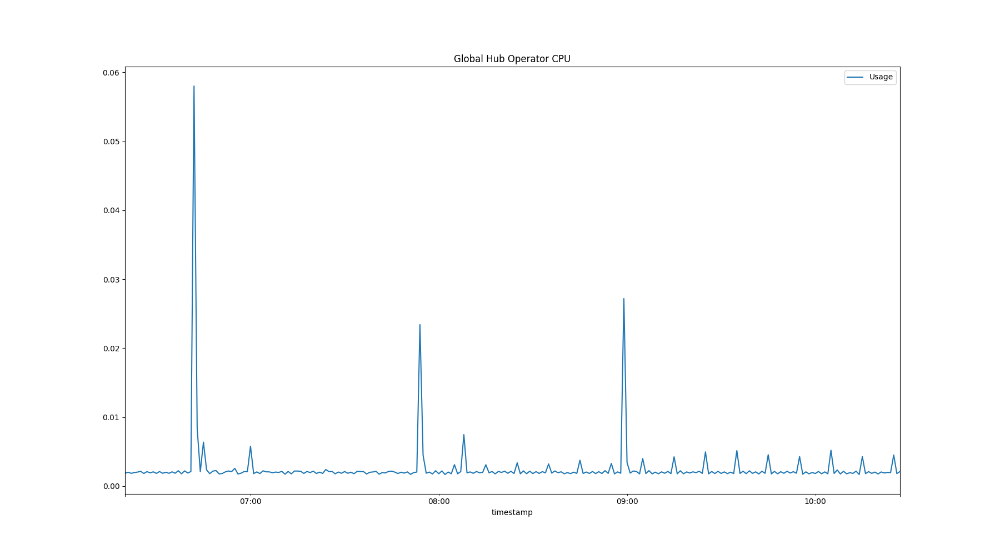

- Multicluster Global Hub Agent on Managed Hub

<!-- 
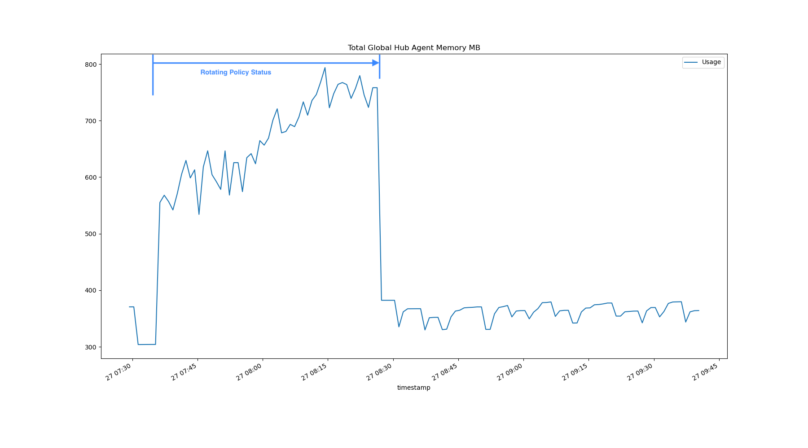 -->

Check the agent memory on the simulated cluster

```bash
# hub1 -> 294 MB
cat /sys/fs/cgroup/memory.current
307929088
# hub4 -> 295 MB
$  cat /sys/fs/cgroup/memory.current
309264384
# hub7 -> 264 MB
cat /sys/fs/cgroup/memory.current
276987904
```

### The CPU and Memory Consumption of the Middlewares

- Multicluster Global Hub Postgresql

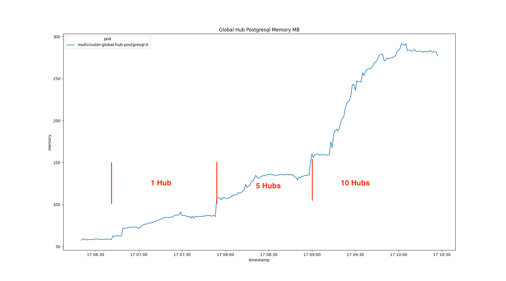
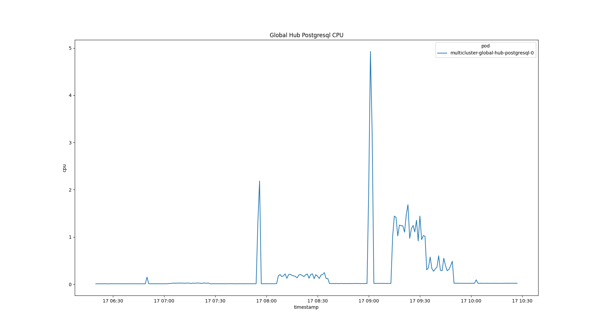
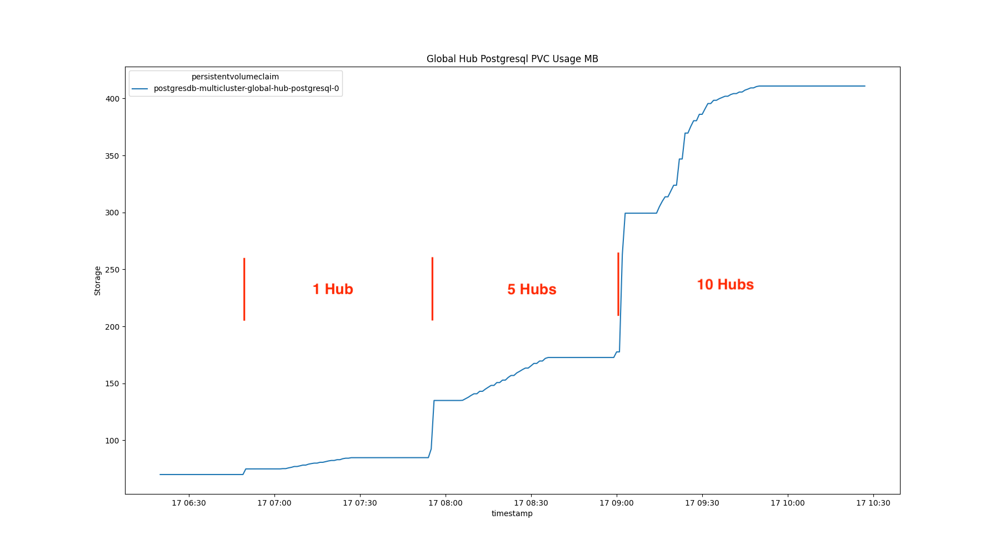

- Multicluster Global Hub Kafka

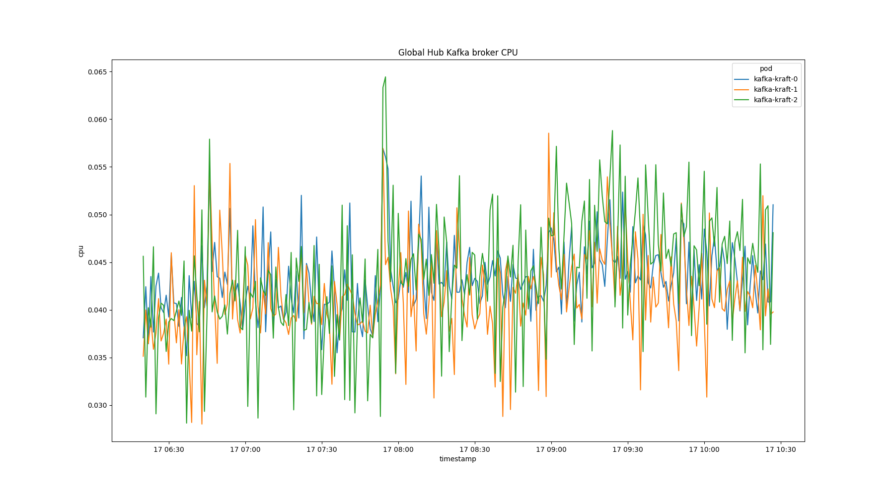
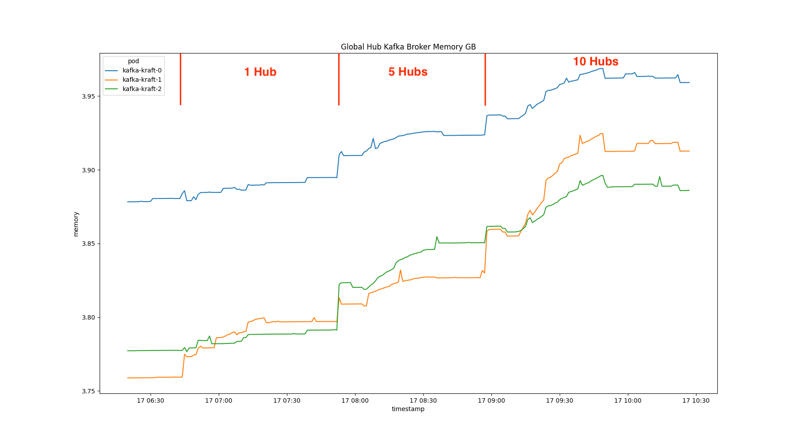
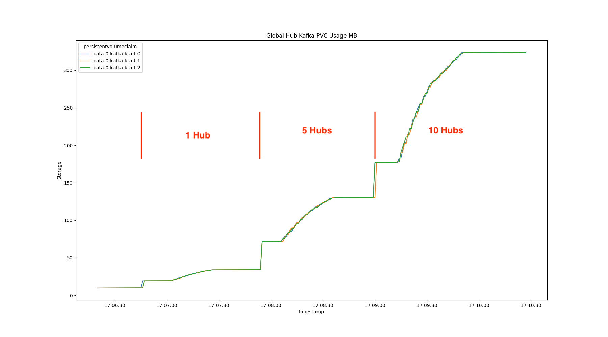

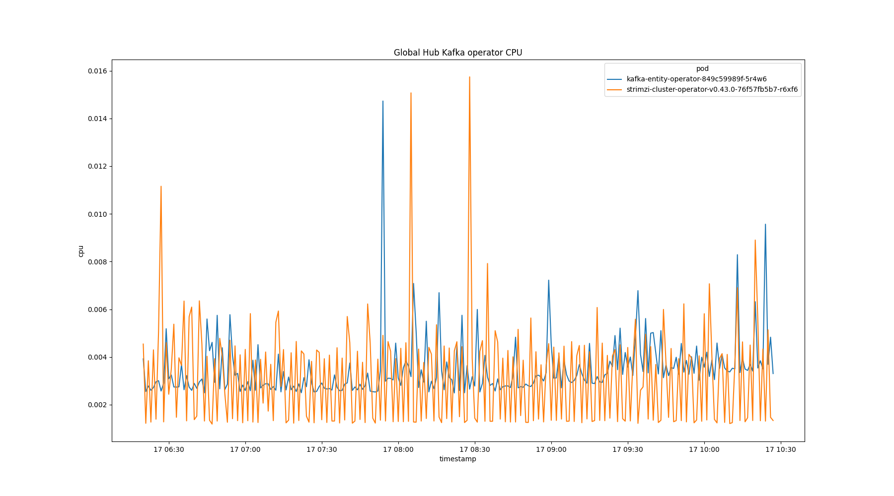

