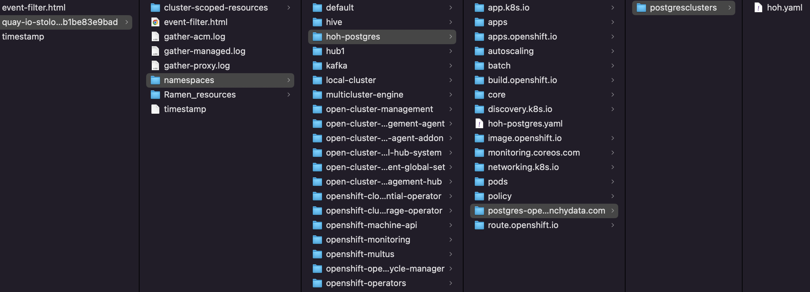
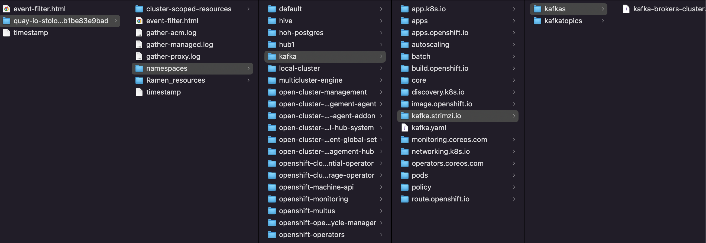
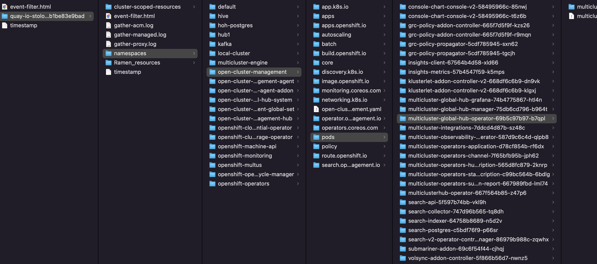

# Troubleshooting

You can run troubleshooting steps to determine issues on your Multicluster Global Hub.

## Access to the provisioned postgres database

Depending on the type of service, there are three ways to access the [provisioned postgres database](../operator/config/samples/storage/deploy_postgres.sh) database.

* `ClusterIP` service
    1. Run the following command to determine your postgres connection URI:
        ```
        kubectl get secrets -n hoh-postgres hoh-pguser-postgres -o go-template='{{index (.data) "uri" | base64decode}}'
        ```
    2. Run the following command to access the database:
        ```
        kubectl exec -it $(kubectl get pods -n hoh-postgres -l postgres-operator.crunchydata.com/role=master -o jsonpath='{.items..metadata.name}') -c database -n hoh-postgres -- psql -U postgres -d hoh -c "SELECT 1"
        ```

* `NodePort` service
    1. Run the following command to modify the service to NodePort, set the host to be the node IP, and set the port to 32432: 
        ```
        kubectl patch postgrescluster hoh -n hoh-postgres -p '{"spec":{"service":{"type":"NodePort", "nodePort": 32432}}}'  --type merge
        ```
    2. Run the following command to add your username: 
        ```
        kubectl get secrets -n hoh-postgres hoh-pguser-postgres -o go-template='{{index (.data) "user" | base64decode}}'
        ```
    3. Run the following command to add your password: 
        ```
        kubectl get secrets -n hoh-postgres hoh-pguser-postgres -o go-template='{{index (.data) "password" | base64decode}}'
        ```
    4. Run the following command to add your database name: 
        ```
        kubectl get secrets -n hoh-postgres hoh-pguser-postgres -o go-template='{{index (.data) "dbname" | base64decode}}'
        ```

* `LoadBalancer`
    1. Set the service type to `LoadBalancer` by running the following command:
        ```
        kubectl patch postgrescluster hoh -n hoh-postgres -p '{"spec":{"service":{"type":"LoadBalancer"}}}'  --type merge
        ```
        The default port is 5432
    2. Run the following command to set your hostname:
        ```
        kubectl get svc -n hoh-postgres hoh-ha -ojsonpath='{.status.loadBalancer.ingress[0].hostname}'
        ```
    4. Run the following command to add your username: 
        ```
        kubectl get secrets -n hoh-postgres hoh-pguser-postgres -o go-template='{{index (.data) "user" | base64decode}}'
        ```
    3. Run the following command to add your password: 
        ```
        kubectl get secrets -n hoh-postgres hoh-pguser-postgres -o go-template='{{index (.data) "password" | base64decode}}'
        ```
    4. Run the following command to add your database name: 
        ```
        kubectl get secrets -n hoh-postgres hoh-pguser-postgres -o go-template='{{index (.data) "dbname" | base64decode}}'
        ```

## Running the must-gather command for troubleshooting

Run the `must-gather` to gather details, logs, and take steps in debugging issues. This debugging information is also useful when you open a support request. The `oc adm must-gather CLI` command collects the information from your cluster that is often needed for debugging issues, including:

1. Resource definitions
2. Service logs

### Prerequisites

1. Access to the global hub and regional hub clusters as a user with the cluster-admin role.
2. The Red Hat OpenShift Container Platform CLI (oc) installed.

### Must-gather procedure

Complete the following procedure to start using the must-gather command:

1. Learn about the must-gather command and install the prerequisites that you need at [Gathering data about your cluster](https://docs.openshift.com/container-platform/4.8/support/gathering-cluster-data.html?extIdCarryOver=true&sc_cid=701f2000001Css5AAC) in the Red Hat OpenShift Container Platform documentation.

2. Log in to your global hub cluster. For the usual use-case, you run the must-gather while you are logged into your global hub cluster.

    ```
    oc adm must-gather --image=quay.io/stolostron/must-gather:SNAPSHOTNAME
    ```

    If you want to check your regional hub clusters, run the `must-gather` command on those clusters.

3. Optional: If you need the results to be saved in a named directory, run the following command instead of the one in step 2:
    ```
    oc adm must-gather --image=quay.io/stolostron/must-gather:SNAPSHOTNAME --dest-dir=SOMENAME ; tar -cvzf SOMENAME.tgz SOMENAME
    ```
    The command includes the required additions to create a gzipped tarball file.


### Information Captured

1. Two peer levels: `cluster-scoped-resources` and `namespaces` resources.
2. Sub-level for each: API group for the custom resource definitions for both cluster-scope and namespace-scoped resources.
3. Next level for each: YAML file sorted by kind.
4. For the global hub, you can check the `PostgresCluster` and `Kafka` in the `namespaces` resources.





5. For the global hub, you can check the multicluster global hub related pods and logs in `pods` of `namespaces` resources.



6. For the regional hub cluster, you can check the multicluster global hub agent pods and logs in `pods` of `namespaces` resources.


## Database Dump and Restore

In a production environment, regular backup of your PostgreSQL database is an essential aspect of database management. It is also used for debugging.

### Dump Database for Debugging

Sometimes you need to dump the output in global hub database for debugging purpose. PostgreSQL provides the `pg_dump` command line tool to dump the contents of the database. To dump data from localhost database server:

```
pg_dump hoh > hoh.sql
```

To dump global hub database located on some remote server with compressed format, use the command-line options to control the connection details:

```
pg_dump -h my.host.com -p 5432 -U postgres -F t hoh -f hoh-$(date +%d-%m-%y_%H-%M).tar
```

### Restore Database from Dump

To restore a PostgreSQL database, you can use the `psql` or `pg_restore` command line tools. The `psql` tool is used to restore plain text files created by `pg_dump`:

```
psql -h another.host.com -p 5432 -U postgres -d hoh < hoh.sql
```

The `pg_restore` tool is used to restore a PostgreSQL database from an archive created by `pg_dump` in one of the non-plain-text formats (custom, tar, or directory):

```
pg_restore -h another.host.com -p 5432 -U postgres -d hoh hoh-$(date +%d-%m-%y_%H-%M).tar
```

## Cronjob Compliance Data Restore
### Generate the missed compliance data
The Grafana Datasource is mainly from a table named `history.local_compliance`. Its records are generated by a summarization routine kicks off at 00:00:00 every night. Usually, we don't need to run the summary process manually. However, unexpected errors may occur when running the compliance job, so it is necessary for us to manually log in to the database to perform the whole summary process to recover the data that is not generated. You can follow [Running the Summarization Process manually](./how_global_hub_works.md#running-the-summarization-process-manually) to achieve that.


## Extend postgres column name length limit

Since the maximum length for an event's name can exceed 63 characters, even reaching beyond 253 characters. This contradicts the current limitation of 63 characters for event names in our database tables. This may result in the error `value too long for type character varying(63)` on global hub manager. To address the issue, you can follow the steps outlined below:

- Log in to postgres database

  ```bash
  kubectl exec -it $(kubectl get pods -n hoh-postgres -l postgres-operator.crunchydata.com/role=master -o jsonpath='{.items..metadata.name}') -n hoh-postgres -c database -- psql -d hoh
  ```

- Execute the following SQL statements to remove the limitation on event names

  ```sql
  ALTER TABLE "event"."local_policies" ALTER COLUMN "event_name" TYPE TEXT;
  ALTER TABLE "event"."local_root_policies" ALTER COLUMN "event_name" TYPE TEXT;
  ```