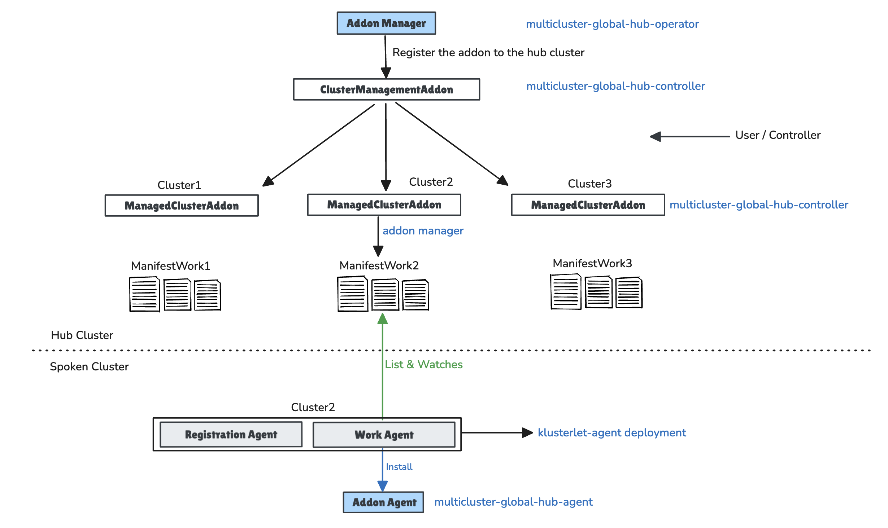

## Multicluster Global Hub Architecure

The global hub agent is deployed using the [addon framwork](https://github.com/open-cluster-management-io/addon-framework) of Open Cluster Management. The overall architecture is as follows:

We need to implement the **addon manager** and **addon agent** in the `multicluster-global-hub-operator`, as described in the guidelines at [here](https://github.com/open-cluster-management-io/enhancements/tree/main/enhancements/sig-architecture/8-addon-framework).

Here are the roles of the files in the current folder involved:

- `addon_manager.go`:  This file starts the global hub **addon manager**, which is responsible for registering the addon in the global hub cluster and initializing the related controllers from the addon framework.

- `addon_agent.go` and `addon_agent_manifest_*.go`: These files contain the configuration for the global hub addon, including how to generate the manifests for the managed hub cluster and the registration configuration for the `multicluster-global-hub-agent` (as shown in the diagram above).

- `default_agent_controller.go` and `hosted_agent_controller`: These files are responsible for creating the corresponding `ManagementClusterAddon` and other resources for the managed hub cluster

Notably, the addon framework team has begun to abstract the addon manager logic into OCM. This means we will be able to deploy addons without needing to implement code at a low level. Instead, if we want to install an addon in the environment, we can use a declarative style, similar to creating other Kubernetes resources, to initialize the addon. A current experience is [Build an addon with addon template](https://open-cluster-management.io/docs/developer-guides/addon/#build-an-addon-with-template)